# 大猫常见寄生虫病的 — 诊断与治疗图谱—

DIAGNOSIS AND TREATMENT OF COMMON PARASITISMS IN DOGS AND CATS

[美] Dwight D. Bowman 著 [美] Elizabeth A. Fogarty

[美] Stephen Charles Barr

主译 胡延春 李和平 主审 索 勋 刘贤勇 贾永根 余 芳

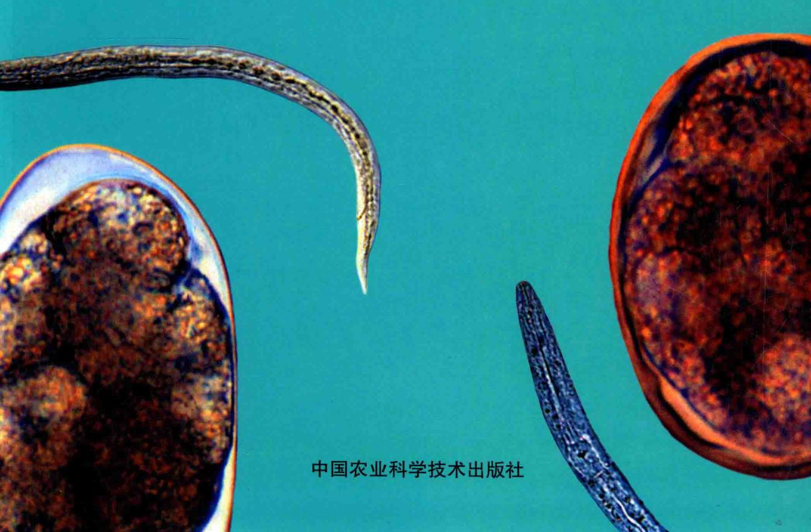

# 犬猫常见寄生虫病的诊断与治疗图谱

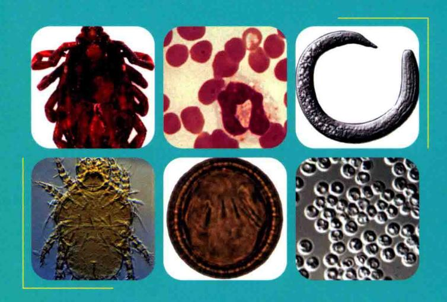

关注微信公众平台 新书第一时间发布

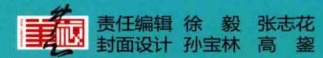

定价: 95.00元

# 犬猫常见寄生虫病的 — 诊断与治疗图谱—

#### DIAGNOSIS AND TREATMENT OF COMMON PARASITISMS IN DOGS AND CATS

[美] Dwight D. Bowman

著 [美] Elizabeth A. Fogarty

[美] Stephen Charles Barr

主译 胡延春 李和平 主审 索 勋 刘贤勇 贾永根 余

芳

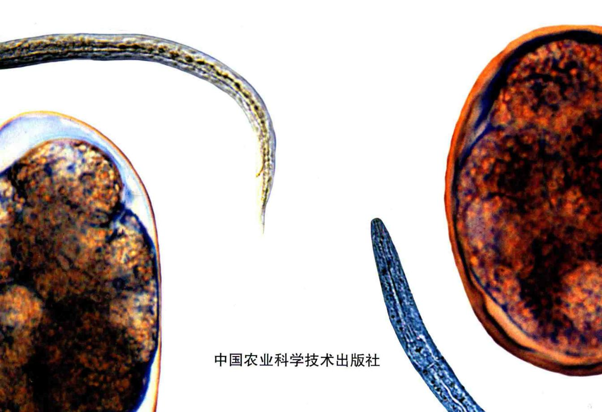

The original English language work has been published by Teton NewMedia
Jackson, Wyoming, USA
Copyright © 2005 Teton NewMedia. All rights reserved.

著作权合同登记号: 图字 01-2016-6397

#### 图书在版编目(CIP)数据

犬猫常见寄生虫病的诊断与治疗图谱/(美)德怀特鲍曼(Dwight D. Bowman),(美)伊丽莎白福格蒂(Elizabeth A. Fogarty),(美)斯蒂芬・查尔斯・巴尔(Stephen Charles Barr)著;胡延春,李和平主译.一北京:中国农业科学技术出版社,2017.1

ISBN 978-7-5116-2792-6

I.①犬… II.①德…②伊…③斯…④胡…⑤李… Ⅲ.①犬病 - 寄生虫病 - 防治②猫病 - 寄生虫病 - 防治 Ⅳ.① S858.292② S858.293

#### 中国版本图书馆 CIP 数据核字(2016)第 246598 号

责任编辑 徐 毅 张志花

责任校对 李向荣

出版者 中国农业科学技术出版社 北京市中关村南大街12号 邮编:100081

电 话 (010)82106636(编辑室)(010)82109702(发行部) (010)82109709(读者服务部)

传 真 (010)82106631

网 址 http://www.castp.cn

经 销 者 各地新华书店

印刷者 北京地大彩色印刷有限公司

开 本 787mm×1 092mm 1/16

印 张 7.25

字 数 170 千字

版 次 2017年1月第1版 2017年1月第1次印刷

定 价 95.00 元

# 《犬猫常见寄生虫病的诊断与治疗图谱》

# 编委会

主 译: 胡延春 李和平

参 译: 古小彬 任俊玲 曾朝蓉 苟丽萍 翁嘉华

主 审: 索 勋 刘贤勇 贾永根 余 芳

# 前 言

《犬猫常见寄生虫病的诊断与治疗图谱》对于从事宠物诊疗工作的执业兽医师、助理执业兽医师、实习医生和学生来说是一本快速、简明、实用的参考书。本书详细描述了 92 种犬/猫常见寄生虫的图谱、发育周期、诊断、成虫寄生部位、近似种属、分布范围、临床症状及治疗方法。它能够给小动物临床医生和学生在临床和实验环境下提供快速、准确、可靠的现场诊断信息,科学鉴别犬/猫感染寄生虫病的种类,评估寄生虫对犬猫的严重危害程度,并能够提供准确的治疗和预防措施。

本书在介绍犬/猫常见寄生虫基本信息的同时,列出了潜在的人兽共患病,为小动物临床医生、学生及宠物饲养者做好治疗前/时的防护工作提供了参考指南,并能让相关人员对患病的犬/猫做好安全有效的管理。

本书所介绍的92种寄生虫病都附有虫卵和/或成虫(雄虫、雌虫)的图片,这些图片都是一线工作者多年来工作成果的积累。

本书介绍的预防和治疗寄生虫病的药物都是现阶段安全有效的药物。我们在翻译过程中还补充了药物的主要成分,便于读者的学习和灵活应用。但是,随着科学技术的进步以及各种药物规定的不断变化,这些药物的使用情况也会发生变化。请大家在教学和兽医临床上活学活用,以达到精准诊断治疗的效果。

感谢原著作者康乃尔大学的德怀特鲍曼(Dwight D. Bowman,博士,教授)、伊丽莎白福格蒂(Elizabeth A. Fogarty,学士)、斯蒂芬·查尔斯·巴尔(Stephen Charles Barr,博士,教授)对本书的撰写和提供素材作出的巨大贡献。由于水平有限,翻译有不妥之处,敬请谅解并提出,以便修订完善。

胡延春 2016 年 12 月

# CONTENIS

# 目 录

#### 犬的寄生虫

| 犬翼形吸虫( <i>Alaria canis</i> )3                  |
|------------------------------------------------|
| 犬钩口线虫( <i>Ancylostoma caninum</i> )4           |
| 巴西钩口线虫( <i>Ancylostoma braziliensis</i> )      |
| 犬巴贝斯虫( <i>Babesia canis</i> )7                 |
| 吉氏巴贝斯虫( <i>Babesia gibsoni</i> )8              |
| 结肠小袋纤毛虫( <i>Ballatidium coli</i> )9            |
| 浣熊贝蛔线虫( <i>Baylisascaris procyonis</i> )       |
| 牙氏姬螯螨( <i>Cheyletiella yasguri</i> ) ······ 11 |
| 狐环棘线虫( <i>Crenosoma vulpis</i> )               |
| 微小隐孢子虫( <i>Cryptosporidium parvum</i> )        |
| 犬蠕形螨( <i>Demodex canis</i> ) ······ 14         |
| 猫栉首蚤( <i>Ctenocephalides felis</i> )           |
| 变异革蜱( <i>Dermacentor variabilis</i> )          |
| 隐存棘唇线虫( <i>Dipetalonema reconditum</i> )       |
| 宽节双叶槽绦虫( <i>Diphyllobothrium latum</i> )       |
| 犬复孔绦虫( <i>Dipylidium caninum</i> ) ······· 21  |
| 犬恶丝虫( <i>DiroPlaria immitis</i> )22            |
| 细粒棘球绦虫( <i>Echinococcus granulosus</i> )       |
| 多房棘球绦虫( <i>Echinococcus multilocularis</i> )   |
| 嗜气真鞘线虫( <i>Eucoleus aerophilus</i> )           |
| 勃氏真鞘线虫( <i>Eucoleus boehmi</i> )               |

| 褐氏类丝虫 (Filaroides hirthi )                                      | 27 |
|-----------------------------------------------------------------|----|
| 欧氏类丝虫 (Filaroides osleri )                                      | 28 |
| 犬贾第虫 ( Giardia canis )                                          | 29 |
| 哈氏哈蒙德球虫 ( Hammondia heydorni )                                  | 31 |
| 美洲肝簇虫 ( Hepatozoon americanum )                                 | 32 |
| 美洲异毕吸虫 ( Heterobilharzia americanum )                           | 33 |
| 犬等孢球虫 ( Isospora canis )                                        | 34 |
| 俄亥俄等孢球虫,伯氏等孢球虫和新里沃特等孢子球虫                                        |    |
| (Isospora ohioensis, I. burrowsi and I. neorivolta)             | 35 |
| 肩突硬蜱(又称达氏硬蜱)(Ixodes scapularis)                                 | 37 |
| 杜氏利什曼原虫 (Leishmania donovani ) ······                           | 39 |
| 中绦属绦虫 ( Mesocestoides spp. ) ·································· | 40 |
| 鲑隐孔吸虫 ( Nanophyetus salmincola )                                | 41 |
| 犬新孢子虫 ( Neospora caninum )                                      | 42 |
| 犬耳痒螨 ( Otodectes cynotis )                                      | 43 |
| 克氏并殖吸虫 ( Paragonimus kellicotti )                               | 44 |
| 皱襞毛细线虫 ( Pearsonema plica )                                     | 45 |
| 人五鞭毛滴虫 ( Pentatrichomonas hominis )                             | 46 |
| 稀泡翼线虫(Physaloptera rara)                                        | 47 |
| 犬拟肺刺螨 ( Pneumonyssoides caninum )                               | 48 |
| 血红扇头蜱(Rhipcephalus sanguineus)                                  | 49 |
| 肉孢子虫属 ( Sarcocystis spp. ) ······                               | 51 |
| 人疥螨(Sarcoptes scabiei)                                          | 52 |
| 狼尾旋线虫(Spirocerca lupi)                                          | 53 |
| 拟孟氏叠宫绦虫(Spirometra mansonsoides)                                | 54 |

| E | 1 | 录 |
|---|---|---|

| 粪类圆线虫 ( Strongyloides stercoralis )                       | 55 |
|-----------------------------------------------------------|----|
| 豆状带绦虫 ( Taenia pisiformis ) ······                        | 56 |
| 狮弓蛔线虫(Toxascaris leonina)                                 | 57 |
| 犬弓首蛔虫(Toxocara canis)                                     | 58 |
| 犬毛虱 ( Trichodectes canis )                                | 59 |
| 狐毛尾线虫 (Trichuris vulpis )                                 | 60 |
| 枯氏锥虫 ( Trypanosoma cruzi )                                | 61 |
| 狭头弯口钩虫 ( Uncinaria stenocephala )                         | 62 |
|                                                           |    |
| ਆ·사·숙·사·슈                                                 |    |
| 猫的寄生虫                                                     |    |
| 深奥猫圆线虫(Aelurostrongylus abstrusus)                        | 65 |
| 消瘦翼形吸虫 ( Alaria marcianae ) ·······                       | 66 |
| 巴西钩口线虫 ( Ancylostoma braziliensis )                       | 67 |
| 管形钩口线虫 ( Ancylostoma tubaeforme )                         | 68 |
| 普氏奥康嗜卡毛细线虫 ( Aonchotheca putorii )                        | 69 |
| 布氏姬螯螨 ( Cheyletiella blakei )                             | 70 |
| 猫隐孢子虫 ( Cryptosporidium felis )                           | 71 |
| 猫胞裂虫 ( Cytauxzoon felis )                                 | 72 |
| 猫栉首蚤 ( Ctenocephalides felis )                            | 73 |
| 猫蠕型螨 ( Demodex cati ) ··································· | 75 |
| 宽节双叶槽绦虫 ( Diphyllobothrium latum )                        | 76 |
| 变异革蜱 ( Dermacentor variabilis )                           | 77 |
| 犬复孔绦虫( <i>Dipylidium caninum</i> )                        | 79 |
| 多房棘球绦虫 ( Echinococcus multilocularis )                    | 80 |

| 嗜气真鞘线虫( <i>Eucoleus aerophilus</i> )                                          | 81  |
|-------------------------------------------------------------------------------|-----|
| 近喙状猫毛虱 ( <i>Felicola subrostratus</i> )                                       | 82  |
| 猫贾第虫 ( <i>Giardia felis</i> )                                                 | 83  |
| 哈氏哈蒙德球虫( <i>Hammondia hammondi</i> ) ····································     | 84  |
| 猫等孢球虫 ( Isospora felis ) ···································                  | 85  |
| 里氏等孢子球虫(Isospora rivolta)                                                     | 86  |
| 肩突硬蜱(又称达氏硬蜱)(Ixodes scapularis) ····································          | 87  |
| 利什曼属原虫(皮肤型)( <i>Leishmania</i> spp.) ···································      | 89  |
| 家猫食毛螨( <i>Lynxacarus radovskyi</i> ) ·······                                  | 90  |
| 中绦属绦虫 ( <i>Mesocestoides</i> spp. ) ··································        | 91  |
| 猫背肛螨(Notoedres cati) ····································                     | 92  |
| 犬耳痒螨(Otodectes cynotis) ····································                  | 93  |
| 克氏并殖吸虫( <i>Paragonimus kellicotti</i> )                                       | 94  |
| 猫 / 犬毛细线虫(Pearsonema feliscati)                                               | 95  |
| 人五鞭毛滴虫( <i>Pentatrichomonas hominis</i> )                                     | 96  |
| 包皮泡翼线虫( <i>Physaloptera praeputialis</i> )                                    | 97  |
| 稀泡翼线虫( <i>Physaloptera rara</i> )                                             | 98  |
| 优美平体吸虫( <i>Platynosomum concinnum</i> )                                       | 99  |
| 血红扇头蜱( <i>Rhipicephalus sanguineus</i> ) ···································· | 100 |
| 肉孢子虫属( <i>Sarcocystis</i> spp.) ···································           | 101 |
| 拟孟氏叠宫绦虫( <i>Spirometra mansonsoides</i> )                                     | 102 |
| 带状带绦虫( <i>Taenia taeniaeformis</i> )                                          | 103 |
| 狮弓蛔线虫( <i>Toxascaris leonina</i> )                                            | 104 |
| 猫弓首蛔虫( <i>Toxocara cati</i> ) ····································            | 105 |
| 刚第弓形虫( <i>Toxoplasma gondii</i> ) ···································         | 106 |

# 犬的寄生虫

#### 犬翼形吸虫 (Alaria canis)

大型肠道吸虫,通过 食入两栖动物或哺乳动物 宿主而感染。

发育周期: 3周。

诊断: 粪中的虫卵较大 (长110~130µm),褐色, 内含胚胎细胞(虫卵采用蔗 糖漂浮法处理后看起来比较 清晰)。

成虫寄生部位:小肠。

近似种:有许多翼形属 虫种可以感染犬。

分布:世界各地。

临床症状: 无症状。

治疗:无批准的药物。 吡喹酮 (praziquantel)疗效 显著,依西太尔(epsiprantel) 很可能也有效。

拜宠清(台湾称内虫逃)
[Drontal® Plus Tablets,主

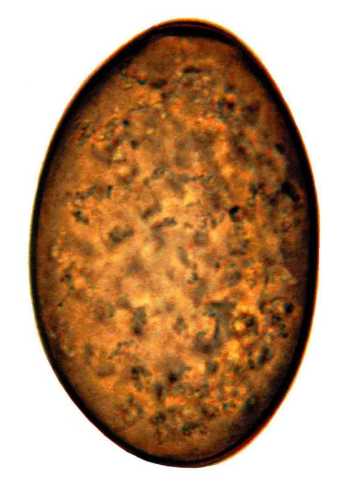

要成分为非班太尔、吡喹酮和双羟萘酸噻嘧啶,不宜给体重在两磅(1磅≈0.45 kg,全书同)以下或者出生未满3周的幼犬使用]。

宠绦清(Cestex®,主要成分为依西太尔,不宜给出生未满7周的幼犬使用)。

重生特犬用驱绦虫片(Droncit® Canine Cestocide Tablets,主要成分为吡喹酮,不宜给出生未满 4 周的幼犬使用)。

重生特犬猫用驱绦虫注射剂 ( Droncit® Injectable Cestocide for Dogs and Cats, 主要成分为吡喹酮 ) 。

#### 犬钩口线虫(Ancylostoma caninum)

犬的常见钩虫(致病性最强)。经皮肤或乳汁感染。

**发育周期**:幼犬最早在出生后两周就可以排出虫卵(经乳汁感染)。

诊断:虫卵细长椭圆形(长60 µm),粪中薄壳虫卵(8个分裂细胞阶段)很难与巴西钩口线虫相区分。钩口属虫卵比弯口属虫卵小。粪中的虫卵发育、孵化成第一期幼虫(长300~340 µm),食道短,基部有食道球,有一个小的生殖原基(与类圆属线虫比较)。在粪便中可以找到虫卵。

成虫寄生部位: 小肠。

近似种: 巴西钩口线虫。

分布:世界各地。

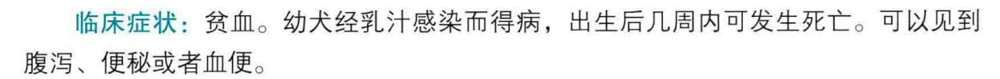

治疗: 立即给贫血幼犬输血,然后驱杀成虫。困居在组织中的幼虫不断游出并定植于肠道发育为成虫。因此,在治疗后两周收集的粪便样品中还可以见到新的虫卵。这种形式的再定植及发育可持续数月至数年。标签剂量下可清除成虫感染的药物如下。

线虫清,或称尼美克斯 (Nemex®)。

22.2% 胖可求颗粒 ( Panacur® Granules 22.2% )。

拜宠清(台湾称内虫逃)(Drontal® Plus,不宜给出生未满 3 周或体重在两磅以下的幼犬使用)。

犬心保(Heartgard® Plus,不宜给出生未满6周的幼犬使用)。 拦截者(Interceptor®,不宜给出生未满6周的幼犬使用)。

鞭蛔清 (Sentinel™,不宜给出生未满 4 周或体重在两磅以下的幼犬使用)。

鞭蛔清风味片(Sentinel® Flavor Tabs®,不宜给出生未满4周或体重在11磅以下的幼犬使用)。

犬用双羟萘酸噻嘧啶片 [Pyrantel pamoate Tablets, 兽药字 (2016) 020161048] (译者加)。

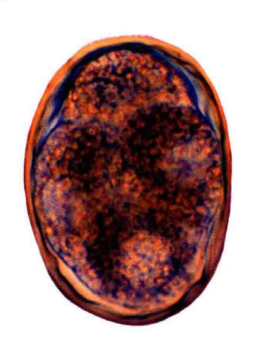

# 巴西钩口线虫(Ancylostoma braziliensis)

犬/猫的常见钩虫,分布于南大西洋海岸和加勒比海。经皮下和摄入转续宿主而感染。

发育周期:两周。

诊断: 粪便中的薄壁虫卵(处于8细胞阶段)细长,椭圆形(长60μm),难与犬钩口线虫虫卵相区分(注:钩虫科下分钩口属 Ancylostoma、板口属 Necator和弯口属 Uncinaria)。钩口属线虫的虫卵比弯口属线虫的虫卵小。粪中的虫卵发育和孵化出的第一期幼虫(长300~340μm)食道短并有基部食道球,有一个小的生殖原基(与类圆属线虫相比较)。

成虫寄生部位:小肠。

近似种: 犬钩口线虫。

分布: 南大西洋海岸和加勒比海。

**临床症状**: 贫血, 但巴西钩口线虫感染导致的失血 少于犬钩口线虫, 因此不太可能引起急性疾病。

潜在的人兽共患病: 在美国东南部和加勒比群岛有 皮肤幼虫移行症的发生。

治疗: 困居在组织中的幼虫不断游出并定植于肠道发育为成虫。因此,在治疗后两周收集的粪便样品中还可以见到新的虫卵。标签剂量下可清除成虫感染的药物如下。

线虫清,或称尼美克斯(Nemex®,主要成分为:噻嘧啶,又称为双羟萘酸噻嘧啶 Pyrantel pamoate)。

22.2% 胖可求颗粒 ( Panacur® Granules 22.2%, 主要成分为芬苯达唑 )。

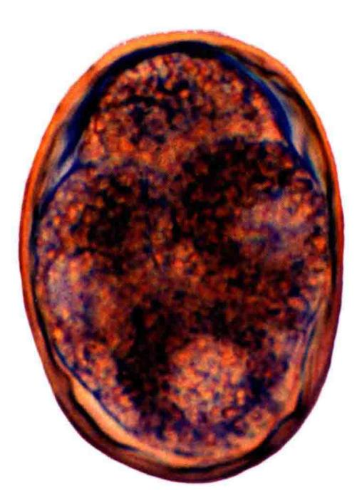

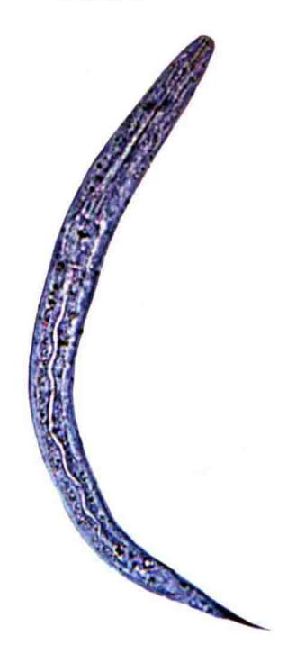

拜宠清(台湾称内虫逃)(Drontal® Plus,不宜给出生未满3周或体重在两磅以下的幼犬使用)。

犬心保(Heartgard® Plus,主要成分为伊维菌素、双氢萘酸噻嘧啶,不宜给出生未满 6 周的幼犬使用)。

拦截者(Interceptor®, 主要成分为米尔贝肟 Milbemycin oxime, 不宜给出生未满 6 周的幼犬使用)。

鞭 蛔 清 (Sentinel ™, 主 要 成 分 为 米 尔 贝 肟 Milbemycin oxime、 氯 芬 奴 隆 Lufenuron,不宜给出生未满 4 周或体重在两磅以下的幼犬使用)。

鞭蛔清风味片(Sentinel® Flavor Tabs®,主要成分为氯芬奴隆,不宜给出生未满4周或体重在11磅以下的幼犬使用)。

#### 犬巴贝斯虫(Babesia canis)

大型巴贝斯虫,寄生于犬红细胞内, 通过蜱叮咬传播。

发育周期: 1~3周。

诊断: 在红细胞内找到滋养体和配子体。

寄生部位:红细胞内。

近似种: 吉氏巴贝斯虫, 在红细胞内的虫体比犬巴贝斯虫小。

分布: 世界各地。

临床症状:在美国,感染犬通常无症状(灵缇犬)。南非虫株致病性较强。急性典型症状为发烧、嗜睡、急性贫血。最急性病例出现高血压性休克、缺氧,罕见血管瘀滞(幼犬),常致死。急性病例出现溶血性贫血、血小板减少、淋巴结肿大、脾肿大,症状可能因并发立克次氏体感染而变得复杂。

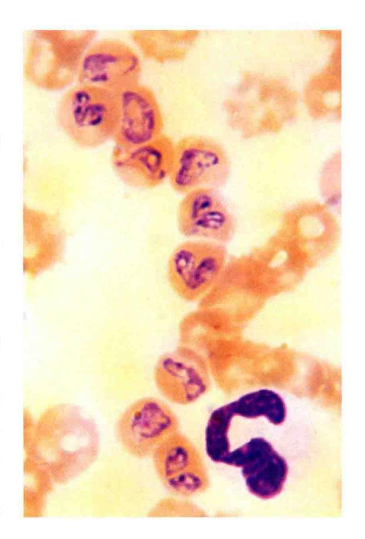

治疗:有一个批准的产品。

咪多卡(Imizol®, 主要成分为二丙酸双咪苯脲 imidocarb dipropionate; 7.5 mg/kg, 肌肉注射 1 次或两周时再重复用药 1 次)。

贝尼尔(Berenil®, 二乙酰胺三氮脒; 3.5 mg/kg, 肌肉注射 1 次; 注意在美国购买不到)。

氧二苯脒 / 非那米丁 (Phenamidine®, 羟乙基非那米丁; 15 mg/kg, 皮下注射, 每 24 小时用药 1 次, 连用两天; 注意在美国购买不到)。1% 台盼蓝 (10 mg/kg, 静脉注射, 1 次)。

支持疗法:全血或袋装红细胞输血,治疗休克(补充液体)。

#### 吉氏巴贝斯虫(Babesia gibsoni)

小型巴贝斯虫,寄生于犬红细胞内,通过蜱叮咬而传播。

发育周期: 1~3周。

诊断: 在红细胞内找到滋养 体和配子体。

寄生部位:红细胞内。

近似种: 犬巴贝斯虫, 红细胞内的虫体比吉氏巴贝斯虫大。

分布:世界各地。美国西南部,该病见于斗牛犬。

临床症状: 比犬巴贝斯虫致病性更强。急性典型症状为发烧,嗜睡,急性贫血。最急性病例出现高血压性休克,缺氧,罕见血管瘀滞(幼犬),但常致死。急性病例出现溶血性贫血,血小板

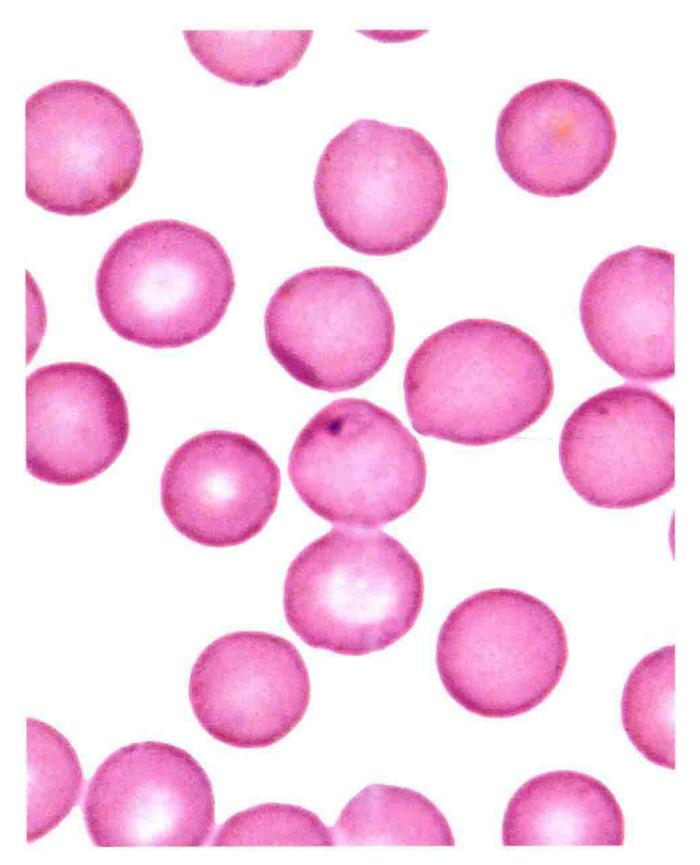

减少,淋巴结肿大,脾肿大。症状可能因并发立克次氏体感染而变得复杂。

治疗: 有一个批准的产品。

咪多卡(Imizol®, 主要成分为二丙酸双咪苯脲; 7.5 mg/kg, 肌肉注射, 1 次或两周时再重复用药 1 次)。

贝尼尔(Berenil®,二乙酰胺三氮脒;3.5 mg/kg,肌肉注射 1次;注意在美国购买不到)。

氧二苯脒/非那米丁(Phenamidine®, 羟乙基非那米丁; 15 mg/kg, 皮下注射 1次, 24 小时 1次, 连用两天; 注意在美国购买不到)。1% 台盼蓝(10 mg/kg, 静脉注射, 1次; 对吉氏巴贝斯虫的功效未知)。

支持疗法:全血或袋装红细胞输血,治疗休克(补充液体)。

#### 结肠小袋纤毛虫(Ballatidium coli)

犬粪便中可见大的有纤毛的滋养体和包囊,犬 通过摄食感染性包囊而感染。

发育周期:两周。

诊断: 粪中的滋养体和包囊。具纤毛的滋养体较大(长可达 150 µm), 卵圆形, 胞口位于窄端, 有两个细胞核(一个大, 呈豆形; 另一个小, 呈球形)。包囊呈球形, 40 ~ 60 µm 宽, 囊壁较薄而透明。刚好在囊壁的下方能看到代表滋养体表面纤毛的条纹。

寄生部位: 盲肠和结肠肠腔内; 能够引起溃疡。

近似种:无。

分布: 世界各地。

**临床症状**: 犬少见。犬若发生该病,出现水样腹泻和肠道溃疡。已被证明具有致命性。

潜在的人兽共患病: 犬可能从其他哺乳动物感染。在处理犬的排泄物时必须做好个人日常防护。

治疗: 没有被批准的药物。

甲硝唑、呋喃唑酮和四环素(疗效不佳)已在 人医应用,对犬或许有效。

灭滴灵(福莱吉, Flagyl®)口服片(甲硝唑: 25 mg/kg, 口服,每 12 小时 1 次,连用 5 天)。

强力霉素 (Vibramycin®) 胶囊 / 片剂 / 口服糖

浆或悬液,或罗那克森(Ronaxan®)片(多西环素:5 mg/kg,口服,每12 小时1次,连用21天)。

得米先 (Terramycin®) 胶囊 (氧四环素: 22 mg/kg, 口服, 每 8 小时 1 次, 连用 14 天)。

痢特灵(Furoxone®)片/口服液(呋喃唑酮:5 mg/kg,口服,每小时1次,连用1周)。

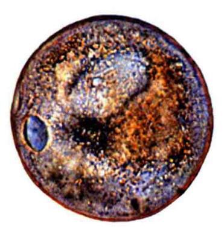

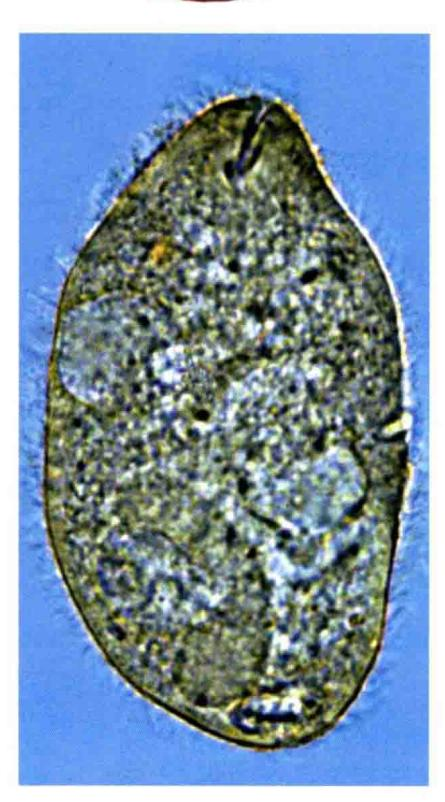

# 浣熊贝蛔线虫(Baylisascaris procyonis)

浣熊蛔虫, 犬可偶尔感染其成虫。浣熊和蜜熊常见。

发育周期:两个月。

诊断: 粪中的虫卵椭圆形(长70 µm),直径比弓首蛔虫、狮弓蛔线虫稍小,黑色,卵壳外部粗糙(无凹点)。

成虫寄生部位:小肠。

近似种: 其他种的贝蛔线虫 见于臭鼬和熊。

分布: 遍及美国北部和中部。 该病通过引进浣熊被带到欧洲。

**临床症状:** 犬感染成虫时无症状。

潜在的人兽共患病:内脏和 眼部游走性幼虫病,伴有严重的 神经系统疾病和死亡。

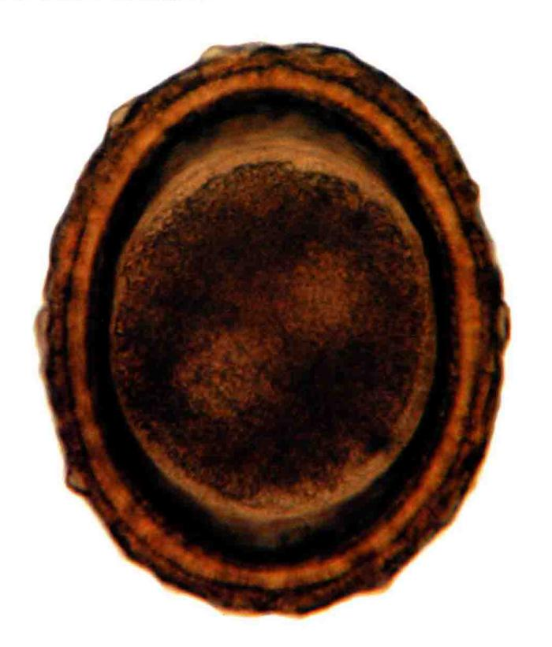

治疗:没有被批准的药物,但经典治疗蛔虫的药物有效。多种药品可供使用,具体参考药品标签说明书。

线虫清,或称尼美克斯 (Nemex®)。

22.2% 胖可求颗粒 ( Panacur® Granules 22.2% )。

拜宠清(台湾称内虫逃)(Drontal® Plus,不宜给出生未满3周或体重在两磅以下的幼犬使用)。

犬心保(Heartgard® Plus,不宜给出生未满 6 周的幼犬使用)。

拦截者(Interceptor®, 不宜给出生未满 6 周或体重在两磅以下的幼犬使用)。

鞭蛔清(Sentinel™,不宜给出生未满4周或体重在两磅以下的幼犬使用)。

鞭蛔清风味片(Sentinel® Flavor Tabs®,不宜给出生未满 4 周或体重在 11 磅以下的幼犬使用)。

# 牙氏姬螯螨 (Cheyletiella yasguri)

犬的一种(抓握)毛发螨,通过直接接触感染。

诊断:通过粪便或皮肤 刮取物检查可以确诊该病。 螨长500~600µm,有足 8条,在前端有强有力的须 肢。虫卵较大,黏附于毛发。 在粪便中,虫卵的一端有突 出部分(胶性物余痕)。

成虫寄生部位:毛发。

近似种:无。

分布:世界范围。

临床症状: 无症状或轻 微皮炎。可以通过正常犬的 皮肤刮取物和粪便发现螨。

潜在的人兽共患病:人 在处理犬姬螯螨时可能引发 一过性病变。

治疗:除虫菊素或苄氯 菊酯的浸液、液雾剂、气雾 剂都可以用于治疗该病。

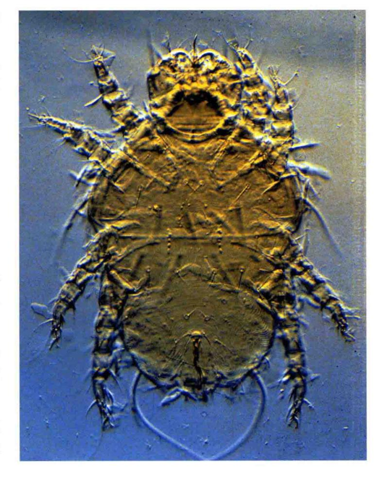

滴必除犬用杀虫剂 (Defend® Exspot® Insecticide for dogs) (苄氯菊酯)。 福来恩滴剂(Frontline® Top Spot®)适用于成年犬及幼犬(非泼罗尼,或称氟虫腈)。

#### 狐环棘线虫(Crenosoma vulpis)

犬的肺线虫,寄生于终末细支气管。犬通过摄入被感染的蜗牛或蛞蝓而引起感染。自然宿主:狐狸和浣熊。

发育周期: 3周。

诊断: 幼虫(长275 μm)随粪便或沿气管壁的分泌物排出。幼虫: 食道长(1/2 体长),尾尖。与类丝虫属幼虫相比,该幼虫呈C形, 头尖。

成虫寄生部位:气管、支气管和细支气管腔内。

近似种:有5种线虫的幼虫能在犬粪中发现,包括:粪类圆线虫(Strongyloides stercoralis)、欧式类丝虫(Filaroides osleri)、褐氏类丝虫(Filaroides hirthi)、狐环棘线虫(Crenosoma vulpis)、孵化的钩口线虫(Ancylostoma)幼虫。

分布:世界各地。

临床症状:运动引起的咳嗽。X线胸片可能显示有明显的细支气管间质型影像。

治疗:没有被批准的药物。有效的治疗方案如下。

胖可求 (Panacur®) (芬苯达唑:

50 mg/kg, 口服, 每 24 小时 1 次, 连用 3 ~ 7 天)。

害获灭(Ivomec®)(伊维菌素: 0.2~0.4 mg/kg,口服,1次,两周时再重复1次)。

左旋咪唑(8 mg/kg,口服,1次,两周时再重复1次)。 强的松(Prednisone 0.5 mg/kg,每 24 小时1次,连用5天)。

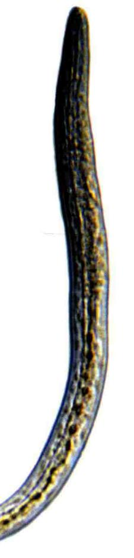

# 微小隐孢子虫 (Cryptosporidium parvum)

微小的球虫, 犬通过摄 入卵囊而感染。排出体外的 虫体即具有传染性。

发育周期:5~7天。

诊断: 粪中卵囊(直径 5 µm)呈球状,用蔗糖漂浮 法容易检查到。

寄生部位: 小肠黏膜。

近似种:无。

分布: 世界各地。

临床症状:通常无症状。 有其他免疫抑制疾病的犬可 能发生严重腹泻。

潜在的人兽共患病:不 清楚多少人感染过犬基因型 的微小隐孢子虫,但可以确 定犬粪中的卵囊对人类有传染性。

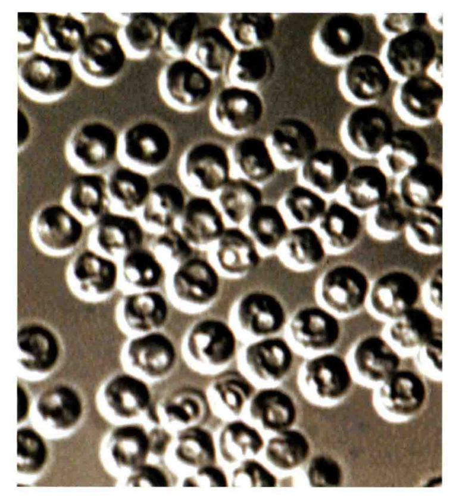

治疗:没有被批准的药物。巴龙霉素(Paromomycin)有效,但在用于年幼的犬和严重腹泻犬时一定要谨慎。在一例猫的病例治疗中,据报道泰乐菌素(Tylosin)有效。

隐虫停(Humatin®)(巴龙霉素: 125~165 mg/kg,口服,每12 小时1次,连用5天)。注意:如果胃肠道发炎,那可能是药物被吸收入血,引起氨基糖苷源性肾病。

泰农(Tylan®)可溶粉(泰乐菌素,100g包装,3g/茶匙量),猫适用剂量:11 mg/kg,口服,每12小时1次,连用4周。

#### 犬蠕形螨 (Demodex canis)

犬的毛囊螨,通过直接接触感染。

诊断:可以通过皮肤 刮片或粪便检查确诊。蠕形 螨和虫卵都细长。蠕形螨长 200~300 µm,体细长, 前端有非常短的腿。卵细长, 长 150 µm。

寄生部位:毛囊。

近似种:无。

分布:世界各地。

临床症状: 常常无症状。正常犬通过刮片和分泌物检查也能发现蠕形螨。可能出现局部脱毛或者全身性脱毛,毛囊炎,继发性细菌感染。

潜在的人兽共患病:人 在处理犬蠕形螨病时,可能 发生一过性病变。

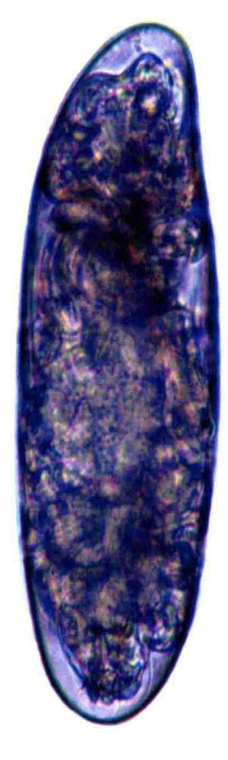

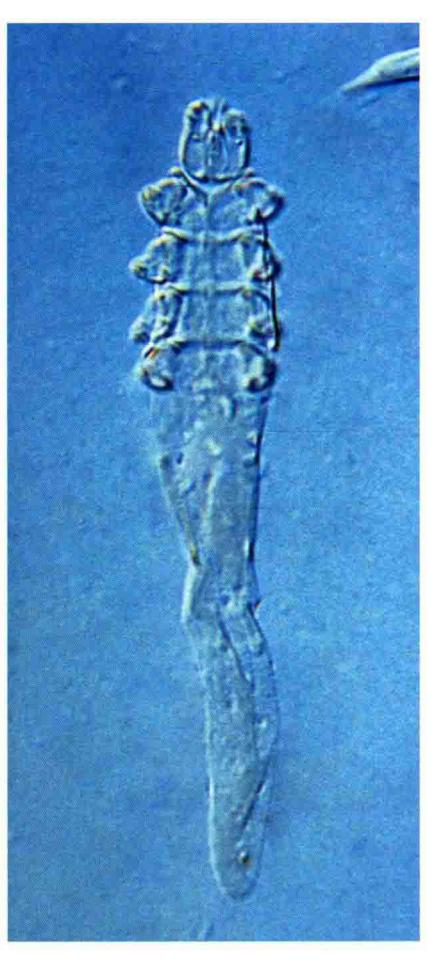

治疗:双虫脒(Mitaban®)是唯一被批准的药物。增强剂量的阿维菌素常用在有遗传倾向的患犬。

双虫脒 (Mitaban®) (标注剂量)。

拦截者(Interceptor®,每天2 mg/kg体重,直到完全清除),不宜用于体重不足21 磅或初生不足6 周的幼犬。

害获灭(伊维菌素:每天 0.3~0.6 mg/kg,直到完全清除,可能花费几年时间)。

# 猫栉首蚤 (Ctenocephalides felis)

猫和狗常见的跳蚤。

诊断: 成虫1~3 mm, 深棕色至黑色, 颊颈部有 梳状线(厚鬃毛线), 侧 面扁平, 6 条腿。

成虫寄生部位:被毛。 虫卵和幼虫主要存在于垫料 上。为犬复孔绦虫的传播媒介——当跳蚤还是幼虫的时 候被感染。

近似种: 犬啮毛虱 (*Trichodectes canis*)、猫羽 虱(*Felicola subrostratus*)。

分布: 世界各地。

临床症状:通常无症状。感染数量较多时出现 贫血。

潜在的人兽共患病:猫 栉首蚤的粪便可能传播猫抓热。

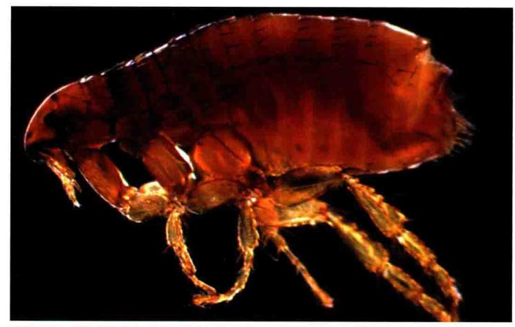

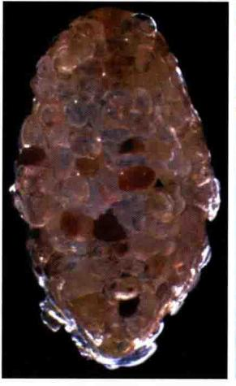

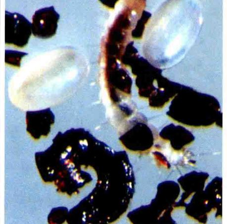

治疗: 拔除虫体后清洗患部。特别严重的感染需要输血。

#### 口服

诺普星(Capstar®)(主要成分为: 烯啶虫胺 Nytenpyram)。

诺扑蚤风味片(Program® Flavor Tabs®)。主要成分为虱螨脲(氯芬奴隆, Lufenuron)。

鞭蛔清风味片(Sentinel® Flavor Tabs®,主要成分为氯芬奴隆和米尔贝肟)。 宝来威(Bravetor)(译者加)。

#### 滴剂

K9 拜宠爽(K9 Advantix™,主要成分为吡虫啉和二氯苯醚菊酯,不能用于猫!)

蚤安(Advantage,主要成分为吡虫啉)。

亚当斯(Adams™)犬用蚤蜱控滴剂(百灭宁,苄氯菊酯)。

福来恩滴剂(Frontline®Top Spot®)成年犬和幼犬用杀虫剂(Fipronil:非泼罗尼,或称氟虫腈)。

大宠爱(Revolution)(Selamectin,塞拉菌素): 辉瑞大宠爱驱虫除蚤防螨虫滴剂。 喜克虫蚤蜱治30日(Scratchex®30 Day Flea and Tick Treatment)(百灭宁, 苄氯菊酯)。

威克大卵控滴剂 (Vet-Kem® Ovitrol Plus® Spot On®) 成年犬和幼犬专用蚤蜱控滴剂 [苄氯菊酯和(S)-甲氧普林]。

#### 颈圈

亚当斯双动力犬用蚤蜱驱避颈圈 [Adams ™ Dual Action Flea and Tick Collar, O-异丙甲基氨基甲酸酯, 3-苯氧基 -d-顺式 - 反式 -2, 2-二甲基 -3-(2-甲代丙烯基) 环丙烷, N-正辛基二环二甲酰亚胺]。

伴赛特(Bansect®)犬用蚤蜱驱避颈圈(二溴磷)。

快乐杰克®诺新™ ( Happy Jack® Novation ™ ) 犬用蚤蜱驱避颈圈(溴氰菊酯)。

哈茨二合一(Hartz® 2 in 1®)成年犬和幼犬用蚤蜱驱避颈圈(杀虫畏)。

长效杀 90 天 (Longlife® 90 Day™) 犬用颈圈 (杀虫畏)。

净除(Preventef®)犬用蚤蜱驱避颈圈(二嗪农)。

喜克虫犬用蚤蜱驱避颈圈(Scratchex® Flea and Tick Collers for dogs)(毒死蜱)。

#### 变异革蜱 (Dermacentor variabilis)

美洲犬蜱。从矮树和灌木丛黏附到犬的皮肤上。

诊断:常常见到成虫,3~15 mm,饱血后 扁平,豆形。在深色背景下,盾板有白色花斑, 眼睛位于盾板边缘,无肛前沟。若虫与小雌蜱相似。

寄生部位:皮肤。

近似种: 血红扇头蜱、肩突硬蜱。

分布:美国东部,西部各州有安德森革蜱。

临床症状:通常无症状。感染过多会引起贫血。

潜在的人兽共患病:直接接触时传播病原。 犬艾利希体病和落基山斑点热的传播媒介。

治疗:移除虫体——用酒精清洗伤口。

#### 滴剂

福来恩滴剂(Frontline®Top Spot®)成年犬和幼犬用杀虫剂(Fipronil:非泼罗尼,或称氟虫腈)。

K9 拜宠爽 (K9 Advantix ™) (吡虫啉和二氯 苯醚菊酯,猫禁用!)。

亚当斯(Adams™)犬用蚤蜱控滴剂(苄氯 菊酯)。

喜克虫蚤蜱驱避 30 天 (Scratchex® 30 Day Flea and Tick Treatment) (苄氯菊酯)。

威克大卵控滴剂 (Vet-Kem® Ovitrol Plus®

Spot On®) 成年犬和幼犬专用蚤蜱控滴剂 [ 苄氯菊酯和 (S) - 甲氧普林 ]。

#### 颈圈

亚当斯勇猛(Adams™ Delta Force™)犬用蜱驱避颈圈(溴氰菊酯)。

亚当斯双动力(Adams™ Dual Action) 大用蚤蜱驱避颈圈[O-异丙甲基氨基甲酸酯, 3-苯氧基 -d-顺式 - 反式 -2, 2-二甲基 -3-(2-甲代丙烯基)环丙烷, N-正辛基二环二甲酰亚胺]。

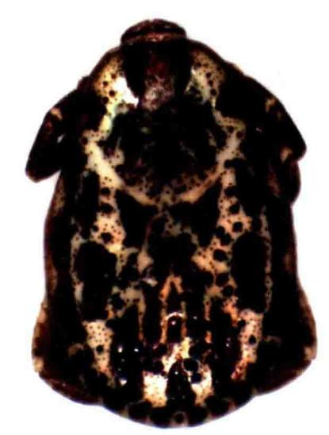

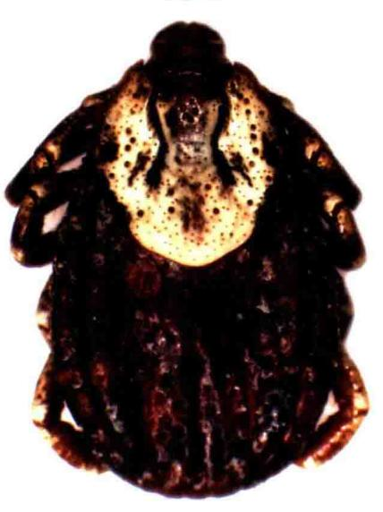

伴赛特(Bansect®)犬用蚤蜱驱避颈圈(二溴磷)。

快乐杰克诺新 ( Happy Jack® Novation ™ ) 犬用蚤蜱驱避颈圈 ( 溴氰菊酯 ) 。

哈茨二合一(Hartz® 2 in 1®)成年犬和幼犬用蚤蜱驱避颈圈(杀虫畏)。

长效杀 90 天 (Longlife® 90 Day™) 犬用颈圈 (杀虫畏)。

净除(Preventef®)犬用蚤蜱驱避颈圈(二嗪农)。

净除(Preventef®)犬用颈圈(双甲脒)。

喜克虫犬用蚤蜱驱避颈圈(Scratchex® Flea and Tick Collers for dogs) (Chlorpyrifos,毒死蜱)。

威克驱蜱(Vet-Kem® Tickaway™) 犬用蜱驱避颈圈(残杀威)。

# 隐存棘唇线虫(Dipetalonema reconditum)

犬的组织丝虫。通过跳蚤传播。

发育周期: 2~4个月。

诊断:检查血液中的微丝蚴。如果 血液循环中发现的是隐存棘唇线虫微丝 蚴,犬恶丝虫抗原检测应该为阴性。

寄生部位:全身结缔组织。

近似种:微丝蚴(长275 µm)常常与犬恶丝虫微丝蚴相混淆。隐存棘唇线虫微丝蚴的躯体中部比红细胞薄,头部钝圆,有一小钩。

分布:有犬和蚊子且非常温暖的地方(虫子在传播媒介——蚊子体内生长需要较高的温度)。

临床症状: 无症状。

治疗:无需治疗。重要的是,如果被误诊为犬恶丝虫病,会用不必要的砷制剂治疗。

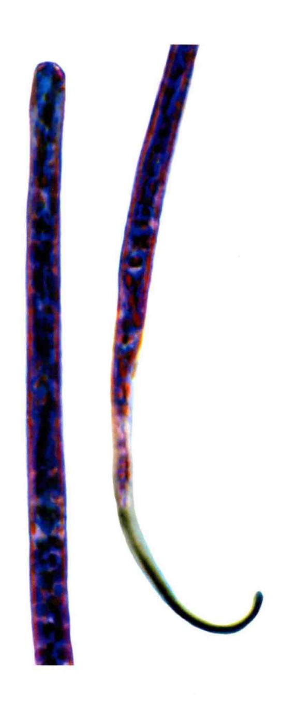

#### 宽节双叶槽绦虫(Diphyllobothrium latum)

犬的阔节绦虫,因食 入淡水鱼类获得感染。

发育周期: 5~6周。

诊断: 粪中虫卵(长 60 µm), 棕色, 细长, 一端有一个小卵盖, 内含 正在发育的幼虫细胞。虫 卵大小与犬钩口线虫虫卵 大小相当。

成虫寄生部位: 小肠。

近似种:世界各地能 够感染犬的外来近缘种。 虫卵与叠宫绦虫属的虫卵 非常相像。

分布: 北部淡水湖。

临床症状:无。

治疗:没有被批准的 药物。据报道吡喹酮有效 (7.5 mg/kg,口服,1次), 可按产品标签剂量给药。

拜宠清(台湾称内虫

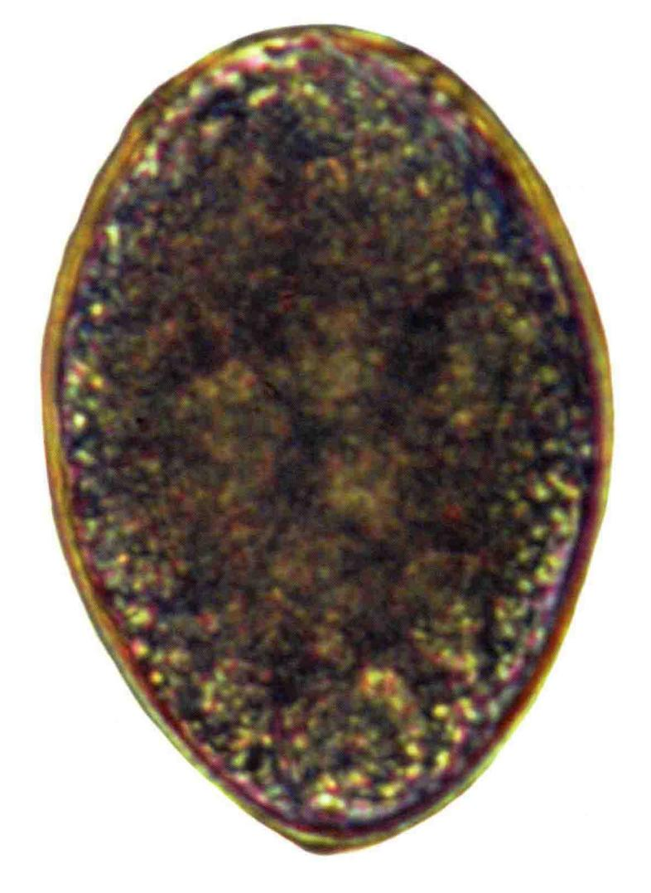

逃)(Drontal® Plus Tablets)(不宜给出生未满 3 周或体重在两磅以下的幼犬使用)。 宠绦清(Cestex®)(不宜给出生未满 7 周的幼犬使用)。

重生特犬用驱绦虫片(Droncit® Cestocide Tablets,不宜给出生未满4周的幼犬使用)。 重生特犬猫用驱绦虫注射剂(Droncit® Injectable Cestocide for Dogs and Cats)。

# 犬复孔绦虫(Dipylidium caninum)

犬(猫)的跳蚤绦虫,通过食入跳蚤获得。

发育周期: 3周。

诊断: 粪中检查到绦虫节片(长250~1000μm)或卵袋(2~30个虫卵/卵囊)。在节片两侧有生殖孔开口,内含卵袋。卵袋:大小差异很大,小的如弓首蛔虫虫卵大小(如果仅仅含有几个虫卵),大的有弓首蛔虫虫卵直径的2~3倍(如果含有30个虫卵)。

#### 成虫寄生部位:小肠。

近似种:犬粪中能找到的其他绦虫节片:豆状带绦虫(Taenia pisiformis,生殖孔只见于孕节一侧),而叠宫绦虫属(Spirometra)、双叶槽属(Diphyllobothrium)、中绦属(Mesocestoides)的所有种都是中央生殖孔。

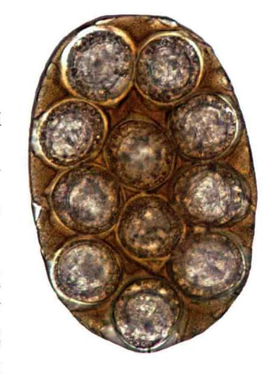

分布: 世界各地。

**临床症状**:无症状。有跳蚤感染的幼犬偶尔可见死于大量虫体引起的肠道阻塞。

潜在的人兽共患病:偶尔感染(如同犬一样),见于误食感染犬复孔绦虫跳蚤的儿童。通常没有症状,但在纸尿裤上能发现活动的节片。

治疗: 犬复孔绦虫准用药物为吡喹酮或依西太尔配制而成,按照标签剂量使用都是非常有效的(苯并咪唑类,如胖可求则不能清除复孔绦虫属感染)。

拜宠清(台湾称内虫逃)(Drontal® Plus Tablets)(不宜给出生未满3周或体重在两磅以下的幼犬使用)。

宠绦清(Cestex®)(不宜给出生未满7周的幼犬使用)。

重生特犬用驱绦虫片(Droncit® Canine Cestocide Tablets,不宜给出生未满 4 周的幼犬使用)。

重生特犬猫用驱绦虫注射剂 ( Droncit® Injectable Cestocide for Dogs and Cats ) 。 犬用双羟萘酸噻嘧啶片 [Pyrantel pamoate Tablets, 兽药字( 2016 )020161048]( 译者加 )。

#### 犬恶丝虫(Dirofilaria immitis)

犬心丝虫, 经蚊子传播。

发育周期: 7个月。

诊断:血液中发现微丝蚴或者通过抗原检测确定该病。带有成虫或多量微丝蚴的犬,抗原检测偶尔出现阴性,但总体来说与微丝蚴的查出符合率高。

寄生部位: 肺动脉和右心。

近似种:微丝蚴(长300 µm) 易与隐存棘唇线虫(Dipetalonema reconditum)的微丝蚴相混淆。犬恶 丝虫微丝蚴的躯体中部比红细胞稍宽, 头部逐渐变细,形成尖端。

分布:有犬和蚊子且非常温暖的地方;虫子在传播媒介——蚊子体内生长需要较高的温度。

临床症状:通常表现为呼吸系统症状,如咳嗽、呼吸急促、运动不耐受、昏厥、少有咳血。常常分

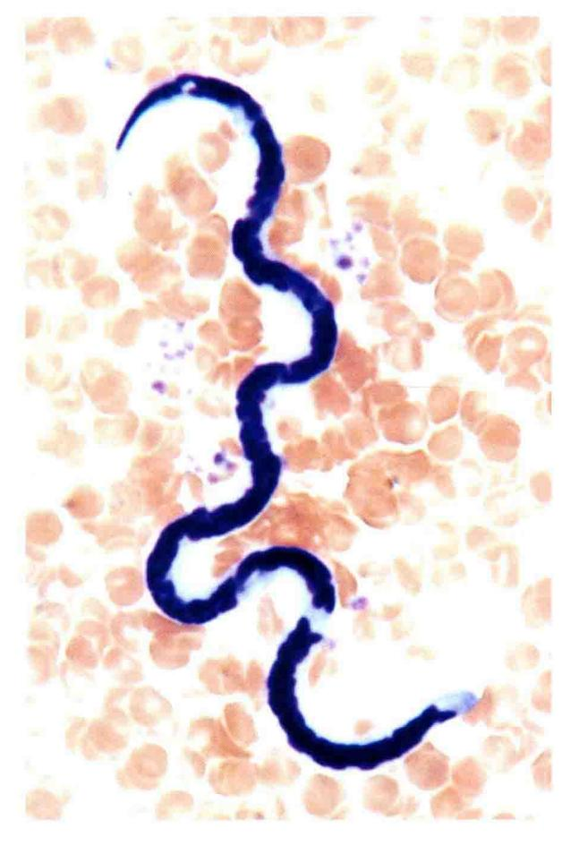

为 3 级: Ⅰ级: 无症状,没有影像学表现和贫血; Ⅱ级: 咳嗽,运动不耐受,贫血(20%~30%),影像学检查出现肺动脉扩张; Ⅲ级:心源性恶病质,休息时严重的咳嗽,右心衰竭症状(腹水),有严重右心衰的影像学征像,肺动脉扩张,血管栓塞引起肺浸润,严重的贫血(<20%)。

潜在的人兽共患病: 很少见, 人被蚊子叮咬后感染引起肺部结节。

治疗: 丝虫净(Immiticide®)(美拉索明盐酸盐: Ⅰ级和Ⅱ级: 2.5 mg/kg, 腰肌深部肌肉注射,每24小时两剂;如果4~6个月后抗原检测仍然阳性,必须重复用药。Ⅲ级: 先用阿司匹林、糖皮质激素、呋塞米稳定心衰,2.5 mg/kg,腰肌深部肌肉注射,1次,然后1个月内,2.5 mg/kg,腰肌深部肌肉注射,每24小时两剂)。

#### 细粒棘球绦虫(Echinococcus granulosus)

犬体内很小的绦虫, 通过食入被感染的反刍兽 (绵羊和驼鹿)的内脏而 感染。

发育周期:两个月。

诊断: 粪中虫卵(长 30~35μm)。如果给予泻 药(比较危险,因为虫卵 可以感染人),可以在粪 便中发现成虫(2mm)。

成虫寄生部位: 小肠。

近似种: 棘球属绦虫 的虫卵不能与带属绦虫的 虫卵区分开。

分布:绵羊(加利福尼亚州、亚利桑那州、新

墨西哥州、犹他州)、驼鹿、麋鹿的区域都能发现。

临床症状: 无症状。

潜在的人兽共患病:人因为在处理含有细粒棘球绦虫卵的犬粪时,误食虫卵而发生囊型包虫病。虫卵被犬排出体外时具有传染性。

治疗:可以选择的药物如下。

吡喹酮(100%有效)。

拜宠清(台湾称内虫逃)(Drontal® Plus Tablets)(不宜给出生未满3周或体重在两磅以下的幼犬使用)。

重生特犬用驱绦虫片(Droncit® Canine Cestocide Tablets,不宜给出生未满 4 周的幼犬使用)。

重生特犬猫用驱绦虫注射剂 ( Droncit® Injectable Cestocide for Dogs and Cats ) 。

# 多房棘球绦虫(Echinococcus multilocularis)

犬体内较小的绦虫, 通过食入感染的小型啮 齿动物而感染。

发育周期: 3周。

诊断: 粪中的虫卵 (长30~35μm)。 如果给予泻药(比较危险, 因为虫卵可以感染人), 可以在粪便中发现成虫 (2mm)。

成虫寄生部位:小肠。

近似种: 棘球属的虫 卵与带属绦虫的虫卵难以 区分。

**分布**:美国大多数地方少见。阿拉斯加州、横

穿加拿大,并延伸到美国中部野生犬科种群的区域。

临床症状: 无临床症状。

潜在的人兽共患病:人摄入虫卵会发生泡型棘球蚴病。虫卵被排出时具有传染性。 如不采取治疗措施,死亡率为 100%。

治疗: 首选药物是吡喹酮(100%有效)。在呈地方性流行地区的犬群内(阿拉斯加州等),应该每3周治疗1次。

拜宠清(台湾称内虫逃)(Drontal® Plus Tablets)(不宜给出生未满 3 周或体重在两磅以下的幼犬使用)。

重生特犬用驱绦虫片(Droncit® Canine Cestocide Tablets,不宜给出生未满 4 周的幼犬使用)。

重生特犬猫用驱绦虫注射剂 ( Droncit® Injectable Cestocide for Dogs and Cats ) 。

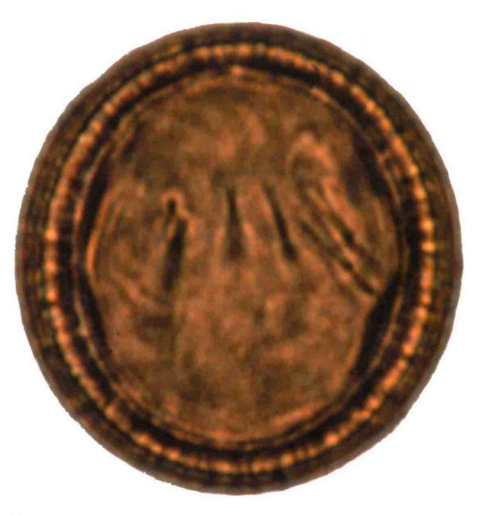

# 嗜气真鞘线虫(Eucoleus aerophilus)

常见的犬呼吸道毛细线虫。 其生活史为直接型或经蚯蚓传播。

发育周期: 3~5周。

诊断: 粪中的虫卵与犬鞭虫的相似,但要小些(长60 µm),卵塞常常偏离虫卵中轴一定的角度。卵壳表面具有微细的网状纹饰。

成虫寄生部位:肺和支气管 黏膜。

近似种:鼻窦内的勃氏真鞘 线虫(Eucoleus boehmi)。

分布:世界各地。

临床症状:哮喘,咳嗽,体 重增长停滞,慢性干咳。影像学 特征:弥漫性分布支气管周围及 间质。

治疗:无被批准的药物。在治疗后,成虫被杀死,虫卵随粪便排出可持续数周。可行的治疗方法如下。

胖可求 (Panacur®, 主要成分为芬苯达唑: 50 mg/kg, 连用3天), 延长治疗到1周或者每隔1周治疗1次,连续治疗两个月。

害获灭(Ivomec®, 1% 伊维 菌素注射剂: 0.2 mg/kg, 皮下注 射或者口服, 两周时重复给药 1次)。

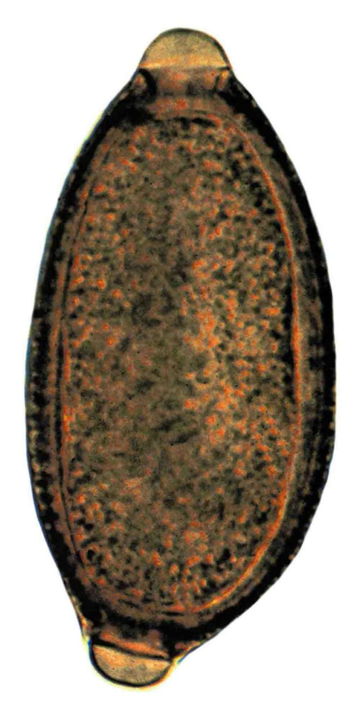

#### 勃氏真鞘线虫(Eucoleus boehmi)

犬鼻窦毛细线虫。生活史直接型或 以蚯蚓为转续宿主。

发育周期: 1个月。

诊断: 粪中的虫卵与犬鞭虫相似,但要小些(长60 µm),卵塞常常偏离虫卵中轴一定的角度。卵壳表面有细小的凹凸点。在排出体外时,勃氏真鞘线虫卵内有一个长卵形的胚胎,而嗜气毛细线虫的虫卵则只有一个单细胞。

成虫寄生部位:整个鼻黏膜。

近似种:寄生于支气管上皮组织中的 嗜气真鞘线虫(Eucoleus aerophilus)。

分布: 世界各地。

临床症状:无症状,但可能发生鼻炎(浆液性鼻分泌物、打喷嚏)。

治疗: 无被批准的药物。在治疗后, 成虫被杀死,虫卵随粪便排出可持续数 周。可行的治疗方法如下。

胖可求(Panacur®,主要成分为 芬苯达唑:50 mg/kg,连用3天),

延长治疗到 1 周或者每隔 1 周治疗 1 次,连续治疗两个月。

害获灭(Ivomec®, 1% 伊维菌素注射剂: 0.2 mg/kg, 皮下注射或者口服, 两周时重复给药)。

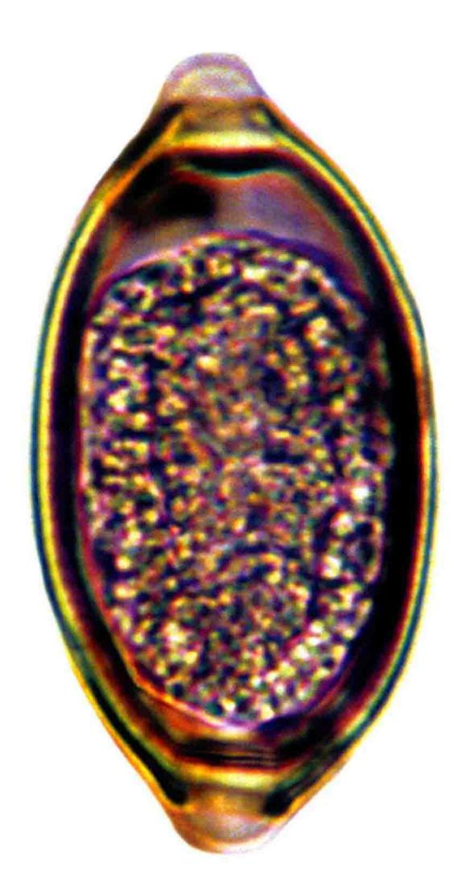

#### 褐氏类丝虫 (Filaroides hirthi)

犬肺实质寄生虫。常见于柯利牧 羊犬和玩具犬品种。粪便、唾液或呕 吐物中的幼虫已具感染性。

#### 发育周期:5周。

诊断:用硫酸锌漂浮法找到粪中幼虫(长225μm)即可确诊。食道长(占体长的1/2),尾端直尖。欧氏类丝虫(Filaroides osleri)在尾尖前有一个扭曲。胸部 X 线片:弥散性间质型。

成虫寄生部位: 贯穿于肺实质。

近似种: 犬粪中有5种线虫的幼

虫能够被查到,包括: 粪类圆线虫、欧氏类丝虫、褐氏类丝虫、狐环体线虫及已孵化的钩口线虫幼虫。

分布: 世界各地。

临床症状: 重度感染时咳嗽, 呼吸困难, 可能出现腹泻, 脱水。轻度感染时无症状。

治疗:无被批准的药物。阿苯达唑是可选择的药物,但安全系数小,犬不能持续给药超过5天。

肠虫清驱牛蠕虫悬浮剂 (Valbazen® Cattle Dewormer Suspension) (阿苯达唑: 11.36%的悬浮剂, 114 mg/mL): 25 mg/kg, 口服,每12 小时1次,连用5天(副作用:骨髓抑制)。

胖可求 (Panacur®, 主要成分为芬苯达唑: 50 mg/kg, 口服,每 24 小时 1 次,连用 14 天,并非所有的病例均可治愈)。

害获灭(Ivomec®)(1% 伊维菌素注射剂: 0.05 mg/kg,皮下注射,1次,两周时重复给药)。

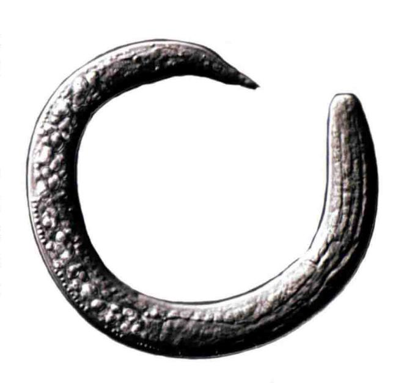

#### 欧氏类丝虫(Filaroides osleri)

犬的结节性肺寄生 虫。常见于柯利牧羊犬和 玩具品种犬。粪便、唾液 或呕吐物中的幼虫已具感 染性。

发育周期: 6个月。

诊断:通过支气管 镜检查在支气管分支处看 到结节,或者在呕吐物、 粪便或气管壁洗液中发现 第一期幼虫。用硫酸锌漂 浮法可找到粪中幼虫(长 250 µm)。食道长(占

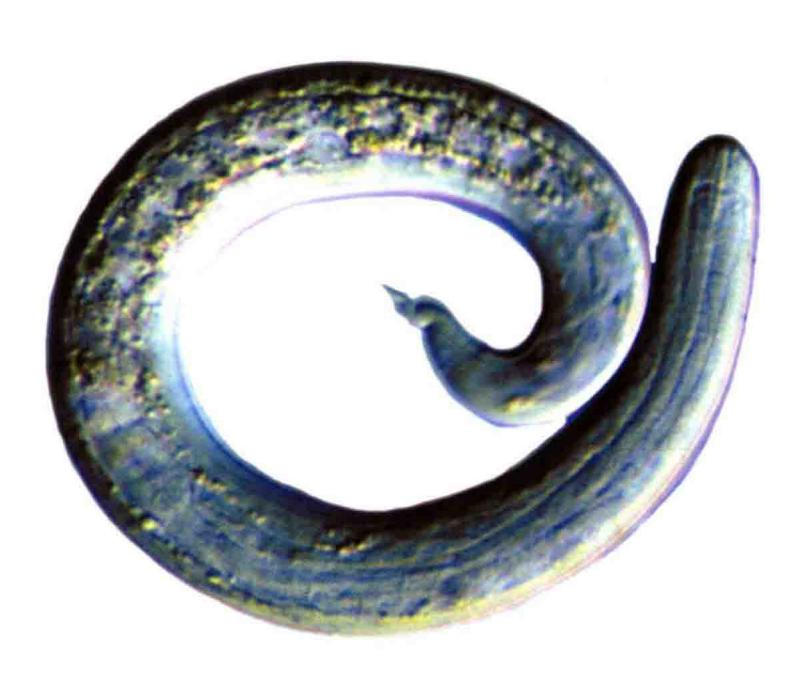

体长的 1/2), 在尾尖前有一个特征性扭曲。褐氏类丝虫尾端是直尖。

成虫寄生部位:气管末端和细支气管结节内。

近似种: 犬粪中有 5 种线虫的幼虫能够被查到,包括: 粪类圆线虫、欧氏类丝虫、 褐氏类丝虫、狐环体线虫、已孵化出的钩口线虫幼虫。

分布: 世界各地。

临床症状:运动性干咳,呼吸困难。

治疗: 无被批准的药物。用支气管镜去除结节。奥芬达唑(10 mg/kg,每24小时1次,连用28天)。强的松(去除结节后,0.5 mg/kg,每24小时1次,连用5天)。

#### 犬贾第虫 (Giardia canis)

犬粪中有鞭毛的滋养体和包囊,犬 通过摄入感染性包囊而感染。

发育周期: 5~7天。

诊断:发现粪中的滋养体和包囊。 滋养体在稀便中更为常见;呈网球拍或泪珠形(长10~17 µm)。有两个核,位于宽的一端,8根向后的鞭毛, 在生理盐水中能滑行运动。包囊(约长10 µm)常见于成形的粪便中,椭圆形, 清晰,含有4个核。

寄生部位:小肠黏膜(表面)。

近似种:滋养体需要与五鞭毛滴虫属(Pentatrichomonas)加以区分。包囊容易与肉孢子虫属的孢子囊和球虫卵囊相混淆。

分布: 世界各地。

**临床症状**:通常没有症状,但能发生小肠性腹泻,腹泻物脂肪含量常高。

潜在的人兽共患病: 贾第虫能传染给人, 但人通常是从其他人而感染。当处理犬类粪便时, 需要做好日常预防措施。

治疗:没有被批准的药物。苯并咪唑现在用得最为广泛。芬苯达唑(胖可求)按驱蠕虫的剂量给药也是有效的。拜宠清和阿苯达唑也使用过。

22.2% 胖可求颗粒 ( Panacur® Granules 22.2% )。

拜宠清(台湾称内虫逃)(Drontal® Plus tablets)按照标定的剂量,每日治疗, 连用3天)。不用于体重低于两磅或出生不足两周的幼犬。

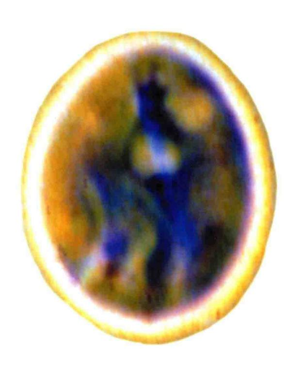

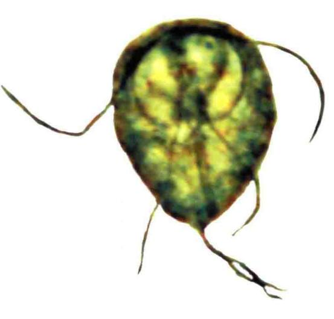

肠虫清驱牛蠕虫悬剂 (Valbazen® Cattle Dewormer Suspension) (阿苯达唑: 11.36%的悬剂, 114 mg/mL。剂量: 25 mg/kg, 1 天两次, 连用 2 ~ 3 天; 副作用: 骨髓抑制)。

灭滴灵(福莱吉, Flagyl®)口服片(甲硝唑: 25 mg/kg, 口服,每 12 小时 1 次,连用 5 天,67% 有效)。

疟涤平(Atabrine®)口服片(阿的平: 6.6 mg/kg,口服,每 12 小时 1 次,连用 5 天, 100% 有效,但 50% 出现嗜睡、发热等副作用)。

# 哈氏哈蒙德球虫(Hammondia heydorni)

犬的小型球虫,通过食入感染的 兔、绵羊或者其他非啮齿类哺乳动物 而感染。卵囊不能直接感染犬。

发育周期:7~8天。

诊断: 粪便中的卵囊清晰, 未孢子化, 圆形至卵圆形(长10~13 µm)。

寄生部位:小肠黏膜。

近似种: 卵囊不能与犬新孢子虫的卵囊区分开。

分布: 世界各地。

临床症状: 无症状。

治疗:没有批准的药物。按照弓形虫病的治疗措施可能有效。

安蒂洛(Antirobe®)胶囊或者口服液,或者氯林可霉素(Cleocin®)注射液(克林霉素,Clindamycin:10~20 mg/kg,口服,肌肉注射,每12 小时 1 次,连用两周)。

畜必生(Tribrissen®)片(磺胺嘧啶-甲氧苄氨嘧啶: 15 mg/kg, 口服,每12小时1次,连用14天)。

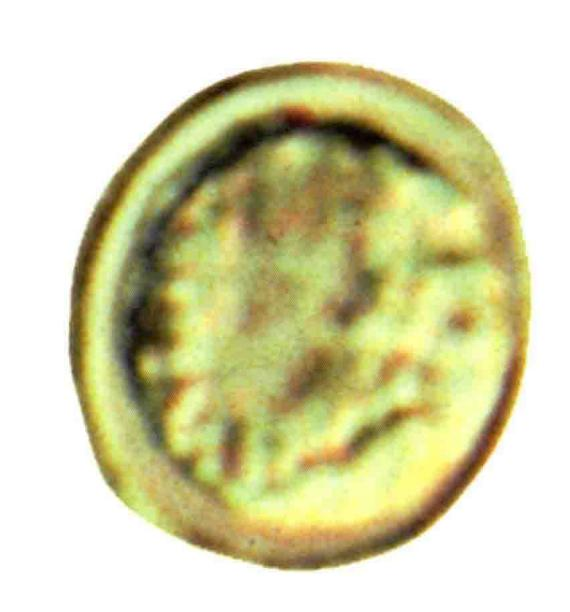

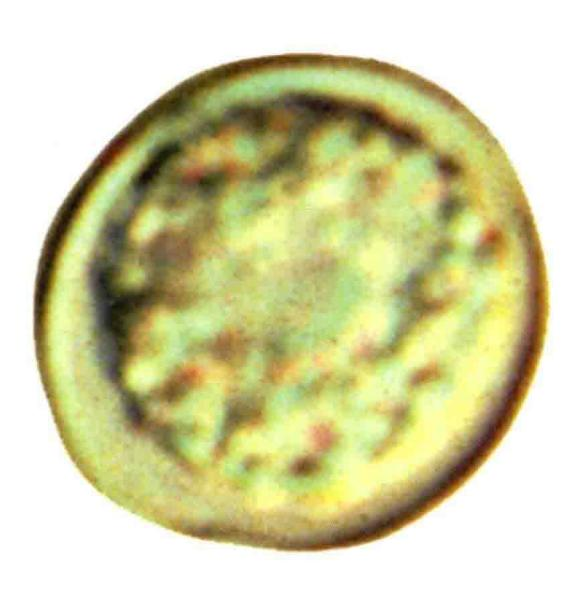

#### 美洲肝簇虫(Hepatozoon americanum)

美国地区犬的肝簇虫,通过采食被感染的蜱而感染。

发育周期: 1~3周。

诊断:中性粒细胞中的配子体,或是 肌肉活检时能够看到的大裂殖体。根据典 型临床症状和影像学检查,嗜中性白细胞 显著升高、在组织中发现虫体可做出诊断。

**寄生部位**:中性粒细胞;裂殖体见于骨骼肌(特别大的包囊)。

近似种:在世界上其他地区,犬肝簇虫(Hepatozoon canis)引起的多为慢性疾病,裂殖体见于多个器官。

分布: 世界各地。

临床症状:消瘦,发热(对抗生素无

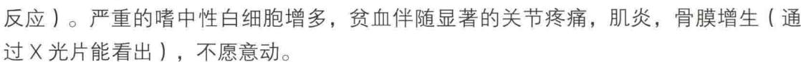

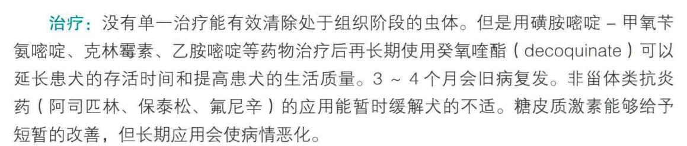

畜必生(Tribrissen®)片(磺胺嘧啶-甲氧苄氨嘧啶: 15 mg/kg,口服,每 12 小时 1 次,连用两周)。

安蒂洛(Antirobe®)胶囊或者口服液(克林霉素: 10 mg/kg,口服,肌肉注射,每8小时1次,连用两周)。

达拉匹林 (Daraprim®) 25 mg 口服片 (乙胺嘧啶: 0.25 mg/kg, 口服, 每 24 小时 1 次, 连用两周)。

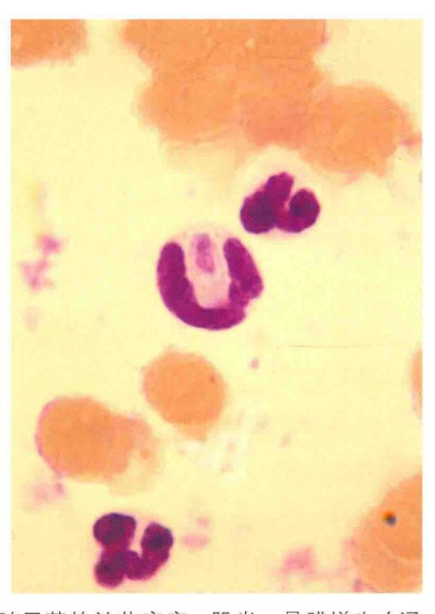

#### 美洲异毕吸虫 (Heterobilharzia americanum)

犬的血液吸虫,通过尾 蚴穿透犬皮肤而引起感染。

发育周期:两周。

诊断: 粪中虫卵相对较圆,直径约80 µm,棕色,内含发育的毛蚴。收集至水中的虫卵会孵化出幼虫。超声检查可以揭示肝门静脉系统的纤维化。

成虫寄生部位: 肠系膜静脉和肝门静脉。

近似种:东南亚地区 的犬可能感染日本血吸虫。

分布:美国东南部。

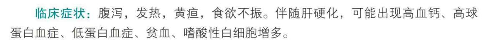

治疗:没有被批准的药物。高剂量的吡喹酮有效。

重生特犬用驱绦片(Droncit® Canine Cestocide Tablets)(吡喹酮; 40~50 mg/kg,口服,1次,然后每月重复1次,连用数月直至虫卵消失)。不宜用于4周龄以下的幼犬。

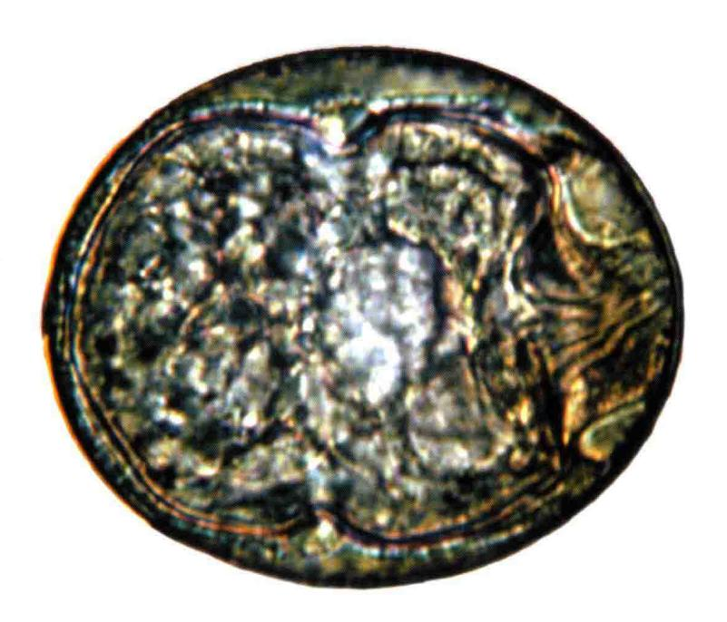

#### 犬等孢球虫(Isospora canis)

犬的大型球虫,犬摄入孢子 化卵囊或者从感染的啮齿动物而 感染。

发育周期: 9~11天。

诊断: 鲜粪中的卵囊,壁光滑,卵圆形,40 μm×30 μm,新鲜排出时含有一个孢子母细胞。

寄生部位: 小肠远端 1/3 处。

近似种: 卵囊大,容易与犬的其他球虫区分开。

分布: 世界各地。

临床症状:腹泻。可能出现血便。

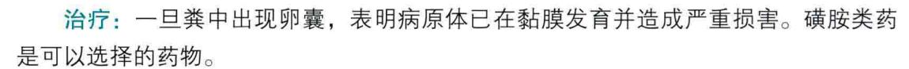

畜必生 (Tribrissen®) 片 (磺胺嘧啶 – 甲氧苄氨嘧啶: 30 mg/kg, 口服, 每 12 小时 1 次, 连用 5 天)。

阿尔邦(Albon®)(磺胺二甲氧嘧啶:50 mg/kg,口服,每24小时1次,连用1~3周)。 普里莫尔(Primor®)(磺胺二甲氧嘧啶-奥美普林:66 mg/kg,口服,每24小时1次,连用1~3周)。

科瑞德(Corid®)[氨丙啉: 1.25% 口服粉碎料, 9.6% 溶液, 20% 可溶性粉剂: 总剂量 100 mg(体重低于 10 kg 以下的幼犬)或者 200 mg(体重大于 10 kg 的幼犬),口服,每 24 小时 1 次,连用 1 ~ 2 周]。如果添加到食物中(母犬和幼犬),按照 250 ~ 300 mg 的总量,制成 20% 的粉末添加到食物中,饲喂两周。如果添加到水中,30 mL 9.6% 的溶液加入 3.8 L(1 加仑)水中,饮用两周,期间不让其饮用其他水源水。

2.5% 百球清 (Baycox®) 口服液 (妥曲珠利: 10 mg/kg, 口服, 1 次, 或者拌料 饲喂  $2 \sim 6 \text{ 天}$ )。不应用于出生在 3 周龄以下的幼犬。

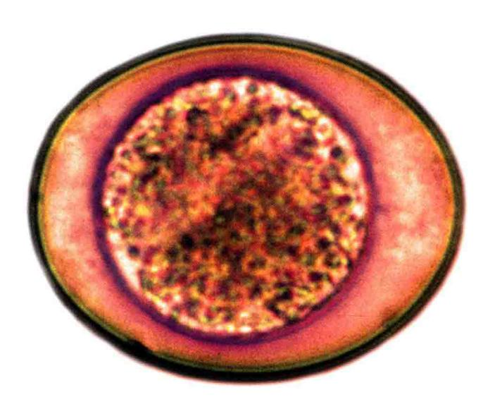

# 俄亥俄等孢球虫,伯氏等孢球虫和新里沃特等孢子球虫 (Isospora ohioensis, I. burrowsi and I. neorivolta)

犬的中等大小球虫。犬通过摄入孢子化卵囊或者被感染的啮齿类动物而被感染。

发育周期: 6~7天。

诊断: 粪中卵囊清晰, 椭圆形, [(17 ~ 27) μm× (16 ~ 23) μm]。

寄生部位:俄亥俄等孢 球虫裂殖体寄生于空肠肠细 胞内,配子体寄生于小肠、 盲肠、结肠的上皮细胞内; 伯氏等孢球虫裂殖体和配子 体寄生于小肠远端 3/5 处的 固有层内;新里沃特等孢子 球虫寄生于小肠后段 1/2 处 的固有层内。

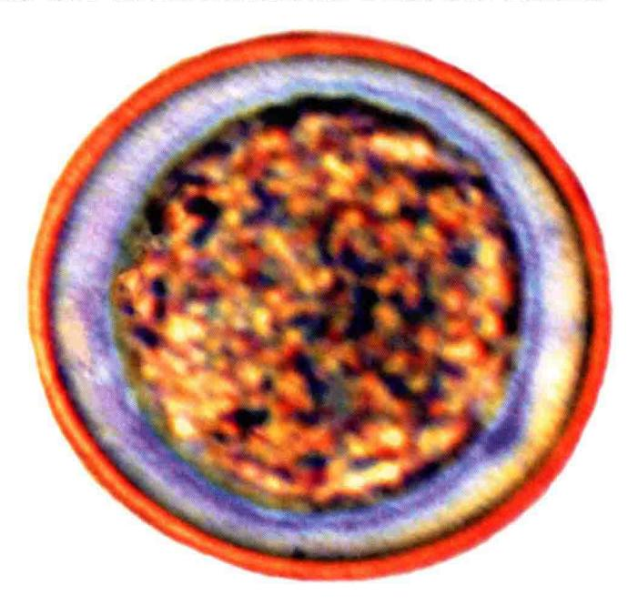

近似种:根据卵囊的形态学观察不能区别这三种球虫。需将其与具有潜在人兽共 患病重要性的更小寄生虫相区分。

分布: 世界各地。

临床症状:腹泻,甚至是出血性的。严重感染能够引起死亡。

**治疗**:一旦粪中出现卵囊,表明病原体已在黏膜发育并造成严重损害。磺胺类药是可以选择的药物。

畜必生 (Tribrissen®) 片 (磺胺嘧啶 – 甲氧苄氨嘧啶: 30 mg/kg, 口服, 每 12 小时 1 次, 连用 5 天)。

阿尔邦(Albon®) (磺胺二甲氧嘧啶: 50 mg/kg, 口服, 每 24 小时 1 次, 连用 1~3 周)。

普里莫尔 (Primor®) (磺胺二甲氧嘧啶 – 奥美普林: 66 mg/kg, 口服,每 24 小时 1 次,连用 1 ~ 3 周)。

科瑞德(Corid®)[氨丙啉: 1.25% 口服粉碎料, 9.6% 溶液, 20% 可溶性粉剂: 总剂量 100 mg(体重低于10 kg 以下的幼犬)或者 200 mg(体重大于10 kg 的幼犬),口服,每 24 小时 1 次,连用 1 ~ 2 周]。如果添加到食物中(母犬和幼犬),按照 250 ~ 300 mg 的总量,制成 20% 的粉末添加到食物中,饲喂两周。如果添加到水中,30 mL9.6% 的溶液加入 3.8 L(1 加仑)水中,饮用两周,其间不让其饮用其他水源水。

百球清(Baycox®) 2.5% 口服液(妥曲珠利: 10 mg/kg,口服,1次,或者拌料饲喂2~6天)。不应用于出生在3周龄以下的幼犬。

# 肩突硬蜱(又称达氏硬蜱)(Ixodes scapularis)

鹿蜱,莱姆病蜱,黑腿蜱。从灌木丛或矮 树黏附到皮肤上。

诊断:常常见到成虫,3~7 mm,吸饱 血时扁平至豆形,棕色(盾板比躯体黑)。各 阶段虫体都有特征性的肛前沟。若蜱与小雌蜱 相似。

寄生部位:皮肤。

近似种: 变异革蜱、血红扇头蜱。

**分布**:美国东部,其他种类分布于美国西部各州。

临床症状:通常无症状。过多寄生会引起贫血。

**潜在的人兽共患病**:没有叮咬不会被直接 传播病原。

治疗: 移除虫体——用酒精清洗伤口。应该采集饱血的蜱送往诊断实验室,以确定是否感染莱姆病病原。该蜱是莱姆病和多种埃利希氏体病的传播媒介。

#### 滴剂

福来恩滴剂 (Frontline® Top Spot®) 成年犬和幼犬用杀虫剂 (Fipronil)。

K9 拜宠爽(K9 Advantix™)(主要成分为吡虫啉和二氯苯醚菊酯,不能用于猫!)。

亚当斯(Adams™)犬用蚤蜱控滴剂(苄 氯菊酯)。

喜克虫蚤蜱治 30 天 [Scratchex®, 30 Day Flea and Tick Treatment (苄氯菊酯)]。 威克大卵控滴剂 (Vet-Kem® Ovitrol Plus® Spot On®) 成年犬和幼犬专用蚤蜱控滴剂 [苄氯菊酯和(S)-甲氧普林]。

#### 颈圈

亚当斯勇猛(Adams™ Delta Force™)犬用蜱驱避颈圈(溴氰菊酯)。

亚当斯双动力(Adams™ Dural Action)犬用蚤蜱驱避颈圈 [O- 异丙甲基氨基甲酸酯,3- 苯氧基 -d- 顺式 - 反式 -2,2- 二甲基 -3- (2- 甲代丙烯基)环丙烷,N-正辛基二环二甲酰亚胺]。

伴赛特(Bansect®)犬用蚤蜱驱避颈圈(二溴磷)。

快乐杰克诺新 ( Happy Jack® Novation ™ ) 犬用蚤蜱驱避颈圈 ( 溴氰菊酯 ) 。

快乐杰克二合一(Happy Jack® 2 in 1)成年犬和幼犬用蚤蜱驱避颈圈(杀虫畏)。 长效杀 90 天(Longlife® 90 Day™)犬用颈圈(杀虫畏)。

净除(Preventef®)犬用蚤蜱驱避颈圈(二嗪农)。

净除(Preventef®)犬用颈圈(双甲脒)。

喜克虫犬用蚤蜱驱避颈圈( Scratchex® Flea and Tick Collars for dogs )( 毒死蜱 )。 威克驱蜱(Vet–Kem® Tickaway™)犬用蜱驱避颈圈(残杀威)。

#### 杜氏利什曼原虫(Leishmania donovani)

犬内脏利什曼原虫,经白蛉叮咬感染,也可以经胎盘感染。

发育周期: 几周至几年。

诊断:通过皮肤刮取物或者淋巴结、骨髓或者肾脏的活组织(抽取物)中发现巨噬细胞内的无鞭毛体。血清学诊断:间接荧光抗体试验和酶联免疫吸附试验。这两种血清学方法都与枯氏锥虫有交叉反应。

寄生部位:巨噬细胞。

近似种:利什曼原虫属中那些仅能引起皮肤性疾病的虫种。

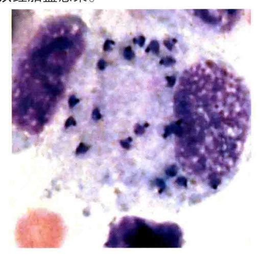

分布: 世界各地。主要见于地中海和巴西等地的犬,但最近报道美国也有感染(特别是猎狐犬种群),这意味着相比以前的认识,在美国可能有更常见的传播。

临床症状: 淋巴结肿大,运动不耐受,消瘦,发热,脾肿大,皮肤角化过度(口鼻处、面部和足垫等处出现大量的皮屑,通常为双侧对称性的)。晚期病例出现皮内结节和溃疡。指甲长,易断。最终发生肾衰竭(肾小球性肾炎)。

潜在的人兽共患病:病原能够通过人的伤口从犬而感染到人,但风险很低。在有 传播媒介存在的地方,犬被认为是传播媒介的贮存宿主。

治疗: 单一用药或联合用药均不能完全治愈。根据药物是否可购和宠物主人是否同意设计用药方案。监测肾功能。

喷特斯坦(Pentostam®)(葡萄糖酸锑钠; $30 \sim 50 \text{ mg/kg}$  五价锑,静脉或皮下注射,每 24 小时 1 次,连用 4 周)。注意:该药仅在美国(CDC)有售。

锑酸葡胺 ( Glucantime® ) ( 葡甲胺锑; 75 mg/kg,皮下注射,每 24 小时 1 次,连用 3 ~ 4 周;同时使用别嘌呤醇: 15 ~ 30 mg/kg,每 12 小时 1 次,连用 12 个月或更长 )。

别嘌呤醇, 别嘌醇 ( Allopurinol 10 ~ 30 mg/kg, 每 12 小时 1 次, 长期使用 )。

福吉(Fungizone®)(两性霉素 B,  $0.5 \sim 0.8$  mg/kg, 用 5% 葡萄糖  $10 \sim 60$  mL 溶解,静脉给药 30 秒以上,每 48 小时 1 次,直到总剂量达到  $8 \sim 15$  mg/kg)。皮下给药方法: $0.5 \sim 0.8$  mg/kg,用 0.45% 盐水 2.5% 葡萄糖 500 mL 溶解,皮下注射直到总剂量达到  $8 \sim 26$  mg/kg。

阿姆比森 (AmBisome®) (两性霉素 B脂质体制剂; 3mg/kg, 5剂)。

#### 中缘属绦虫 (Mesocestoides spp.)

犬通过摄食感染的两栖动物、爬行动物、鸟类 或者小的哺乳动物而感染该类绦虫。

#### 发育周期: 3周。

诊断: 粪中节片长 250 ~ 500 µm, 有时长链的节片被排泄出来。小的节片容易被忽视, 但可以通过以下特点加以鉴定: 虫卵被聚合在孕节中部的一个球内(约30个或更多的虫卵在中间的小球内,每个虫卵内含一个有3对小钩的幼虫)。

#### 成虫寄生部位:小肠。

近似种:中缘属有很多种绦虫,包括卡氏中绦虫(Mesocestoides kirbyi)、偏侧中绦虫(M. latus)、线中绦虫(M. lineatus)、纹饰中绦虫(M. litteratus)和曼氏中绦虫(M. manteri),几乎所有的都能感染犬。所有的这些绦虫十分相似,能在野生的犬科和猫科动物上发现。

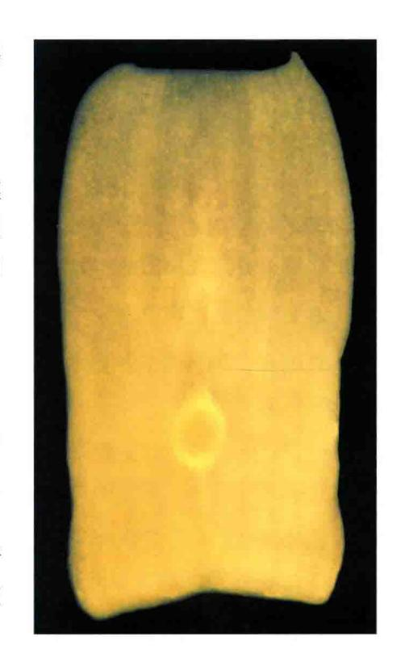

#### 分布: 全世界。

**临床症状**:通常无症状。偶尔,特别是在美国西部,犬可能发生严重危及生命的感染,由腹腔内寄生的幼虫侵入其他器官如肝脏而致。肠道感染和内脏感染之间好像没有任何相关性。

治疗: 没有批准的药物。多次发现吡喹酮有效。应首先用标签剂量尝试治疗。宠绦清,依西太尔(Cestex®)也可能有效。

拜宠清(台湾称内虫逃)(Drontal® Plus Tablets,不宜给出生未满3周或体重在两磅以下的幼犬使用)。

宠绦清(Cestex®,不宜给出生未满7周的幼犬使用)。

重生特犬用驱绦虫片(Droncit® Canine Cestocide Tablets,不宜给出生未满 4 周的幼犬使用)。

重生特犬猫用驱绦虫注射剂 ( Droncit® Injectable Cestocide for Gods and Cats ) 。

# 鲑隐孔吸虫(Nanophyetus salmincola)

犬鲑鱼中毒性吸虫,食入感染的鱼而引起。

发育周期: 5~8天。

诊断:发现粪中的虫卵。 犬常常表现出发烧和腹泻,系由 该吸虫传播的蠕虫新立克次氏体 (Neorickketsia helminthoeca) 的感染所致。虫卵棕色,长75~ 80 µm,一端有卵盖,另一端有一 个钝的突起。

成虫寄生部位:小肠。

近似种:一些输入性的吸虫 有相似的形态学特征,但极少感 染犬。

分布: 北太平洋沿岸。

临床症状: 感染吸虫的犬可能没有症状, 但吸虫携带的蠕虫新立克次氏体可引起犬发热性疾病。

治疗:没有批准的药物。日常是用吡喹酮和依西太尔驱虫。 用四环素治疗立克次氏体感染。

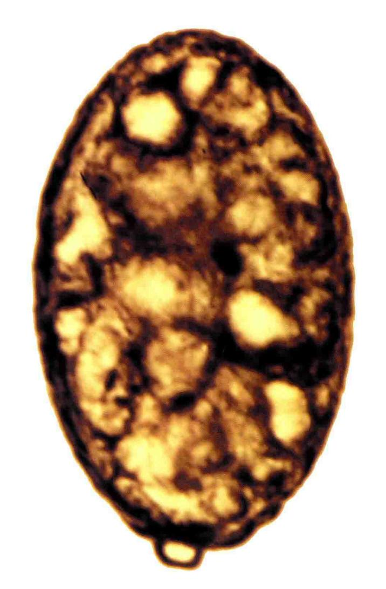

拜宠清(台湾称内虫逃)(Drontal® Plus Tablets)(不宜给出生未满 3 周或体重在两磅以下的幼犬使用)。

宠绦清(Cestex®)(不宜给出生未满7周的幼犬使用)。

重生特犬用驱绦虫片(Droncit® Canine Cestocide Tablets,不宜给出生未满 4 周的幼犬使用)。

重生特犬猫用驱绦虫注射剂 ( Droncit® Injectable Cestocide for Dogs and Cats )。

#### 犬新孢子虫(Neospora caninum)

犬的小型球虫,犬通过摄 食被感染的牛肉而感染。犬也 可通过摄入卵囊而感染。

发育周期: 6~9天。

诊断: 粪便中的卵囊,清晰,未孢子化,圆形或椭圆形(长10~13µm)。

寄生部位:小肠黏膜。

近似种: 卵囊与海氏哈蒙德 球虫 (*Hammondia heydomi*) 的 卵囊不易区分。

分布:全世界。

临床症状:无症状。犬, 特别是在出生之前感染的犬, 会发生严重的疾病,如表现为 软瘫的多发性神经根炎,但这 种表现的新孢子虫病常为散发。

治疗:没有批准的药物。 或可参照弓形虫病相同的治疗 方案。

安蒂洛 (Antirobe®) 胶囊

或者口服液,或者氯林可霉素 (Cleocin®)注射液 (克林霉素: 10~20 mg/kg,口服,肌肉注射,每 12 小时 1 次,连用两周)。

畜必生片 (Tribrissen® Tablets) (磺胺嘧啶 – 甲氧苄氨嘧啶: 15 mg/kg,口服,每 12 小时 1 次,连用 14 天)。

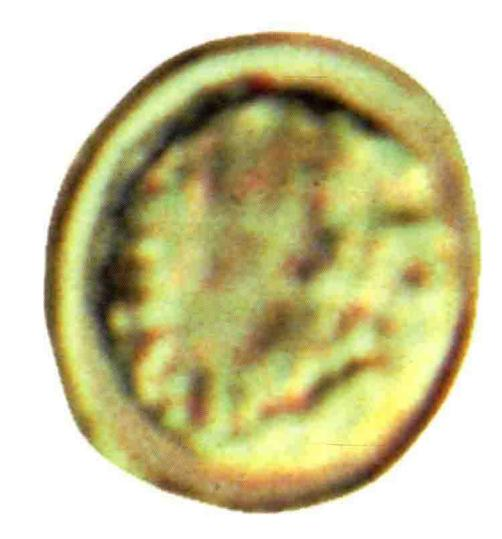

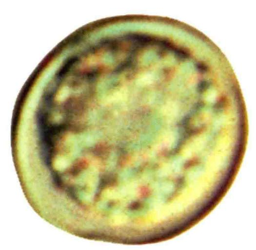

# 犬耳痒螨 (Otodectes cynotis)

犬的耳螨。犬通过直接接触而感染。

诊断:通过耳拭子或分泌物镜检发现螨虫。螨虫约长 400 μm,圆形身体上有 8 条相对长的足。雌螨的 I、Ⅱ 对足及雄螨的所有足末端的茎杆较短,不分节,末端为吸盘。雌螨其他足末端有刚毛。虫卵约长 200 μm。

成虫寄生部位: 耳道。

近似种:无。

分布:全世界。

**临床症状**:耳炎,伴随甩头和耳朵抓伤,有耳垢。能导致严重的耳部继发感染。

治疗: 有若干个被批准的产品。

蜱螨净(Acarexx™,主要成分为伊维菌素)。

大宠爱 (Revolution™, 塞拉菌素)。

耳螨灭 (Milbemite™,米尔贝肟)。

以除虫菊酯为基本方的产品: 奥瑞米特 (Aurimite®)、噻如米特(Cerumite®)、 依瑞德梅特(Eradimate™)、快乐杰克(Happy Jack®)、迈特克斯(Mitex™)、哈茨(Hartz®)、 保措(Health Measures™)、犬用耳螨治 疗剂(Ear Mite Treatment for Dogs)、螨 净(Mita-Clear™)、诺威迈特(Nolvamite®)、 欧体卡尔-M耳螨治疗剂(OtiCare®-MEar Mite Treatment)、复方欧特迈特(Otomite®) Plus)、普俘默耳螨杀手(Performer® Ear Mite killer)、宠物耳螨护理洗液或驱虫剂(Pet Care Ear Mite Lotion & Repellent)。

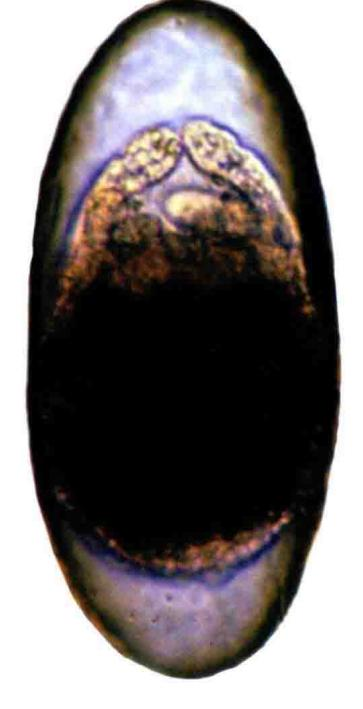

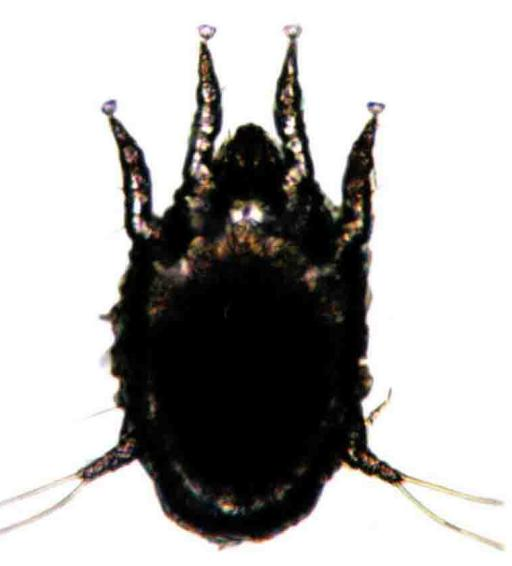

以鱼藤酮为基本方的产品: 耳螨溶液(Ear Mite Solution)、耳螨杀剂(Ear Mitecide)、螨驱 –R(Mitaplex–R™)。

# 克氏并殖吸虫(Paragonimus kellicotti)

犬的肺吸虫。犬通过食入感染的小龙虾(或者是啮齿类宿主)而引起。

发育周期:5~7周。

诊断: 粪中的虫卵呈棕色, 一端有一个"坐式"卵盖(帽子),另一端有一个小的突起, 长70~100μm。胸片显示肺脏 有囊性病变。

成虫寄生部位: 肺中的虫囊。

近似种:世界各地,感染 犬和猫的许多种并殖吸虫被报道 过。虫卵易与叠宫绦虫、裂头绦 虫的虫卵混淆。

分布: 克氏并殖吸虫分布于 北美洲, 其他种类分布于世界各地。

临床症状: 轻微咳嗽到阵发性咳嗽, 伴随呼吸困难。能够引起气胸。

**治疗**:没有批准的药物。加大剂量的吡喹酮治疗数天有效。

重生特犬用驱绦虫片 (Droncit® Canine Cestocide Tablets)(吡喹酮,25mg/kg, 每8小时1次,连用3天)。不 宜给出生未满4周的幼犬使用。

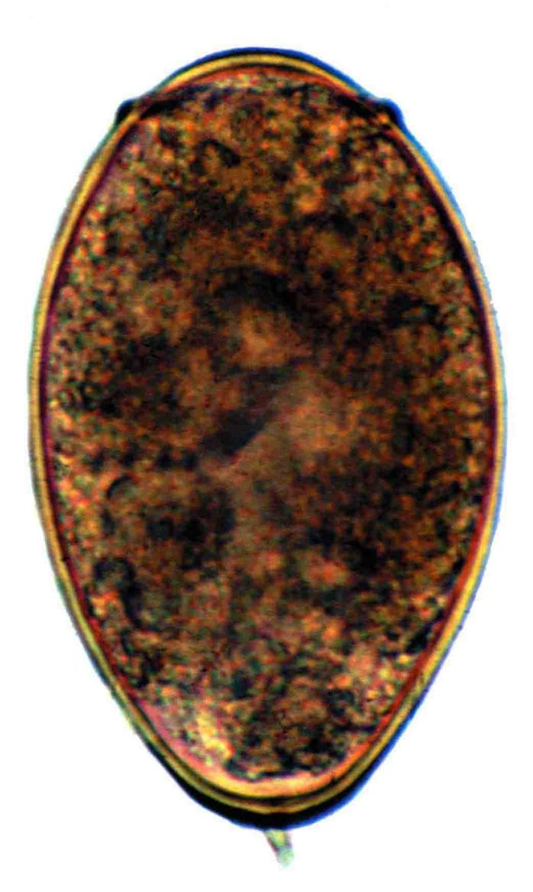

# 皱襞毛细线虫 (Pearsonema plica)

犬膀胱的毛细线虫。犬通过吞 入蚯蚓或者其他可能的转续宿主而 感染。

发育周期:两个月。

诊断: 尿液中的虫卵类似犬鞭虫虫卵, 但是比鞭虫虫卵小(长60 µm), 表面有大的凹陷。

成虫寄生部位:寄生于整个膀胱壁的黏膜。

近似种:无。

分布: 世界各地。

**临床症状**:无症状,可能出现膀胱炎。

治疗:没有批准的药物。在治疗后,成虫被杀死之后,虫卵可持续数周随尿液排出。

可尝试的用药方案如下。

害获灭(1% 伊维菌素注射液: 0.2 mg/kg,皮下注射或口服,在 两周内重复给药1次)。

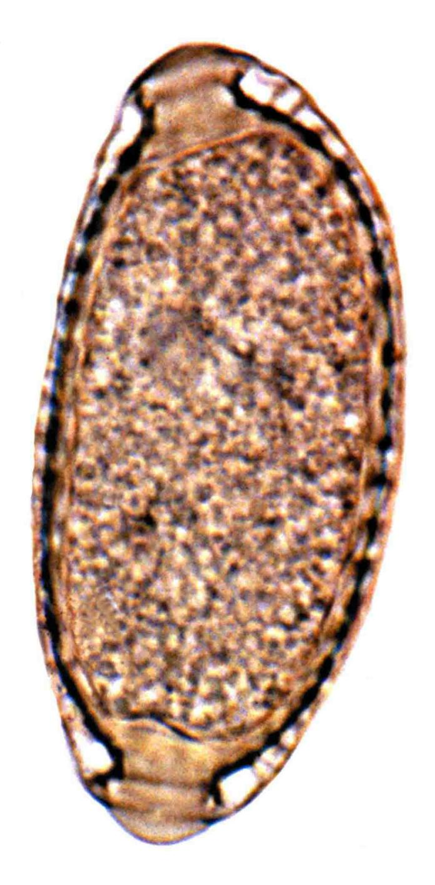

#### 人五鞭毛滴虫(Pentatrichomonas hominis)

犬的毛滴虫。经粪口途 径传播。

发育周期: 1周。

诊断: 粪便置于生理 盐水中(漂浮集卵法所用的 溶液则会杀死运动虫体), 可发现带鞭毛的滋养体(长 10 µm),颠簸前进运动。 在被杂质困住的虫体上可见 到波动膜。

寄生部位: 盲肠和结肠 肠腔内。

近似种:需与贾第虫的 滋养体相区分。

分布: 世界各地。

临床症状: 虫体见于腹泻的犬,可能不是引起腹泻的主要原因。

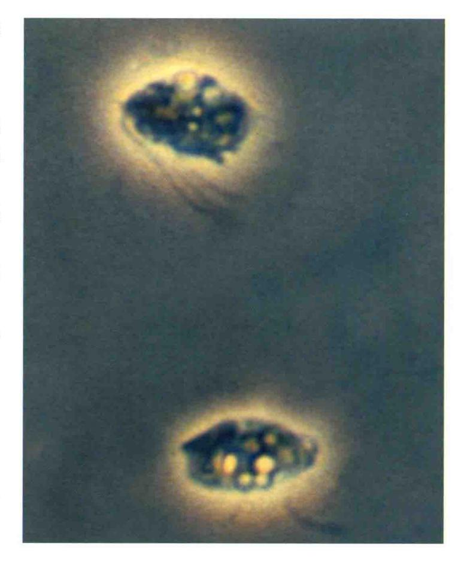

潜在的人兽共患病:可以直接由患犬粪便传染给照料犬的人。在清理犬粪便时应 采取常规防护措施。

治疗: 没有批准的药物; 但甲硝唑已经用于治疗该病。

灭滴灵(福莱吉, Flagyl®)口服片(甲硝唑: 66 mg/kg, 口服,每 24 小时 1 次,连用 5 天。注意:应用该剂量可能导致神经症状,不应长期使用)。

#### 稀泡翼线虫(Physaloptera rara)

犬的胃线虫,成虫黏 附在胃窦和十二指肠近端。 中间宿主为食粪类甲虫。

发育周期: 2~3周。

诊断: 粪中虫卵(长 45 µm)非常清晰,比钩虫 虫卵稍短。卵壳相对较厚, 内含一个幼虫。

成虫寄生部位:胃和小肠前端。

近似种:近缘的虫种 见于其他犬、猫、狐狸、 臭鼬和浣熊。

分布: 世界各地。

临床症状:呕吐。

治疗: 没有批准的药物。预防犬恶丝虫的制剂不能阻止感染。下列治疗方案可能有效。

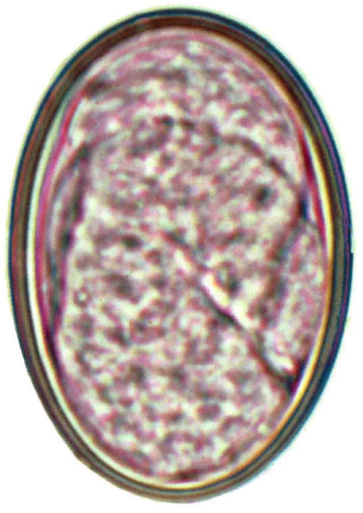

硕虫敌(又称壮吉)(Strongid®T)(双羟萘酸噻嘧啶: 5 mg/kg,口服,1 次,可两周重复给药 1 次)。

胖可求 (Panacur®) (芬苯达唑: 50 mg/kg, 口服, 每 24 小时 1 次, 连用 3 天)。

# 犬拟肺刺螨 (Pneumonyssoides caninum)

犬的鼻螨。犬通过直接接 触而感染。

诊断: 螨长超过1 mm, 虫卵长约200 μm。通过鼻分 泌物检查发现螨虫。

成虫寄生部位:鼻窦。

近似种:无。

分布: 世界各地。

临床症状: 打喷嚏, 逆向 喷嚏, 鼻出血。

治疗:没有批准的药物。 阿维菌素有效。塞拉菌素(司 拉克丁,Selamectin)可能有效。

拦 截 者 (Interceptor®) (0.5 ~ 1 mg/kg 体重,每周1次,连用3周),不宜用于体重不足两磅或初生不足6周的幼犬。

害获灭(伊维菌素:每天 0.2~0.4 mg/kg,每周1次, 连用3周)。

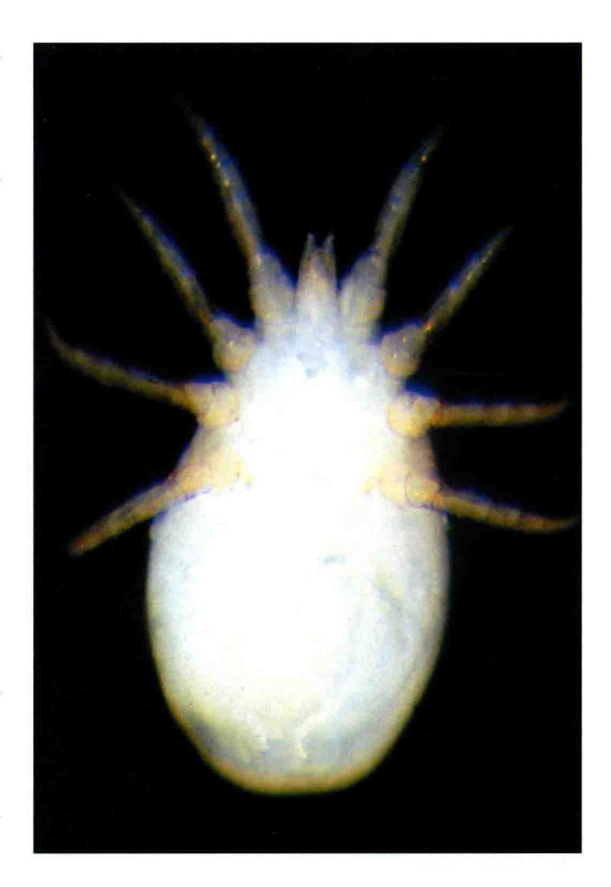

# 血红扇头蜱 (Rhipcephalus sanguineus)

棕色犬蜱。犬通过灌木丛或矮树丛时被黏附 到皮肤上。

诊断:常常见到成蜱,3~7 mm,吸饱血时扁平,豆形,棕色。眼睛位于盾板边缘。无肛前沟。若蜱与小雌蜱相似。

寄生部位:皮肤。

近似种: 变异革蜱 ( *Dermacentor variabilis* ) 、 肩突硬蜱 ( *Ixodes scapularis* ) 。

分布: 美国南部,不耐受冰点温度,但可在室内越冬。

临床症状:通常无症状。过多会引起贫血。

潜在的人兽共患病:没有叮咬不会直接传播 其携带病原。所有的发育阶段(幼蜱、若蜱和成蜱) 都在犬身上度过。可感染同窝犬和照料犬的人。 犬巴贝斯虫病的传播媒介。

治疗: 拔除虫体——用酒精清洗伤口。

#### 口服

宝来威(Bravetor)(译者加)。

#### 滴剂

福来恩滴剂 (Frontline® Top Spot®) 成年犬和幼犬用杀虫剂 (Fipronil)。

K9 拜宠爽(K9 Advantix™)(主要成分为吡虫啉和二氯苯醚菊酯,猫禁用!)。 亚当斯(Adams™)犬用蚤蜱控滴剂(苄氯菊酯)。

喜克虫蚤蜱治 30 天 (Scratchex® 30 Day Flea and Tick Treatment) (苄氯菊酯)。 威克大卵控蚤蜱控滴剂 (Vet-Kem® Ovitrol Plus® Spot On®) 成年犬和幼犬专用 蚤蜱控滴剂 [苄氯菊酯和(S)-甲氧普林]。

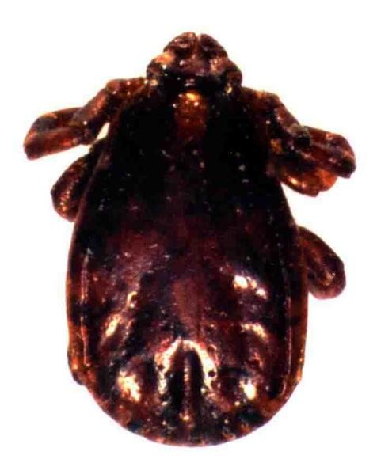

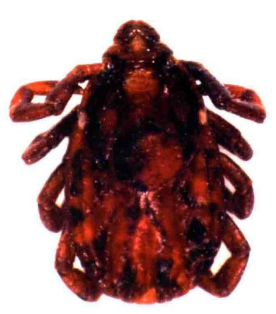

#### 颈圈

亚当斯勇猛 (Adams™ Delta Force™) 犬用蜱驱避颈圈 (溴氰菊酯)。

亚当斯双动力 (Adams ™ Dual Action ™) 犬用蚤蜱驱避颈圈 [O- 异丙甲基氨基甲酸酯, 3- 苯氧基 -d- 顺式 - 反式 -2, 2- 二甲基 -3- (2- 甲代丙烯基) 环丙烷, N- 正辛基二环二甲酰亚胺 ]。

伴赛特(Bansect®)犬用蚤蜱驱避颈圈(二溴磷)。

快乐杰克诺新 ( Happy Jack® Novation ™ ) 犬用蚤蜱驱避颈圈 ( 溴氰菊酯 ) 。

哈茨二合一(Hartz® 2 in 1)成年犬和幼犬用蚤蜱驱避颈圈(杀虫畏)。

长效杀 90 天 (Longlife® 90 Day) 犬用颈圈 (杀虫畏)。

净除(Preventef®)犬用蚤蜱驱避颈圈(二嗪农)。

净除(Preventef®)犬用颈圈(双甲脒)。

喜克虫犬用蚤蜱驱避颈圈( Scratchex® Flea and Tick Collars for dogs )( 毒死蜱 )。 威克驱蜱(Vet–Kem® Tickaway™)犬用蜱驱避颈圈(残杀威)。

# 肉孢子虫属 (Sarcocystis spp.)

犬粪中的孢子囊。犬 因摄食中间宿主的肌肉组 织而引起感染。

发育周期: 3天至3周。

诊断: 粪中的孢子囊清晰,已孢子化、椭圆形,长9~17µm,有时可在薄的卵囊壁内看到成对的孢子囊。排泄时即具有感染性。

寄生部位: 小肠黏膜。

近似种: 肉孢子虫属 是一个大的属,有许多个 虫种可以感染多种不同的 中间宿主。应该认真检查 孢子囊,与小卵囊和犬贾 第虫的包囊区分开。

分布:世界各地。

临床症状:无症状。

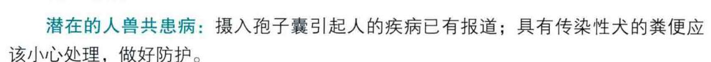

治疗:无。

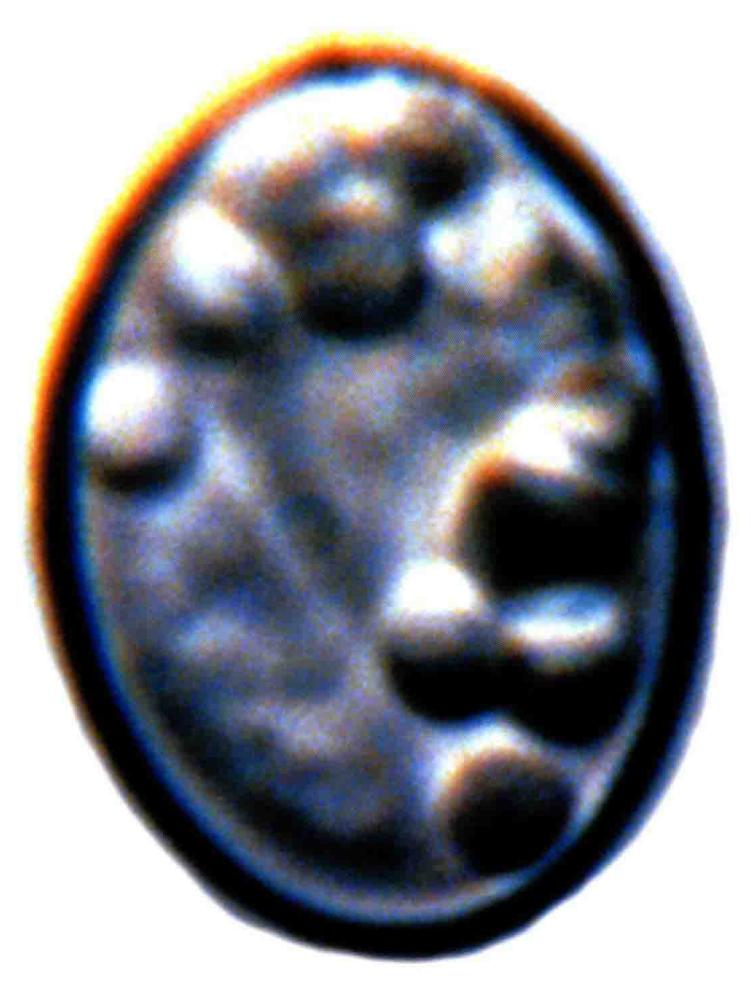

#### 人疥螨 (Sarcoptes scabiei)

犬的疥螨。犬通过直接 接触而感染。

诊断:可以通过皮肤刮取物或粪便检查确诊。螨长约350μm,有8条足,体表有许多粗壮的刺。雌螨的Ⅰ、Ⅱ对足及雄螨的Ⅰ、Ⅱ、Ⅳ对足末端的茎杆较长,不分节,茎杆最末端为吸盘。雌、雄螨其他足末端为刚毛。虫卵约长200μm。

成虫寄生部位:在皮肤下挖掘隧道。

近似种:无。

分布:世界各地。

临床症状: 瘙痒, 角质 化过度, 脱毛, 自己造成的 创伤。典型症状出现在面部 和跗关节部。

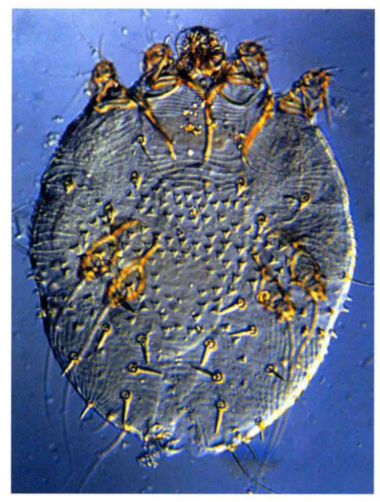

治疗:两种批准的药物,但通常用治疗牛的伊维菌素,按照 200  $\mu$ g/kg 体重给药。双甲脒(Mitaban®)(标签剂量)。

大宠爱 (Revolution™): 辉瑞的驱虫蚤螨滴剂。

# 狼尾旋线虫(Spirocerca lupi)

犬的食道线虫,寄生在食道基部的结节 内。犬因摄食感染的甲壳虫、鸡或啮齿动物 而感染。

发育周期: 5~6个月。

诊断: 粪便中的虫卵狭长, 卵壳厚, 清晰, 较小(长35 µm,仅仅和带绦虫的虫卵一样 长),内含一个幼虫。虫卵可能容易与稀泡 翼线虫虫卵混淆,但更为狭长。

成虫寄生部位:胃、食管基部的结节。

近似种:无。

分布:美国南部和热带地区。

临床症状:食道结节能导致吞咽困难和 呕吐, 使患犬厌食和消瘦。移行的幼虫能引 起动脉瘤或动脉破裂等主动脉病变。可发生 食道纤维肉瘤或骨肉瘤。5~10胸椎会发生 椎间盘炎。

治疗:没有批准的药物。外科移除结节 证实是成功的。

萨金特氏蠕虫清犬用 [Sergeant's® Worm-Away® for Dogs, 枸橼酸哌嗪, 1570 mg/天(约 11个胶囊的含量),连用3天]。

通灭(Dectomax®)注射液(多拉菌素,200 μg/kg,皮下注射,打 3 针,每针间 隔两周。或仍需要另一个疗程:500 µg/kg,每天口服,连续6周进行治疗)。

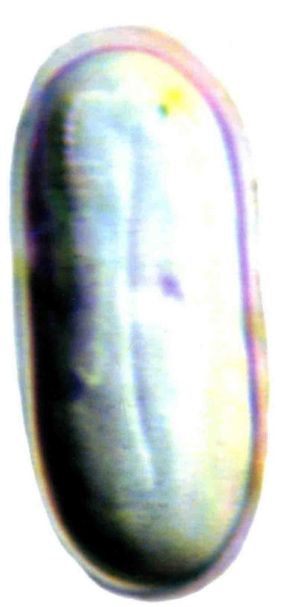

# 拟孟氏叠宫绦虫 (Spirometra mansonsoides)

犬/猫绦虫。通过摄食感染的蛇、啮齿动物和其他小脊椎动物而感染。

发育周期: 短至10天,排虫卵可持续数年。

诊断: 粪中虫卵(长60 µm), 棕色, 细长, 一端有一个小卵盖, 内含发育中幼虫的细胞。 虫卵大小与犬钩口线虫虫卵大小相近。

成虫寄生部位: 小肠。

近似种:全世界有多个叠宫属绦虫的虫种。虫卵与宽节双叶槽绦虫的虫卵非常相似。

分布:美国。

临床症状:可能发生腹泻、消瘦和/或呕吐。犬临床病例似乎比猫少见,或许是因为 犬不容易感染。

治疗:没有批准的药物。有报道证实,按照 5 mg/kg 吡喹酮治疗能取得成功,但其他一些报道也指出需要加大剂量。依西太尔(宠绦清, Cestex®)也可能有效。阿苯达唑无效。

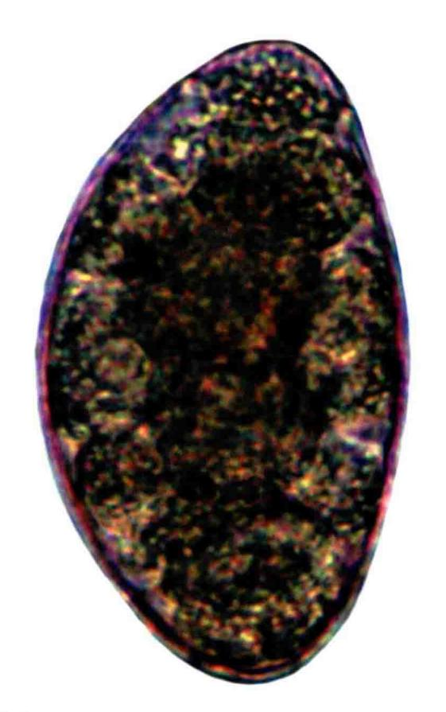

拜宠清(台湾称内虫逃)(Drontal® Plus Tablets,不宜给出生未满 3 周或体重在两磅以下的幼犬使用)。

宠绦清(Cestex®)(不宜给出生未满7周的幼犬使用)。

重生特犬用驱绦虫片(Droncit® Canine Cestocide Tablets,不宜给出生未满 4 周的幼犬使用)。

重生特犬猫用驱绦虫注射剂(Droncit® Injectable Cestocide for Dogs and Cats)。

如果以上治疗未见效,可以尝试下面方案。

重生特犬用驱绦虫片(Droncit® Canine Cestocide Tablets, 吡喹酮 7.5 mg/kg×2 天或者 25 mg/kg×2 天)。不宜给出生未满 4 周的幼犬使用。

# 粪类圆线虫(Strongyloides stercoralis)

犬的肠道线虫。通过幼虫穿透皮肤或者经乳汁传播而感染。 在犬体外,粪中幼虫发育为感染阶段幼虫。能够造成明显的环境 污染,特别是在犬数量较多的犬舍。

发育周期:两周。

诊断: 粪中幼虫(长380 µm)有大的生殖原基(超过身体宽), 食道明显的分成3部分(体部、峡部、球部)。尾长且直。

成虫寄生部位: 贯穿于整个小肠黏膜。

近似种: 犬粪中可以找到 5 种线虫类幼虫: 粪类圆线虫、欧氏类丝虫、褐氏类丝虫、狐环棘线虫、孵化的钩口线虫幼虫有时亦可见。孵化的钩口线虫幼虫比粪类圆线虫长些,有一个稍小的生殖原基和一个显著的口囊。欧氏类丝虫和狐环棘线虫幼虫的食道在中部不会变细。

分布: 世界各地。

临床症状:通常无症状。轻微腹泻。哺育期内(经乳汁传播)的幼犬或是有免疫抑制的成年犬会发生严重/致命性感染。严重感染的症状类似病毒性肠炎。

潜在的人兽共患病:人类也会引起相似的感染。

**治疗**:没有批准的药物。在美国,伊维菌素被批准用于人类的治疗。可用于母犬分娩期治疗。

害获灭(1% 伊维菌素注射剂:每天 0.2 mg/kg,  $\Gamma$   $\Gamma$   $\Gamma$   $\Gamma$   $\Gamma$   $\Gamma$   $\Gamma$   $\Gamma$   $\Gamma$   $\Gamma$ 

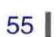

#### 豆状带绦虫(Taenia pisiformis)

兔的绦虫。犬摄食兔的内脏而感染。

发育周期:两个月。

诊断: 粪中检查到绦虫节片(长500~1000μm) 或绦虫卵(长30~35μm)。孕节: 矩形,单侧有生 殖孔。可以撕开孕节找到典型虫卵。

#### 成虫寄生部位:小肠。

近似种: 犬是其他带绦虫属(绵羊带绦虫、多头带绦虫等)的宿主。孕节只能通过专业人士进行鉴别,无法通过虫卵进行区分。犬粪中能找到的其他绦虫节片包括: 犬复孔绦虫(生殖孔集中在每个孕节的两侧),叠宫绦虫属(Spirometra)、双叶槽属(Diphyllobothrium)、中绦属(Mesocestoides)的绦虫生殖孔都在节片中央——因此,除非认真观察,否则好像它们都没有生殖孔。带绦虫的虫卵与棘球绦虫不容易区分。

分布: 世界各地。

临床症状: 无症状。

治疗:有效的准用产品有如下。

22.2% 胖可求 ( Panacur® Granules 22.2% ) 颗粒剂。

拜宠清(台湾称内虫逃)(Drontal® Plus Tablets,不宜给出生未满 3 周或体重在两磅以下的幼犬使用)。

宠绦清(Cestex®,不宜给出生未满7周的幼犬使用)。 重生特犬用驱绦虫片(Droncit® Canine Tablets,不宜 给出生未满4周的幼犬使用)。

重生特犬猫用驱绦虫注射剂 ( Droncit® Canie Injectable Cestocide for Dogs and Cats ) 。

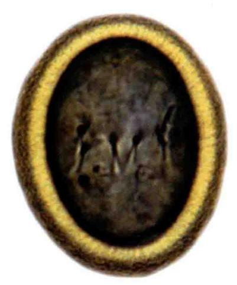

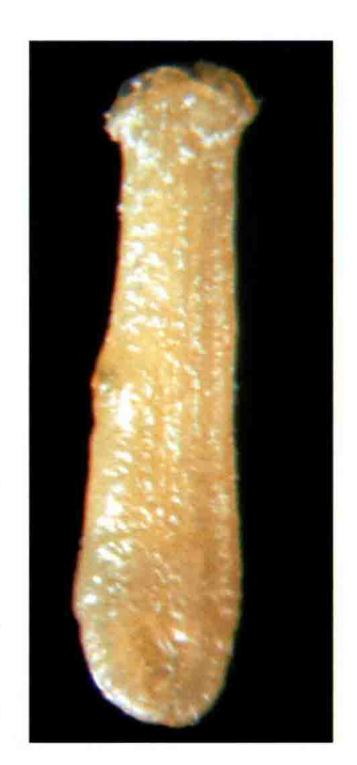

#### 狮弓蛔线虫(Toxascaris leonina)

犬(猫)常见的蛔虫。 幼犬往往不感染(无胎儿期 感染)。

发育周期:两个月。

诊断: 粪中虫卵(卵圆形, 长 90 µm),有厚而光滑的 卵壳,内部的卵细胞看起来 带有色彩。虫卵发育迅速。

成虫寄生部位:小肠。

近似种: 犬弓首蛔虫的 虫卵有相似的大小和形态, 但其卵壳表面有凹陷、卵细 胞的色彩较暗。

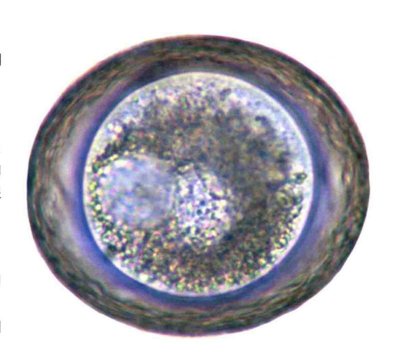

分布: 世界各地, 但更常见于气候凉爽地区。

**临床症状**:通常没有症状。足够数量才会引起发病,很少见。由于虫卵发育很快,可在犬舍或动物园内会积累大量的蛔虫。

潜在的人兽共患病: 儿童感染后会幼虫可在内脏移行。

治疗:即使标签上可能没有注明能驱该虫,但依照标签剂量使用对该虫有效的药物如下。(按标签说明书)。

线虫清,尼美克斯(Nemex™)。

22.2% 胖可求颗粒 ( Panacur® Granules 22.2% )。

拜宠清(台湾称内虫逃)(Drontal® Plus Tablets,不宜给出生未满3周或体重在两磅以下者的幼犬使用)。

犬心保(Heartgard® Plus,不宜给出生未满 6 周的幼犬使用)。

拦截者(Interceptor®,不宜给出生未满6周的幼犬使用)。

鞭蛔清 (Sentinel™, 不宜给出生未满 4 周或体重在两磅以下的幼犬使用)。

鞭蛔清风味片(Sentinel™ Flavor Tabs®, 不宜给出生未满 4 周或体重在 11 磅以下的幼犬使用)。

#### 犬弓首蛔虫(Toxocara canis)

犬的常见蛔虫。幼犬出生前 在母体内就能感染大量的蛔虫。

发育周期: 幼犬出生后最早3~4周就可以排出虫卵。

诊断:虫卵见于所有年龄段的犬粪中,虫卵都是球形,长 90 µm。卵壳表面有点蚀。

成虫寄生部位:小肠。

近似种: 狮弓蛔线虫虫卵: 大小相似, 但其卵壳表面光滑, 卵细胞色彩更亮。

分布: 世界各地。

临床症状: 幼犬: 精神沉郁,食欲下降,腹围膨大,被毛凌乱。严重感染:便秘,腹泻,

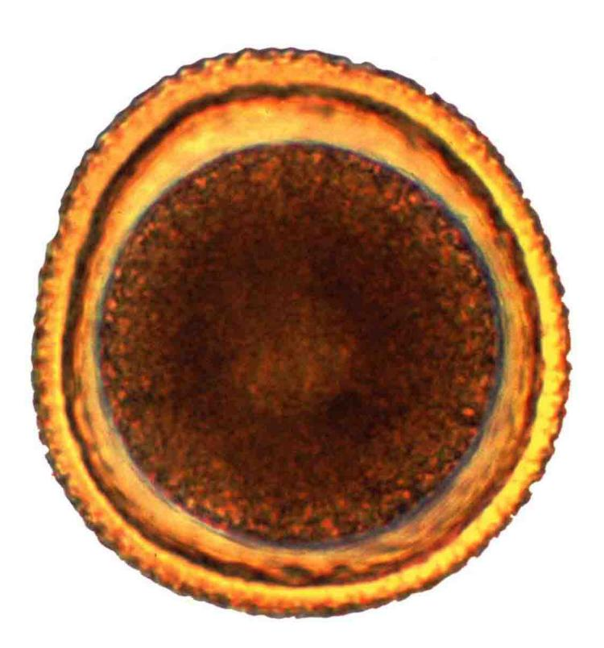

可能出现腹痛(触诊)。大量的蛔虫感染造成肠阻塞或肠穿孔。

潜在的人兽共患病: 儿童发生内脏或眼幼虫移行症。

治疗:有许多药物可用,使用时参照标签说明书。

线虫清,尼美克斯(Nemex™)。

22.2% 胖可求颗粒 ( Panacur® Granules 22.2% ) 。

拜宠清(台湾称内虫逃)(Drontal® Plus,不宜给出生未满3周或体重在两磅以下者的幼犬使用)。

犬心保(Heartgard® Plus,不宜给出生未满 6 周的幼犬使用)。

拦截者(Interceptor®,不宜给出生未满6周的幼犬使用)。

鞭蛔清 (Sentinel™, 不宜给出生未满 4 周或体重在两磅以下的幼犬使用)。

鞭蛔清风味片 (Sentinel ™ Flavor Tabs®, 不宜给出生未满 4 周或体重在 11 磅以下的幼犬使用)。

犬用双羟萘酸噻嘧啶片 [Pyrantel pamoate Tablets, 兽药字 (2016) 020161048] (译者加)。

#### 犬毛虱 (Trichodectes canis)

犬的食毛虱。与其他感染犬直接 接触传染。

诊断: 常常发现成虫,1~2 mm,依附在毛发上。细长,头宽,常常为米色到浅棕色。宽大的头部能与相对少见的犬吸血虱(棘颚虱)相区分。雄虱和雌虱在外形上相似。虫卵有小卵盖。

成虫寄生部位:依附于毛发。虫 卵紧贴毛发。

近似种: 猫栉首蚤。

分布:世界各地。

临床症状:通常没有;可引起皮肤瘙痒。

**注解**:发生感染通常表明犬居住 条件较差或者犬舍过于拥挤。

潜在的人兽共患病:无。

治疗: 需确保动物在家里受到合理的护理。

蚤安(Advantage,主要成分为吡虫啉)。

滴必除(Defend® Exspot®) 犬用杀虫剂。

福来恩(Frontline®)(Fipronil:非泼罗尼,或称氟虫腈)。

大宠爱 (Revolution) (塞拉菌素, Selamectin)。

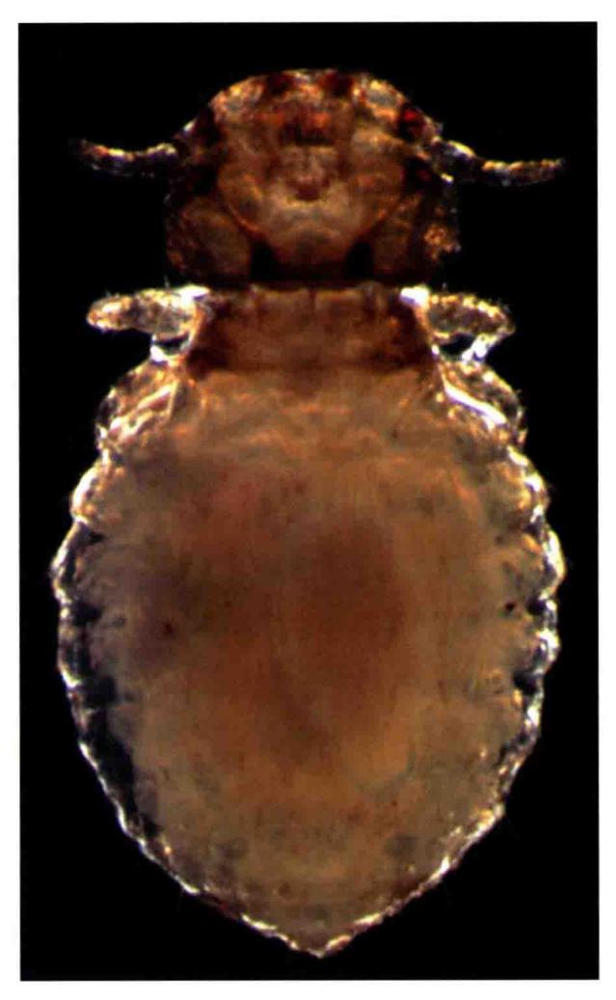

#### 狐毛尾线虫(Trichuris vulpis)

犬鞭虫,常见于3月龄以上的犬。生活史为直接发育型。

发育周期: 3个月。

诊断: 粪中虫卵呈棕色, 柠檬形, 有卵塞, 卵壳光滑, 与犬弓首蛔虫的虫卵一样长(80 µm)。粪中能发现的毛细线虫虫卵比狐毛尾线虫的要小。

成虫寄生部位: 盲肠, 当数量超过 100条时, 也可存在于结肠中。

近似种:无。

分布: 世界各地。黏性土壤区域最常见。

临床症状:大肠性腹泻(大量寄生时), 有时伴有贫血。重度感染出现棕红色粪便。

治疗: 蛔虫和钩虫以外的抗虫谱的药物。有效成分为苯并咪唑和米尔贝肟。3种犬恶丝虫的预防产品(复方菲拉瑞比特(Filaribits Plus®),拦截者(Interceptor®),鞭蛔清(Sentinel™)对鞭虫有效。以下药品按照标签剂量用药。

胖可求颗粒 22.2% ( Panacur® Granules 22.2% )。

拜宠清(台湾称内虫逃)(Drontal®

Plus Tablets,不宜给出生未满 3 周或体重在两磅以下者的幼犬使用)。

拦截者(Interceptor®,不宜给出生未满6周或体重不足两磅的幼犬使用)。

鞭蛔清 (Sentinel™,不宜给出生未满 4 周或体重在两磅以下的幼犬使用)。

鞭蛔清风味片 (Sentinel ™ Flavor Tabs®, 不宜给出生未满 4 周或体重在 11 磅以下的幼犬使用)。

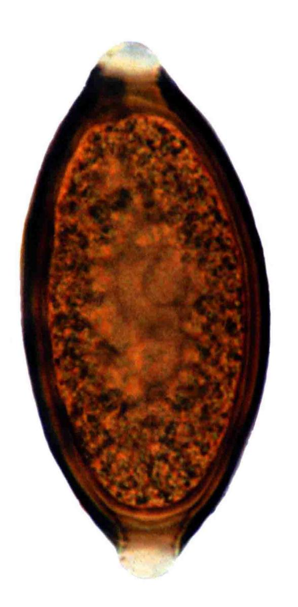

# 枯氏锥虫(Trypanosoma cruzi)

美洲锥虫病。经猎蝽传播。

发育周期: 6~9天。

诊断:血液中的锥鞭毛体呈小写"C"形,末端的动基体大,活组织检查可发现无鞭毛体。

寄生部位: 血液和组织。

近似种: 枯氏锥虫的无 鞭毛体段与利什曼原虫属的 无鞭毛体阶段不容易区别; 容易区别的是枯氏锥虫能感 染许多类型的细胞,而利什 曼原虫属仅感染巨噬细胞。

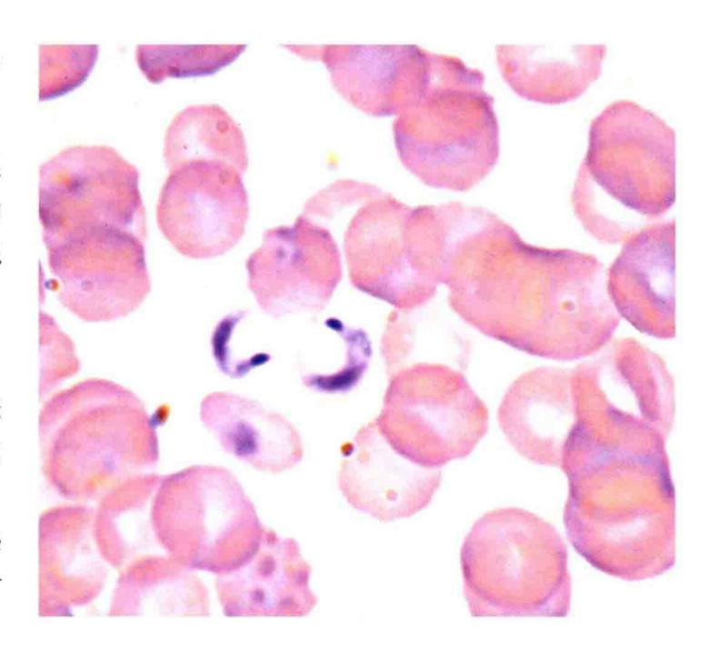

分布:美洲。美国分离株比南美洲分离株致病力低。

临床症状:无临床症状。急性病例(感染后2~3周)主要见于青年犬,表现急性心肌炎(虚弱、黏膜苍白、厌食、淋巴结肿大)或者弥漫性神经系统体征(注意与犬瘟热区分开)。慢性病例(感染后几月至数年)则出现扩张性心肌病(虚弱/运动不耐受/腹水/室性心律失常)。

**潜在的人兽共患病**:被感染的血液是试验人员、兽医、动物饲养管理技术人员的潜在感染源。

治疗: 心功能异常时需采取支持疗法。苄硝唑能清除血液里的锥虫, 在慢性感染期可能缓解病情的严重程度, 但在犬上的具体效果未知。

苄硝唑(Ragonil®)(苄硝唑: 5 mg/kg,每 12 小时 1 次,连用 30 天。副作用包括发烧、恶心、胃肠道症状。直到症状减轻后才能停止治疗,然后治疗改为每 24 小时 1 次)。注意:美国仅疾病控制中心(CDC)有售。

# 狭头弯口钩虫(Uncinaria stenocephala)

气候凉爽地区发生的犬钩虫。未见幼犬发生(不 经乳汁传播)。

发育周期:两周。

诊断: 粪便中的虫卵细长(90 µm), 椭圆形, 薄壳, 随粪便排出时已发育为8细胞阶段, 比其他钩口线虫的虫卵大。粪中的虫卵发育孵化出的第一期幼虫(长290~360 µm)的基部将会出现一个球状短食道和一个小的生殖原基(与类圆线虫属比较)。

成虫寄生部位:小肠。

近似种:其他钩虫的虫卵相似,但弯口线虫要大些。

分布: 在美国北部一些居民聚集区域。

临床症状:除非在犬舍发生高度污染,罕见临床症状(为犬钩虫中致病性最弱的)。症状:贫血、黑便、腹泻或便秘。

治疗: 含活性成分米尔贝肟的拦截者和鞭蛔清 (Sentinel™)均对于狭头弯口钩虫无效。按标签剂量 使用的药物如下。

线虫清,尼美克斯(Nemex™)。

胖可求颗粒 22.2% ( Panacur® Granules 22.2% )。

拜宠清(台湾称内虫逃)(Drontal® Plus,不宜给出生未满3周或体重在两磅以下的幼犬使用)。

犬心保(Heartgard® Plus,不宜给出生未满 6 周的幼犬使用)。

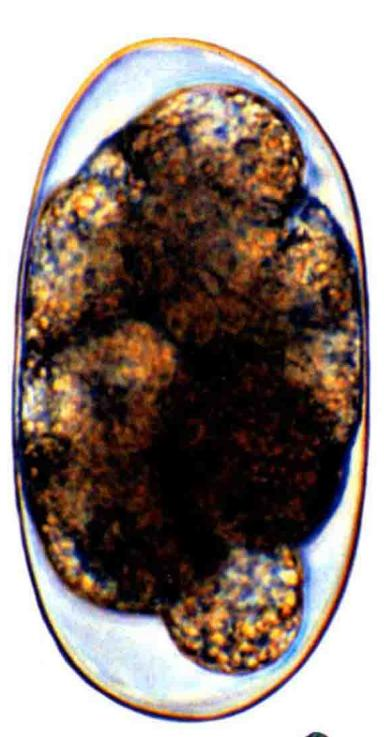

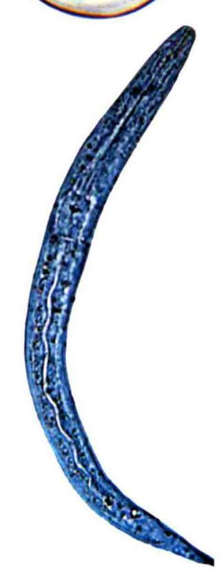

# 猫的寄生虫

#### 深奥猫圆线虫 (Aelurostrongylus abstrusus)

猫的肺线虫,通过摄食啮齿类动物以及鸟类获得感染。

发育周期: 5周。

诊断: 幼虫(体长 375 μm) 在粪便中很活跃, 易于用贝尔曼漏斗(Baermann funnel) 法分离到; 在其尾部有一个独特的背脊。通过气管洗涤能容易获 得其幼虫,气管冲洗物中可能会有增加的嗜酸性粒细 胞。胸片显示有弥漫性轮廓不清的结节状阴影,肺后 叶区域最为常见。即使临床症状改善,治疗后的 X 线 片看起来可能更糟糕。

成虫寄生部位: 肺实质之间。

近似种:很少有线虫随宿主粪便排出幼虫,猫却 是这些线虫的常见宿主。

分布范围:世界性。

**临床症状**:通常无明显症状。一般症状表现从轻微咳嗽到严重的急性气喘和呼吸窘迫。必须要与哮喘、心丝虫、心脏病和并殖吸虫感染等区分开来。

治疗: 无症状病例通常无需治疗。病情严重者, 糖皮质激素(强的松,0.5 mg/kg,口服,每 24 小时 1 次,持续给药 5 天)将减轻临床症状。目前还没有能杀死成虫的准用药物,但有效的治疗方案如下。

害获灭(1% 伊维菌素注射剂: 0.4 mg/kg,皮下注射或口服,两周时再给药1次)。

胖可求(Panacur® 芬苯达唑: 50 mg/kg, 口服, 每 24 小时 1 次, 持续给药 5 ~ 10 天)。

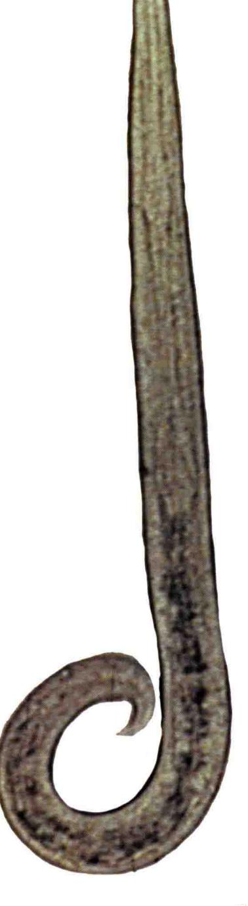

#### 消瘦翼形吸虫(Alaria marcianae)

较大的肠道吸虫,通过 摄食两栖宿主或哺乳动物而 感染。

发育周期: 3周。

诊断: 其粪便中的虫卵很大(长110~130 µm), 呈棕色,含有胚胎细胞。蔗糖漂浮后清晰可见。

成虫寄生部位:小肠。

近似种: 多个翼形属的 吸虫都能感染猫。

分布: 全世界皆有分布。

临床症状:无明显症状。

治疗: 吡喹酮对其有效, 依西太尔或许有效。

小 拜 宠 清 ( Drontal® Tablets ) ,4 周以下或低于 0.7 kg 的小猫禁用。

宠练清(Cestex®,依 西太尔),小于7周的小猫禁用。

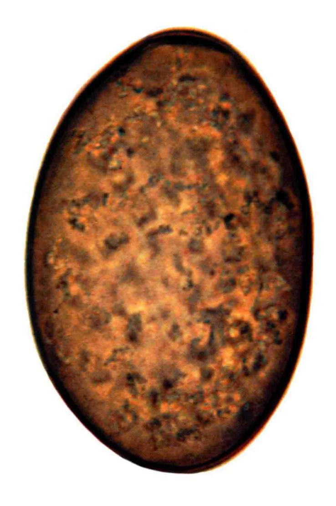

猫用重生特驱绦虫片(Droncit® Feline Cestocide Tablets, 抗绦虫药片), 小于 6 周的小猫禁用。

重生特犬猫用驱绦虫注射剂 ( Droncit Injectable Cestocide for Dogs and Cats ) , 猫犬通用抗绦虫药,小于 6 周的小猫禁用。

# 巴西钩口线虫 (Ancylostoma braziliensis)

猫/犬钩虫,在南大西洋海岸以及加勒比海很常见。经皮肤感染,啮齿类动物是其转续宿主。

发育周期: 刚出生后的小猫在两周内可排出 虫卵(经乳汁传播)。

诊断:在粪便中能找到长椭圆形的薄壳的卵(长60 µm),排出时虫卵内有8个细胞,大小难与犬钩口线虫相区别。钩口属线虫虫卵比弯口属的虫卵小。如果虫卵在粪便里生长发育,第一期幼虫(长300~400 µm)会在其底部有个球形的短食道和一个很小的生殖原基(与类圆属线虫比)。

成虫寄生部位:小肠。

近似种: 犬钩口线虫。

分布: 南大西洋海岸以及加勒比海。

临床症状: 再生性贫血。与管形钩口线虫(Ancylostoma tubaeforme)相比,巴西钩虫造成的血液流失更少,因此很少造成急性病发作。

潜在的人兽共患病:在美国东南部和加勒比群岛的皮肤性幼虫游走症。

治疗:标签剂量可驱除成虫感染的药物如下。

小拜宠清 (Drontal® Tablets, 小于 4 周或低于 0.7 kg 的小猫禁用)。

大宠爱(Revolution™,小于6周的小猫禁用)。

特色克 (Task® Tabs, 小于 10 天或体重低于 0.45 kg 的小猫禁用)。

拦截者(Interceptor®)风味片(小于6周或体重低于0.7 kg的小猫禁用)。

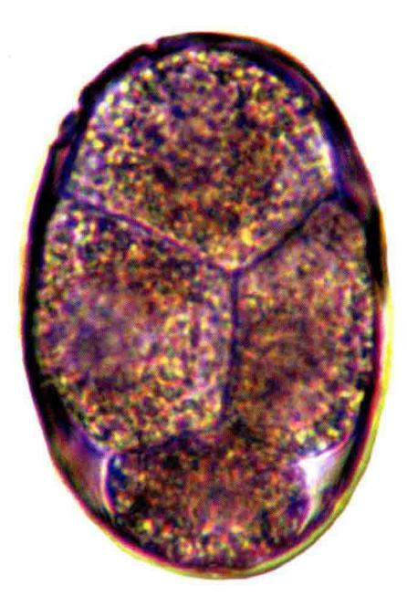

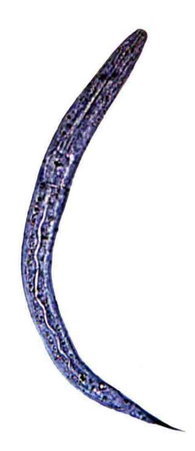

# 管形钩口线虫(Ancylostoma tubaeforme)

常见的猫科动物钩虫(致病性最强), 经皮肤感染,啮齿动物为其转续宿主。

**发育周期**:出生后两周左右的猫就可产生虫卵(经乳汁传播)。

诊断:在粪便中能找到8个细胞大小的长椭圆形(长60µm)、薄壳的卵,与巴西钩虫很难区分。钩口属线虫虫卵比弯虫属虫卵小,虫卵在粪便里发育形成的第一期幼虫(长300~400µm)会在其底部有个球形的短食道和一个很小的生殖原基(与类圆线虫属相比)。

成虫寄生部位:小肠。

近似种: 巴西钩虫。

分布:全球均有分布。

**临床症状**:再生性贫血症,猫会因大量失血导致贫血症并死于此类钩虫感染。

治疗:标签剂量驱除成虫感染的药物如下。

小拜宠清(Drontal® Tablets,小于 4 周或体重低于 0.7kg的小猫禁用)。

大宠爱(Revolution™, 小于6周的小猫禁用)。 特色克(Task® Tabs, 小于10天或0.45 kg的小猫禁用)。

拦截者风味片(Interceptor® Flavor Tabs, 小于 6 周或 0.7 kg 的小猫禁用)。

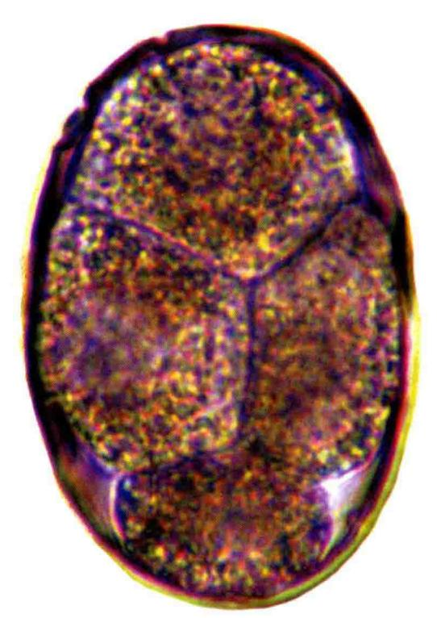

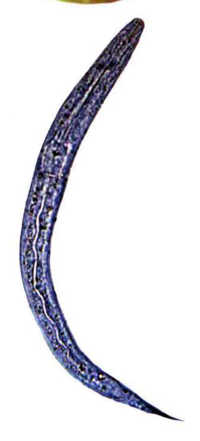

#### 普氏奥康嗜卡毛细线虫 (Aonchotheca putorii)

猫科动物的胃毛细线虫,生活史为直接 型发育。

发育周期: 1个月。

诊断: 普氏奥康嗜卡毛细线虫的虫卵与狐毛尾线虫的虫卵形态相似,呈长椭圆形,两端有塞状突起。但普氏奥康嗜卡毛细线虫的虫卵形态较小,颜色也较深,长仅为60 μm,且虫卵表面有较深的条纹。

成虫寄生部位: 遍布胃黏膜。

近似种:与寄生在支气管上皮的肺真鞘 线虫相类似。

分布: 世界各地均有分布。

临床症状:患畜无明显症状,但可能会 出现厌食、呕吐和排出焦油状黑色粪便等 症状;有的甚至会出现轻微的再生障碍性 贫血的症状。

治疗:没有批准的药物。成虫被驱杀后, 虫卵可持续数周经粪便排出体外。以下为可 能的治疗方案。

胖可求(Panacur®)(芬苯达唑): 50 mg/kg,口服,每天1次,连用3天。 然后每周1次或者每隔1周1次,连续两个月。

害获灭(Ivomec®): 1% 伊维菌素注射剂,按0.2 mg/kg,皮下注射或者口服,两周时重复1次。

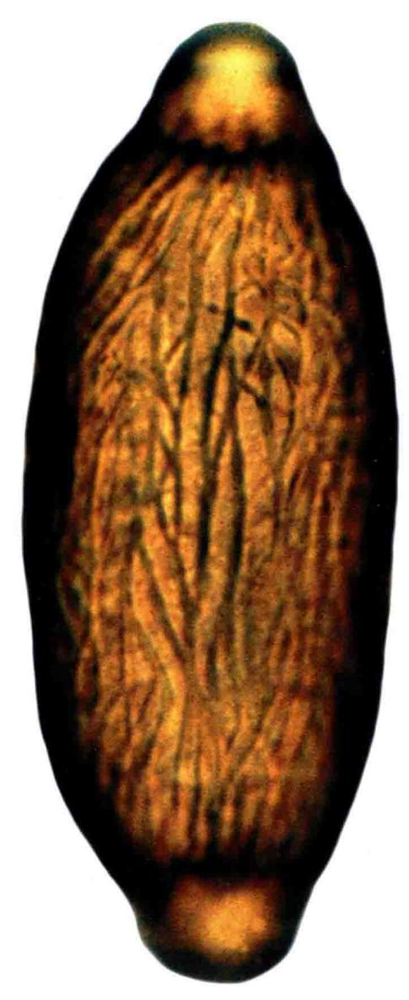

#### 布氏姬螯螨 (Cheyletiella blakei)

猫的毛螨,直接接触感染。

诊断:在皮肤刮取物或 者粪便中可见螨虫虫体,体长 500~600µm,有8对足, 足前端有强大的须肢爪,具有 诊断意义。虫卵较大且紧紧附 着在毛发上,在粪便中的卵一 端有突出部分(胶性物质余痕)。 在健康猫的皮肤刮取物和粪便 样品中可检出布氏姬螯螨。

成虫寄生部位:毛发。

近似种:无。

分布:世界各地。

临床症状:无症状或出现 轻微的皮炎现象。

潜在的人兽共患病: 在处 理布氏姬螯螨的猫时,可能会 在手臂上形成一过性病变。

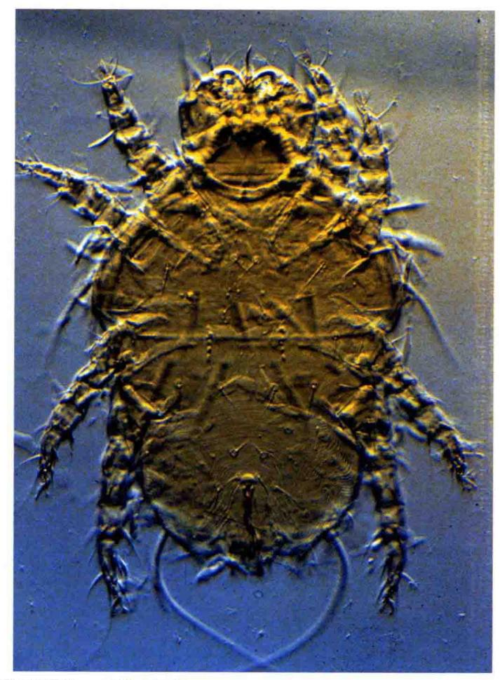

治疗: 可用除虫菊素或苄氯菊酯浸泡、喷洒患畜。

滴必除猫专用杀虫剂 (Defend® Just for Cats™ Insecticide): 主要成分是除虫菊酯,仅用于成年猫。

福来恩滴剂 (Frontline® Top Spot®): 主要成分是非泼罗尼 (Fipronil), 可用于成年猫和幼猫。

# 猫隐孢子虫(Cryptosporidium felis)

微小的球虫,通过摄入卵囊(随粪便排出时即有感染性)而发病。

发育周期: 5~7天。

诊断: 卵囊直径约5 μm,粪便中卵囊通过蔗糖漂浮法很容易被检测出来。

寄生部位:小肠黏膜。

近似种:无。

分布: 全球性分布。

临床症状:通常无症状,具有免疫抑制性疾病的猫可发生严重腹泻。

#### 潜在的人兽共患病:

目前尚不清楚多少人感染

猫源的隐孢子虫虫种,但为降低人潜在感染的风险,必须无害化处理猫粪便中的卵囊。

治疗:没有批准的药物;巴龙霉素有效但幼龄猫及具有严重腹泻症状的猫要谨慎用药;据报道泰乐菌素对一只猫的隐孢子虫感染治疗有效。

隐虫停(Humatin®,主要成分为巴龙霉素)125~165 mg/kg,口服,1天两次,连用5天。注意:如果胃肠道发炎,那可能是药物被吸收入血,引起氨基糖苷源性肾病。

泰农(Tylan®)可溶粉(泰乐菌素,100g包装,3g/茶匙量),猫适用剂量:11 mg/kg,口服,每12小时1次,连用4周。

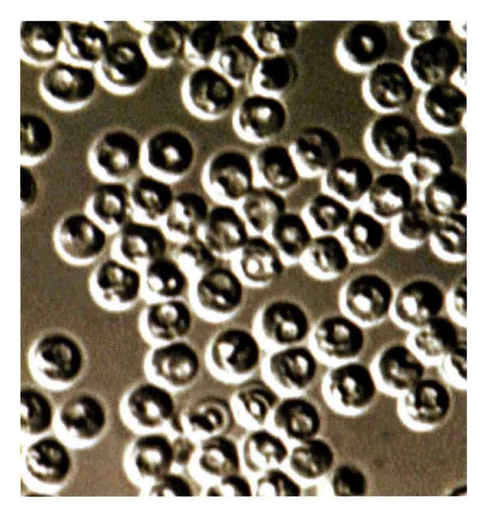

#### 猫胞裂虫 (Cytauxzoon felis)

猫红细胞内的小巴贝斯虫样虫体,经蜱叮咬传播。

发育周期: 1~3周。

诊断: 在红细胞内部可发现滋养体和配子体,通常只有1%~4%的猫受到感染。

寄生部位:红细胞,在骨髓穿刺物中可见到组织细胞的损伤,系 裂殖体寄生引起的。

近似种:无。

分布:美国东南部和中南部。

临床症状: 患猫通常表现极度 衰弱、严重贫血、精神沉郁、高热、 脱水、黄疸,肝、脾肿大等。猫往 往在感染后 9 ~ 15 天死亡。最近 发现一种毒力较弱的猫胞裂虫,其 致死性稍低,且不是所有感染的猫 都有临床症状。

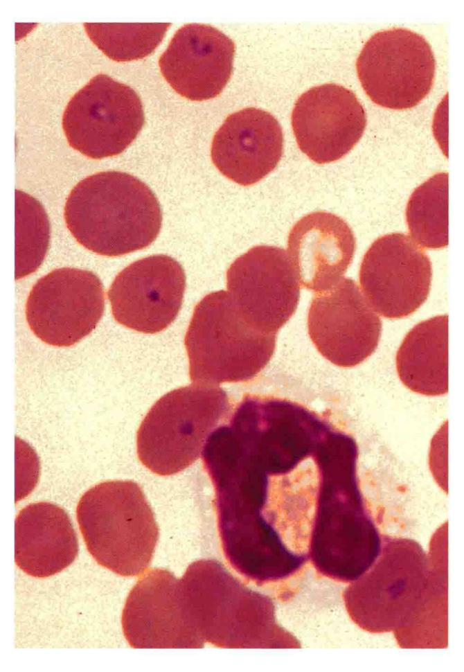

治疗: 积极治疗弥散性血管内凝血: 等渗液体, 肝素 (150 U/kg, 皮下注射, 每8 小时 1 次), 血浆。咪唑苯脲二丙酸酯 (Imidocarb diproprionate) 对该病的治愈率达 50%。

伊米唑(Imizol®,主要成分为咪唑苯脲二丙酸酯)5 mg/kg,肌肉注射,两次1个疗程,间隔两周。

贝尼尔 (Berenil®,主要成分为 diminazine) 2 mg/kg,肌肉注射,两次 1 个疗程,间隔 7 天;该药在美国没有销售。

# 猫栉首蚤 (Ctenocephalides felis)

猫和犬常见的跳蚤。

诊断: 成年栉首蚤长 1 ~ 3 mm, 在其颈部和脸颊有黑褐色至黑色类似 梳子的厚刚毛,两侧扁平,有6条腿。

寄生部位:被毛。虫卵和幼虱主要见于猫床上。

**近似种**:犬的犬毛虱(*Trichodectes canis*),猫的近喙状猫毛虱(*Felicola subrostratus*)。

分布: 全球性分布。

**临床症状**:通常无症状,有时可能引起猫贫血。

**注解**:幼虱是犬复孔绦虫的传播 媒介。

潜在的人兽共患病:猫粪便可能 会传播猫抓热。

**治疗**: 驱除猫栉首蚤后要洗澡, 对于感染较严重的猫可能需要输血。

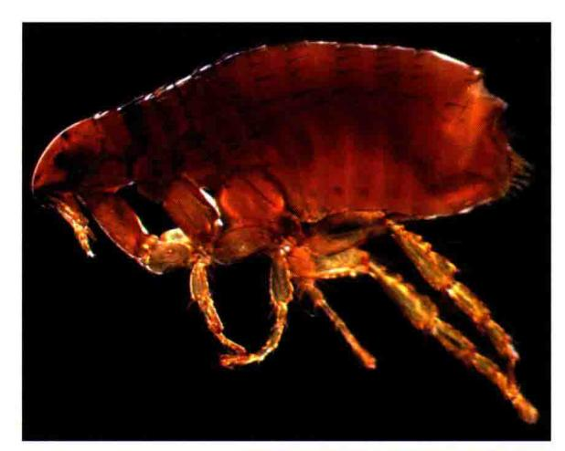

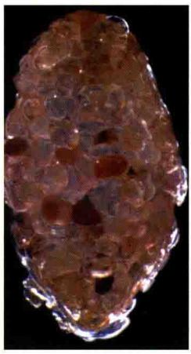

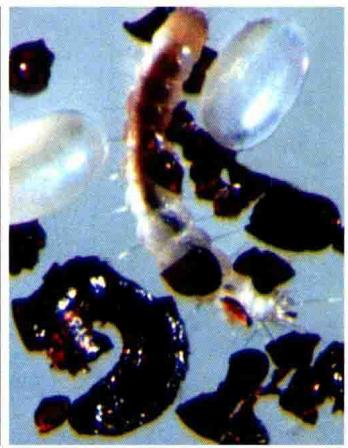

#### 注射剂

诺扑蚤®猫用6个月注射剂[Program®6-month Injectable for cats,主要成分为 氯芬奴隆(Lufenuron)],皮下注射。

#### 口服

诺普星 [Capstar®,主要成分为烯啶虫胺(Nitenpyram)]。 诺扑蚤风味片 [Program® Flavor Tabs®,主要成分为氯芬奴隆(Lufenuron)]。 诺扑蚤悬液(Program® Suspension)。

宝来威(Bravetor)(译者加)。

#### 滴剂

蚤安[(Advantage),主要成分为吡虫啉(Imidacloprid)]。

哈茨宠爱月月驱蚤蜱除滴剂 [Hartz® Advanced Care ™ Brand Once-a-Month ™, 主要成分为苯氧司林 (Phenothrin)]进行护理,1个月1次,对跳蚤和蜱有效,成年猫和幼猫的滴剂。

大宠爱 [Revolution,主要成分为塞拉菌素 (Selamectin)]。

#### 颈圈

亚当斯双动力猫用蚤蜱驱避颈圈 (Adams ™ Dual Action Flea and Tick Collar), 药物结构为: O- 异丙甲基氨基甲酸酯, 3- 苯氧基 -d- 顺式 - 反式 -2, 2- 二甲基 -3-(2- 甲代丙烯基)环丙烷, N- 正辛基二环二甲酰亚胺。

伴塞特(Bansect®)猫用蚤蜱驱避颈圈,主要成分为二溴磷(Naled)。

哈茨二合一(Hartz® 2 in 1®) 猫用蚤蜱驱避颈圈,主要成分为杀虫畏 Tetrachlorvinphos)。

长效杀 90 天 (Longlife® 90 Day™) 猫用蚤蜱驱避颈圈(主要成分为杀虫畏 Tetrachlorvinphos)。

净除猫用蚤蜱驱避颈圈 [Preventef®,主要成分为二嗪农(Diazinon)],为成年猫防治跳蚤和蜱虫的颈圈。

喜克虫猫用蚤蜱驱避颈圈 [Scratchex® Flea and Tick Collars for cats, 主要成分为毒死蜱 (Chlorpyrifos)]。

威克必克(Vet-Kem® Breakaway®) 猫用蚤蜱驱避颈圈[主要成分为残杀威(Propoxur)和(S)-烯虫酯(S)-Methoprene]。

#### 猫蠕型螨 (Demodex cati)

猫的毛囊螨, 通过直接接触感染。

诊断:通过皮肤刮取物或者粪便检查可以检测出来,螨及虫卵都呈细长型。成虫体长 180 ~ 220 µm,体细长,腿短小;虫卵细长,70 µm。

寄生部位:毛囊。

近似种:无。

分布: 世界性分布。

临床症状:通常无症状。成虫通常可在健康猫的皮肤刮取物和粪便中检查出来。可在已经感染的猫的脸部、眼睑、下巴或者脖子等处看到特征性的弥散性脱毛。也可在身体的其他部位看到损伤。

**潜在的人兽共患病**:抱过患有蠕形 螨的猫的人可在两臂出现一过性病变。

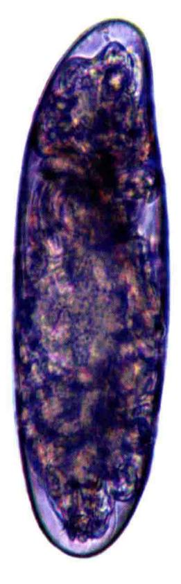

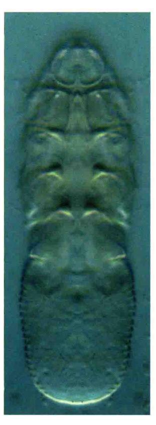

治疗: 双甲脒 (Mitaban®,主要成分为双甲脒)可将其标签剂量 (0.0125%)减半用于感染猫,每周1次,通常也可将阿维菌素增加剂量使用。

双甲脒(Mitaban®,按照标签剂量减半使用)。

拦截者 (Interceptor®) 2 mg/kg,每天 1 次直至症状消除,不能用于年龄小于 6 周或者体重低于 1.5 磅的幼猫。

害获灭 [Ivomec®, 主要成分为伊维菌素 (ivermectin)]0.3 ~ 0.6 mg/kg, 每天 1 次直至症状消除,可能持续几年时间。

#### 宽节双叶槽绦虫(Diphyllobothrium latum)

猫科动物的阔节绦虫,通过食入被感染的淡水鱼而感染。

发育周期: 5~6周。

诊断: 粪便中的虫卵与管 形钩口线虫虫卵的大小相近,长 60 µm,呈褐色、卵圆形,一端 有一个小的卵塞,虫卵内有发育 中幼虫的细胞。

成虫寄生部位:小肠。

近似种:全世界的外来近缘种都可以感染猫;与叠宫属绦虫的虫卵很相似。

分布:美国北方淡水湖泊。

临床症状: 无临床症状。

治疗:无批准药物。吡喹酮 (Praziquantel, 35 mg/kg, 口服, 1次)报道有效。

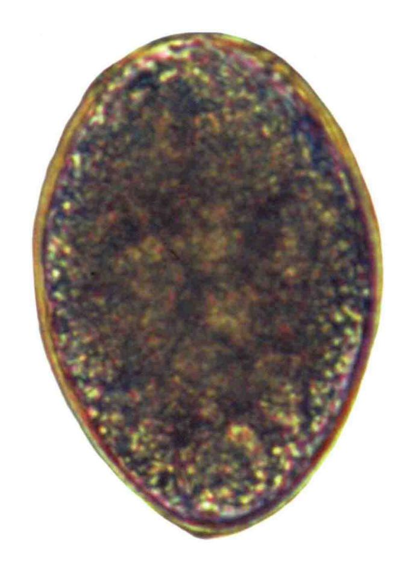

小拜宠清 (Drontal® Tablets,每片含吡喹酮 18.2 mg),不能用于年龄小于 4 周或者体重小于 1.5 磅的小猫。

重生特猫用驱绦虫片(Droncit® Feline Cestocide Tablets,每片含 23 mg 吡喹酮),不能用于年龄小于 6 周的小猫。

重生特犬猫用驱绦虫注射剂 ( Droncit® Injectable Cestocide for Dogs and Cats, 每毫升针剂含 56.8 mg 吡喹酮 ) ,不能用于年龄小于 6 周的小猫。

#### 变异革蜱 (Dermacentor variabilis)

美国犬蜱,从灌木和矮树丛爬到猫的皮肤上。

诊断:常可见成蜱,体长3~15 mm,当饱 血时外观呈扁平状。深色背景下盾板上可见白色 镶嵌,眼睛位于盾板边缘。没有肛前沟。若蜱与 小雌蜱相似。

寄生部位:皮肤。

近似种: 血红扇头蜱, 肩板硬蜱。

分布:美国东部;西部州有安氏革蜱。

临床症状: 常无症状, 可能会引起贫血。

注解: 猫胞裂虫病的传播媒介。

潜在的人兽共患病:如无直接接触,不会传播该病原。

治疗: 拔除后用酒精清洗伤口。

#### 滴剂

哈茨宠爱月月驱蚤蜱除 [Hartz® Advanced Care ™ Brand Once-a-Month ™, 主要成分为苯氧司林 (Phenothrin)]进行护理,1个月1次,对跳蚤和蜱有效,成年猫和幼猫的滴剂。

#### 颈圈

亚当斯双动力 (Adams™ Dural Action) 犬用 蚤蜱驱避颈圈 [O- 异丙甲基氨基甲酸酯, 3- 苯氧

基 -d- 顺式 - 反式 -2 , 2- 二甲基 -3- (2- 甲代丙烯基)环丙烷,N- 正辛基二环二甲酰亚胺 ]。

伴塞特(Bansect®)猫用蚤蜱驱避颈圈,主要成分为二溴磷(Naled)。

哈茨二合一(Hartz® 2 in 1®) 猫用蚤蜱驱避颈圈,主要成分为杀虫畏(Tetrachlorvinphos)。

长效杀 90 天猫用颈圈 [(Longlife® 90 Day™,主要成分为杀虫畏(Tetrachlorvinphos)]

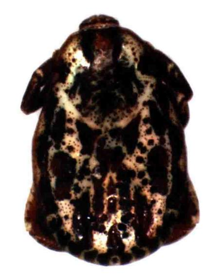

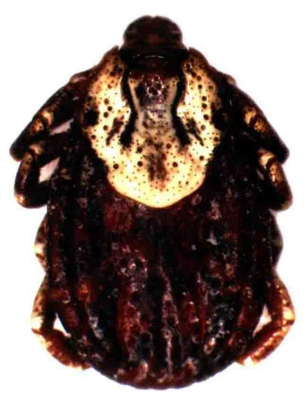

为成年猫做的防治跳蚤和蜱虫的颈圈。

净除猫用蚤蜱驱避颈圈 [Preventef®,主要成分为二嗪农(Diazinon)],为成年猫防治跳蚤和蜱虫的颈圈。

喜克虫猫用蚤蜱驱避颈圈 [Scratchex®,主要成分为毒死蜱(Chlorpyrifos)],为成年猫防治跳蚤和蜱虫的颈圈。

威克必克(Vet-Kem® Breakaway®) 猫用蚤蜱驱避颈圈[主要成分为残杀威(Propoxur)和(S)-烯虫酯(S)-Methoprene]。

# 犬复孔绦虫(Dipylidium caninum)

猫(犬)的跳蚤绦虫,通过食入被感染的跳蚤而感染。

发育周期: 3周。

诊断: 粪便中可检测出绦虫节片(长250~1000 µm)或卵袋(每个袋中有2~30个虫卵)。特征为生殖孔位于节片两侧,节片内含有卵袋,卵袋的大小不同,当其含少量的虫卵时(仅有几个),其大小相当于弓首蛔虫虫卵,而包含30个左右虫卵的卵袋则是弓首蛔虫虫卵大小的2~3倍。

成虫寄生部位:小肠。

近似种:在猫的粪便中可发现其他绦虫:带 状带绦虫(生殖孔仅在成熟节片一侧),叠宫属 绦虫(生殖孔位于成熟节片的中央),中绦属绦虫(有副子宫器)。

分布:全球性分布。

临床症状: 无症状。可在其肛周皮毛见到运动的节片。

潜在的人兽共患病:儿童吞下被绦虫感染的跳蚤会偶尔发生感染。通常无症状,但可在尿布上见到绦虫的运动节片。

治疗: 批准用于治疗猫复殖孔绦虫病的药物主要成分为吡喹酮或者依西太尔, 且根据产品说明给药非常有效。

小拜宠清 [Drontal® Tablets,主要成分为吡喹酮 (Praziquantel)] 不能用于年龄小于 4 周或者体重小于 1.5 磅的幼猫。

宠绦清(Cestex®,主要成分为伊西太尔)不能用于年龄小于7周的幼猫。

重生特猫专用驱虫片 ( Droncit® Feline Cestocide Tablets ) 不能用于年龄小于 6 周的幼猫。

重生特犬猫用驱绦虫注射剂 ( Droncit® Injectable Cestocide for Dogs and Cats ) ,不能用于年龄小于 6 周的幼猫。

犬用双羟萘酸噻嘧啶片 [Pyrantel pamoate Tablets, 兽药字(2016)020161048](译者加)。 猫用吡喹酮片 [Praziquantel Tablets, 兽药字(2016)020162514](译者加)。

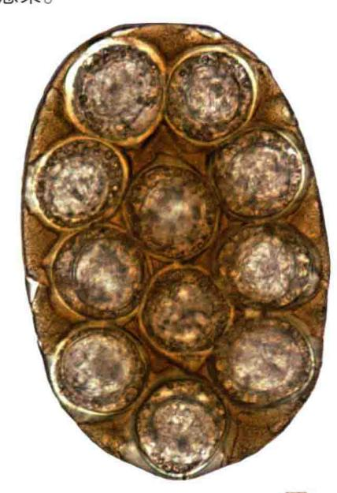

#### 多房棘球绦虫(Echinococcus multilocularis)

犬的一种非常小的绦虫, 少见于猫,通过食入被感染 的小型啮齿动物而感染。

发育周期: 3周。

诊断: 粪便中可检测出 虫卵(长30~35μm),如 果给予泻剂(这种做法很危 险,因为虫卵可以感染人), 在粪便中可能检测出成虫(长 2 mm)。

成虫寄生部位:小肠。

近似种: 棘球绦虫的虫卵 与带属绦虫的虫卵很难区分。

分布:在美国的大部分 地区极少见,但在阿拉斯加,

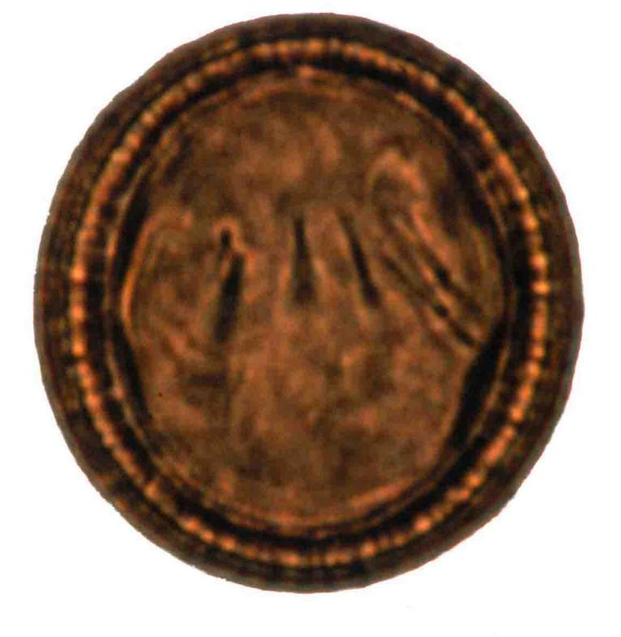

整个加拿大和有野生犬科动物种群分布的美国中部各州有此病的发生。

临床症状: 无症状。

潜在的人兽共患病:人类食入具有感染性的虫卵会发生泡型棘球蚴病。排出体外的虫卵具有感染性。如无治疗,人体发病的死亡率是 100%。

治疗:可选药物如下。

吡喹酮(100%有效)。

小拜宠清 (Drontal® Tablets) 不能用于年龄小于 4 周或者体重低于 1.5 磅的幼猫。 重生特猫专用驱绦虫片 (Droncit® Feline Cestocide Tablets, 主要成分为吡喹酮) 不能用于年龄小于 6 周的幼猫。

重生特犬猫用驱绦虫注射剂 ( Droncit® Injectable Cestocide for Dogs and Cats, 主要成分为吡喹酮) 不能用于年龄小于 6 周的幼猫。

# 嗜气真鞘线虫(Eucoleus aerophilus)

猫的常见呼吸系统毛细线虫,生活 史为直接型或可通过蚯蚓传播。

发育周期: 3~5周。

诊断: 粪便中的虫卵与狐毛尾线虫相似,但稍小(长约60 µm);虫卵两端有卵塞,但卵塞位置稍偏离中轴。其表面有细的网状纹饰。

成虫寄生部位:肺和支气管的黏膜上。

近似种属:寄生于鼻窦的伯氏真鞘线虫(Eucoleus boehmi)。

分布:全球性分布。

临床症状: 哮喘、咳嗽、体重下降、 慢性干咳。X 光可见弥漫性的支气管和 间质性浸润。

**诊疗**:无批准药物。成虫被驱杀 后,虫卵在几周内仍然随粪便中排出。 有效的治疗药物如下。

胖可求(Panacur®,主要成分为 芬苯达唑)50 mg/kg,口服,1天1次, 连用3天,可延长1周治疗或每隔1 周给药1次连续两个月。

害获灭(Ivomec®,主要成分为1% 伊维菌素注射剂),0.2 mg/kg,皮下注射或口服,两周时重复给药1次。

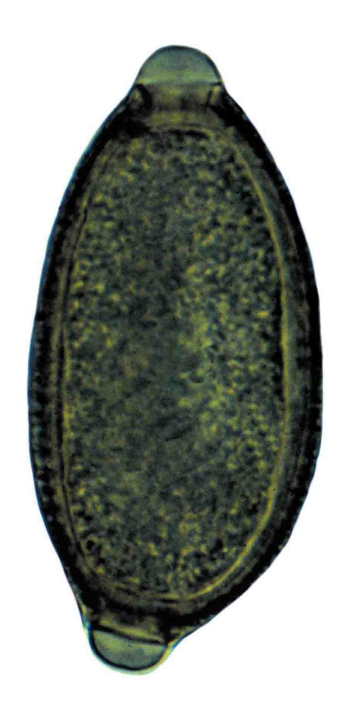

#### 近喙状猫毛虱 (Felicola subrostratus)

猫的食毛虱,通过与被感染的猫直接接触传染。

诊断: 在毛发上可见 1 ~ 2 mm 大的成年 虱,身体细长,头部呈三角形,呈奶油色至浅 褐色,雌虱和雄虱外观相似,虫卵有一个小的 卵盖。

寄生部位: 附着在毛发上,虫卵黏附在毛发上。

近似种: 猫栉首蚤。

分布:呈世界性分布。

临床症状:通常无,引起瘙痒。

潜在的人兽共患病:无。注解:此虱仅 见于猫。

治疗: 需要确保宠物在家里能够得到合理护理。

蚤安(Advantage,主要成分为吡虫啉)。 福来恩(Frontline,主要成分为非泼罗尼)。 大宠爱(Revolution,主要成分为塞拉 菌素)。

蚤蜱虱灭洗发水(主要成分为除虫菊酯, 胡椒基丁醚, N-辛基二环庚烯二甲酰亚胺)。

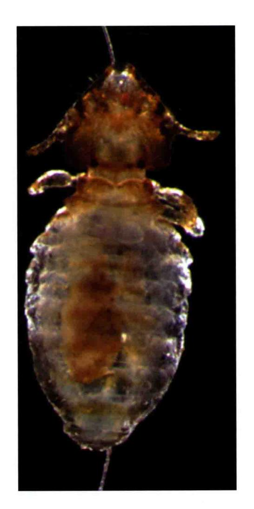

#### 猫贾第虫(Giardia felis)

猫粪便中的有鞭毛的滋养体和包囊,通过食入有感染性的包囊而感染。

发育周期:5~7天。

诊断:在猫粪便中可见滋养体和包囊,滋养体多在稀便中出现,呈网球拍状或水滴状(长10~17 µm),在其较宽的一端有两个细胞核,8根向后鞭毛,在生理盐水中呈滑行运动。包囊(长10 µm左右)多在成形的粪便中出现,椭圆形,清晰可见,有4个核。

寄生部位:小肠黏膜层(表层)。

近似种:滋养体必须与五鞭毛滴虫相区分。 其包囊与肉孢子虫的孢子囊及球虫的卵囊相似。

分布:全球性分布。

**临床症状**:通常无症状;有时见有小肠性腹泻,腹泻物脂肪含量常高。

潜在的人兽共患病:猫贾第虫可传染给人,但 是人主要从其他人获得感染。在处理猫粪便时应采取 适当的防范措施。

治疗:无批准药物。目前常用苯咪唑类药物。 芬苯达唑(胖可求)在标签剂量有效,小拜宠清和 阿苯达唑也已经被用于临床治疗贾第虫感染。

胖可求颗粒 22% ( Panacur® Granules 22.2% )。

肠虫清驱牛蠕虫悬剂 (Valbazen® Cattle Dewormer Suspension) 含阿苯达唑 11.36%, 114 mg/mL),剂量:25mg/kg,连续用药5天;有抑制骨髓的副作用。

灭滴灵口服片(福莱吉, Flagyl®; 主要成分为甲硝唑) 25 mg/kg, 口服, 1天两次, 连用5天, 67% 的病例有效。

疟涤平口服片(Atabrine®,主要成分米帕林)6.6 mg/kg,口服,1天两次,连用5天,100%有效,50%有嗜睡和发热的副作用。

痢特灵 (Furoxone®) 片 / 口服液 (呋喃唑酮: 4 mg/kg, 口服, 每 12 小时 1 次, 连用  $5\sim10$  天)。

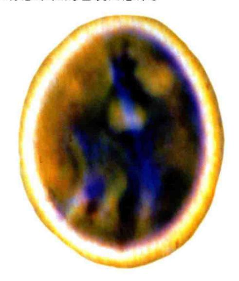

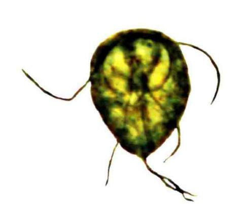

#### 哈氏哈蒙德球虫(Hammondia hammondi)

猫科动物的小型球虫,通过食入被感染的小鼠、山羊、鹿或者其他哺乳动物而感染。

发育周期:5~6天。

诊断: 在粪便中清晰可见未孢子化、球形的 卵囊(长  $10 \sim 13 \, \mu m$ )。

寄生部位: 小肠黏膜层。

近似种:与刚第弓形虫的卵囊无法区分。

分布: 全球性分布。

临床症状:无。

治疗:无。

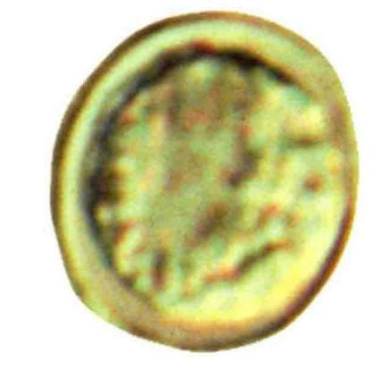

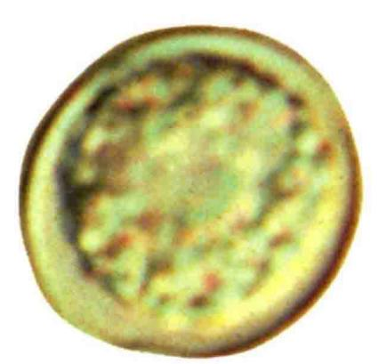

#### 猫等孢球虫 (Isospora felis)

猫科动物的较大球虫,通过食入孢子化卵囊或者已被感染的啮齿类动物而感染。

发育周期: 7~11天。

诊断:在粪便中可见 卵囊(40 µm×30 µm), 卵囊壁清晰、呈卵圆形、 新鲜排出时内有一个孢子 母细胞。

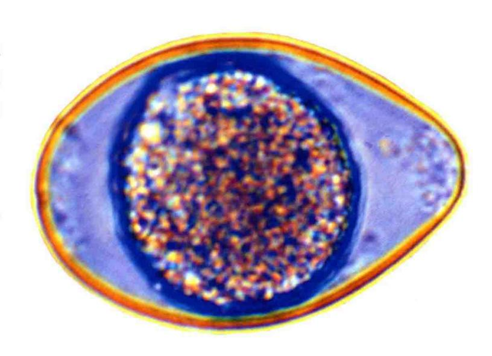

寄生部位:回肠。

近似种: 因其卵囊大, 很容易与其他猫科球虫属区分。

分布: 全球性分布。

**临床症状**:稀软黏液样腹泻。幼猫可能会有典型的肠炎(急性腹泻)、消瘦、有时可能会死亡。

**治疗**:一旦在粪便中发现了卵囊,虫体在黏膜层中发育造成的损伤已经形成,磺胺类药物是治疗该病的首选药物。

畜必生(Tribrissen®)片(磺胺嘧啶 – 甲氧苄氨嘧啶),每千克体重  $15\sim 20~mg$  磺胺嘧啶加  $5\sim 10~mg$  甲氧嘧啶,口服,1天两次,连用 6 天,适用于体重超过 4~kg 的猫。

阿尔邦(Albon®,主要成分为磺胺地托辛):首次剂量按照50 mg/kg,口服,维持剂量27.5 mg/kg,1天1次至症状消失。

普里莫尔(Primor®,主要成分为磺胺地索辛、奥美普林),每千克体重 55 mg 磺胺地索辛加 11 mg 奥美普林,口服,1天1次,连续用药 23 天。

科瑞德 (Corid®, 1.25% 咀嚼片剂, 9.6% 溶液, 20% 可溶解粉剂, 主要成分为安普罗铵):  $300 \sim 400 \text{ mg/kg}$ , 口服, 1天1次, 连用5天;  $110 \sim 220 \text{ mg/kg}$ , 连用7 ~ 12 天;  $20 \sim 40 \text{ mg/kg}$  连用 10 天。

痢特灵(Furoxone®)片/口服液(呋喃唑酮: 4 mg/kg, 口服, 1 天两次, 连用 5 ~ 10 天)。

## 里氏等孢子球虫(Isospora rivolta)

中等大小的猫科动物球虫,通过食入 孢子化卵囊或者已被感染的啮齿类动物而 感染。

发育周期: 4~7天。

诊断: 粪便中的卵囊 [(18~28) μm× (16~23) μm] 清晰、呈球状。

寄生部位:小肠黏膜层。

近似种:有必要将其与有潜在动物传染病风险的、更小的寄生虫区别开来。

分布: 全球性分布。

**临床症状**:有致病性,在新生猫而不 是断奶幼猫引起腹泻。

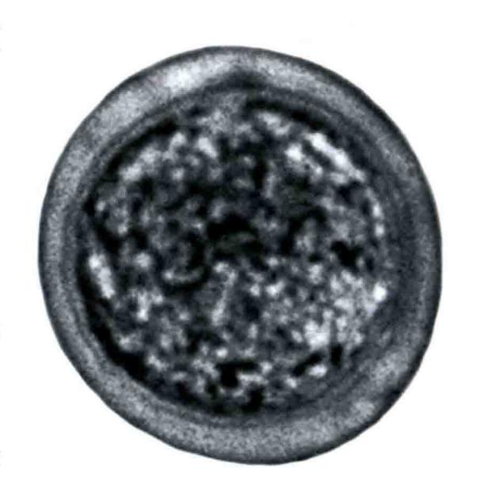

治疗: 一旦在粪便中检测到卵囊, 黏膜层的多半损伤就已经产生, 磺胺类药物是治疗该病的首选药物。

畜必生(Tribrissen®)片(磺胺嘧啶 – 甲氧苄氨嘧啶。每千克体重  $15\sim 50~mg$  磺胺嘧啶加  $5\sim 10~mg$  甲氧苄氨嘧啶,口服,1 天两次,连用 6 天,适用于体重超过 4~kg 的猫)。

阿尔邦(Albon®)(磺胺二甲氧嘧啶:首次剂量按照50 mg/kg,口服,维持剂量27.5 mg/kg,1天1次直至症状消失)。

普里莫尔 (Primor®,主要成分为磺胺地索辛、奥美普林),每千克体重 55 mg 磺胺地索辛 +11 mg 奥美普林,口服,1天1次,连续用药 23 天。

科瑞德 (Corid®, 1.25% 咀嚼片剂, 9.6% 溶液, 20% 可溶解粉剂, 主要成分为安普罗铵):  $300 \sim 400 \text{ mg/kg}$ , 口服, 1 天 1 次, 连用 5 天;  $110 \sim 220 \text{ mg/kg}$ , 连用 7 ~ 12 天;  $20 \sim 40 \text{ mg/kg}$  连用 10 天。

痢特灵 (Furoxone®) 片 / 口服液 (呋喃唑酮: 4 mg/kg, 口服, 每 12 小时 1 次, 连用 5 ~ 10 天)。

#### 肩突硬蜱(又称达氏硬蜱)(Ixodes scapularis)

鹿蜱,莱姆病蜱,黑腿蜱。从矮树或者小灌木丛附着到猫的皮肤上。

诊断: 常可发现成虫,长3~7 mm,饱 血后由扁平变成豆状,腹部呈深浅不一的棕 色,盾板的颜色比身体要深,所有阶段虫体 均存在肛前沟。若蜱与小的雌蜱相似。

寄生部位:皮肤。

近似种:变异革蜱,血红扇头蜱。

分布: 美国东部,在西部地区可见其他 种类。

**临床症状**:通常无症状,感染严重时可引起贫血。

注解: 系莱姆病和埃利希氏体的传播媒介。要确诊其是否为感染莱姆病的病原,要提交饱血蜱来进行实验室诊断。

潜在的人兽共患病:在无直接接触时,不 会传播病原。

治疗: 拔除病原后用酒精清洗伤口。

#### 滴剂

哈茨宠爱月月驱蚤和蜱除滴剂 [Hartz® Advanced Care™ Brand Once—a—Month™, 主要成分为苯氧司林(Phenothrin)]进行护理, 1个月 1次,对跳蚤和蜱有效,成年猫和幼猫滴剂。

#### 颈圈

亚当斯双动力 (Adams™ Dural Action) 猫用蚤蜱驱避颈圈 [O-异丙甲基氨基甲酸酯,

3- 苯氧基 -d- 顺式 - 反式 -2, 2- 二甲基 -3- (2- 甲代丙烯基) 环丙烷, N- 正辛

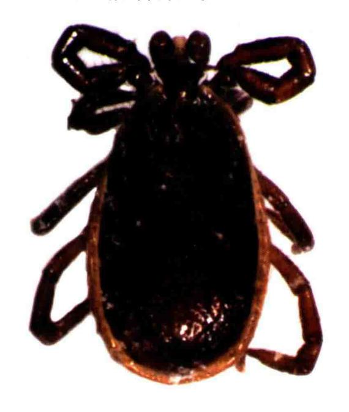

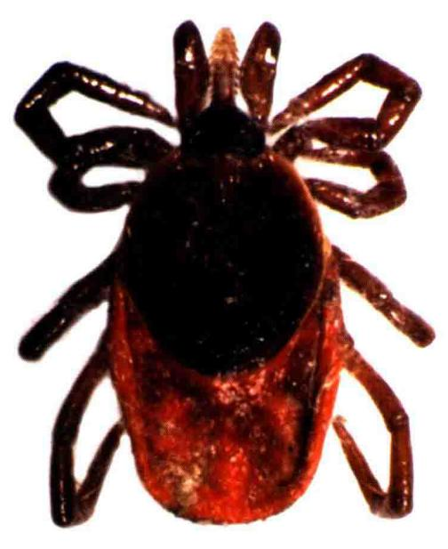

#### 基二环二甲酰亚胺]。

伴塞特(Bansect®)猫用蚤蜱驱避颈圈,主要成分为二溴磷(Naled)。

哈茨二合一(Hartz® 2 in 1®)猫用蚤蜱驱避颈圈,主要成分为杀虫畏(Tetrachlorvinphos)。

长 效 杀 90 天 猫 用 颈 圈 [Longlife® 90 Day ™, 主 要 成 分 为 杀 虫 畏, (Tetrachlorvinphos)]为成年猫做的防治跳蚤和蜱虫的颈圈。

净除蚤蜱驱避颈圈 [Preventef®,主要成分为二嗪农(Diazinon)],为成年猫防治跳蚤和蜱虫的颈圈。

喜克虫猫用蚤蜱驱避颈圈 [Scratchex®,主要成分为毒死蜱(Chlorpyrifos)],为成年猫防治跳蚤和蜱虫的颈圈。

威克必克(Vet-Kem® Breakaway®) 猫用蚤蜱驱避颈圈[主要成分为残杀威(Propoxur)和(S)-烯虫酯(S)-Methoprene]。

# 利什曼属原虫(皮肤型)(Leishmania spp.)

猫的皮肤型利什曼原虫(有数个不同的虫种),通过白蛉叮咬传播。

发育周期:数周到数月。

诊断:在穿刺物印片中见到巨噬细胞内的无鞭毛体可确诊。

寄生部位:巨噬细胞。

近似种:无。

分布:主要见于美国中部(比如俄克拉荷马州和德克萨斯州)的猫体内。

临床症状: 常在耳朵和鼻部出现 病变。

治疗: 对耳朵的病变进行手术去

除是有效的治愈手段。目前在临床上尚无尝试用抗利什曼原虫药物进行治疗。

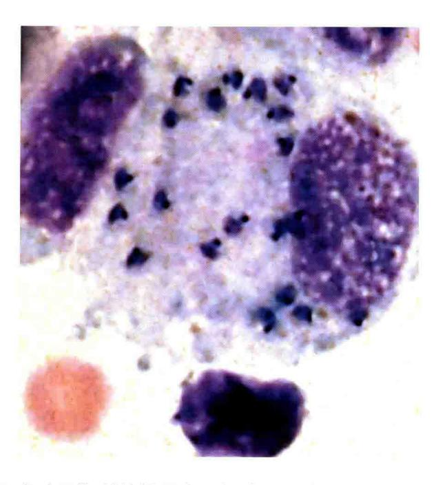

#### 家猫食毛螨(Lynxacarus radovskyi)

猫的毛螨,通过直接接触感染。

诊断: 在进行皮肤检查或者粪便检查时可见此类螨虫。长 500 μm, 两侧扁平, 腹部较长; 虫卵长约 200 μm, 常黏附在毛发上。

成虫寄生部位:通常黏附在猫巴的毛发上。

近似种:无。

分布: 全球性分布。

临床症状: 轻度皮炎。

治疗:没有批准药物,但下列药物有效。

滴必除猫专用杀虫

剂 ( Defend® Just for Cats™, 主要成分为除虫菊酯)。

福来恩滴剂 [Frontline® Top Spot®, 主要成分为非泼罗尼(Fipronil)] 对成年猫和幼猫有效。

大宠爱 (Revolution™)。

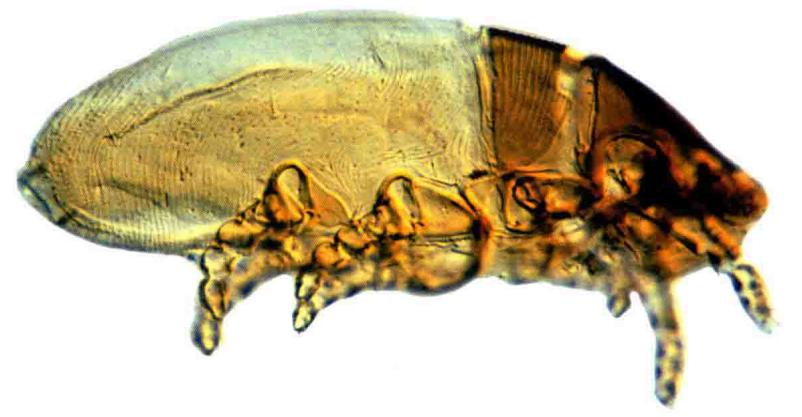

# 中绦属绦虫 (Mesocestoides spp.)

猫的绦虫,通过食入被感染的两栖类、爬行动物、鸟类、小型哺乳动物而感染绦虫。

发育周期: 3周。

诊断: 在粪便中可见绦虫节片(长250~500µm);有时可见链状的多个节片。 节片很小,易被漏检,但是通过鉴定粪便中的虫卵可以确诊。虫卵聚集在节片中央的一个单一的卵球内,一个卵球内大约有30个或者更多的虫卵,每个虫卵内含有一个3对小钩的幼虫。

成虫寄生部位:小肠。

近似种:可以感染猫的中缘属绦虫包括卡氏中绦虫(Mesocestoides kirbyi)、偏侧中绦虫(M. latus)、线中绦虫(M. lineatus)、纹饰中绦虫(M. litteratus)和曼氏中绦虫(M. manteri)。它们都很相似,可能在各种野生的犬科或者猫科动物体内发现。

分布: 全球性分布。

临床症状:无。

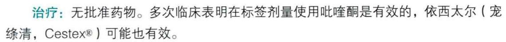

小拜宠清(Drontal® Tablets)不能用于年龄小于4周或者体重低于1.5磅的幼猫。 宠绦清(Cestex®,主要成分为依西太尔)不能用于年龄小于7周的幼猫。

重生特猫用驱绦虫片 (Droncit® Feline Cestocide Tablets, 主要成分为吡喹酮) 不能用于年龄小于 6 周的幼猫。

重生特犬猫用驱绦虫注射剂 ( Droncit® Injectable for Dogs and Cats, 主要成分为吡喹酮) 不能用于年龄小于 6 周的幼猫。

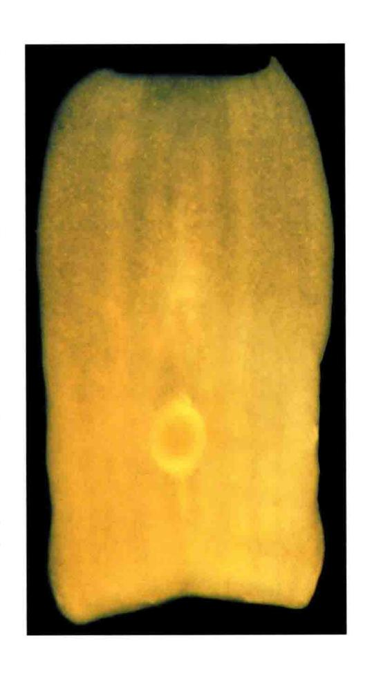

#### 猫背肛螨 (Notoedres cati)

猫的疥螨,通过直接接触传染。

诊断:在皮肤碎屑或者 粪便中可以检测到螨虫。成 螨(长200~250µm)有 4对足,体表有许多粗壮的 刺。足末节(其中雌性在其 第1、第2对足,雄性在第 1、第2、第4对足,其他 足的末端分布刚毛)茎杆较 长,不分节,茎杆最末端为 吸盘。虫卵长约200µm。

成虫寄生部位:在皮肤内挖隧道。

近似种:无。

分布: 全球性分布。

**临床症状**:患病部位瘙痒、皮肤增厚并形成痂皮、

脱毛、患病局部抓挠引起局部外伤感染,病变通常开始于面部或膝盖。

治疗:阿维菌素类药物或许是可供选择的药物。大宠爱(Revolution)在标签剂量对螨虫引起的感染或许有很好的疗效。

害获灭(Ivomec®, 主要成分为 1% 的伊维菌素注射液) 0.2 mg/kg, 单次皮下注射或口服。两周时再用给药 1 次。

大宠爱 ( Revolution ™ )。

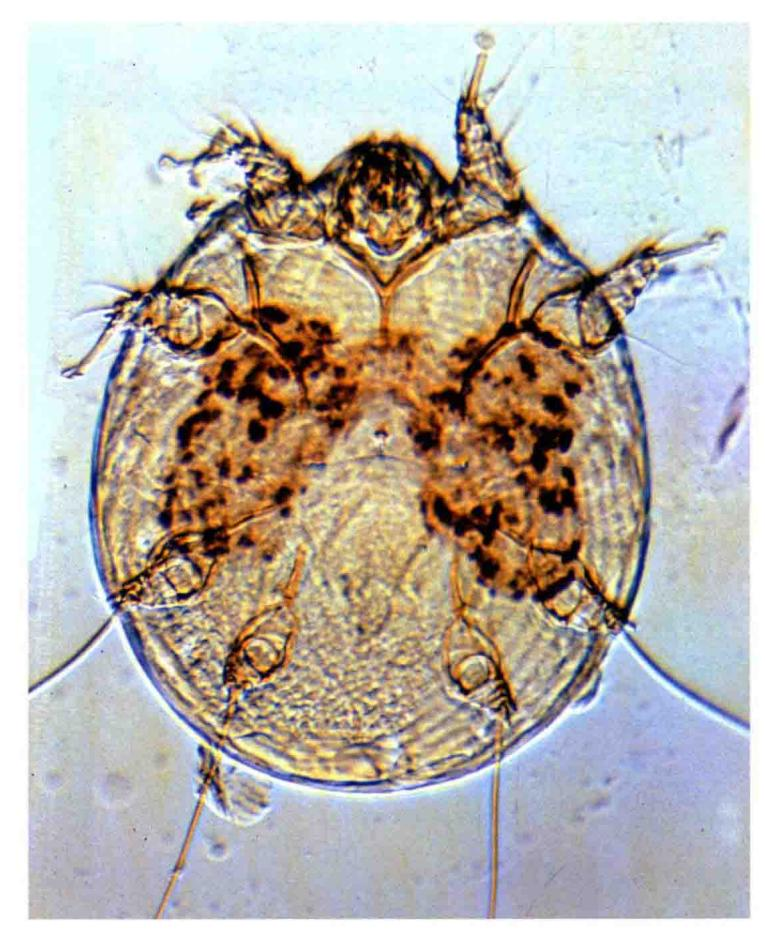

# 犬耳痒螨 (Otodectes cynotis)

猫的耳螨,通过直接接触感染。

诊断:通过耳拭子或者粪便检查可确诊,成虫长约400 μm,体圆形,8条足很长,足上有吸盘(其中雌性在其第1、第2对足,雄性在第1、第2、第3、第4对足,其他足的末端分布刚毛),吸盘柄很短,不分节。虫卵长约200 μm。

成虫寄生部位: 耳道。

近似种:无。

分布:全球性分布。

临床症状: 耳炎,头部剧烈晃动,频繁抓耳朵,大量 耳垢堆积在外耳道,可导致严重的耳道继发性感染。

治疗: 几个批准的药物对猫有很好的疗效。

蜱螨净(Acarexx™,主要成分为伊维菌素)。

大宠爱 (Revolution™, 主要成分为塞拉菌素)。

耳螨灭 ( Milbemite ™, 主要成分为莫西菌素 )。

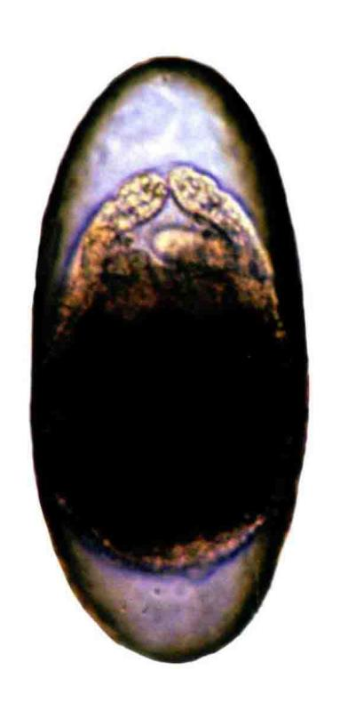

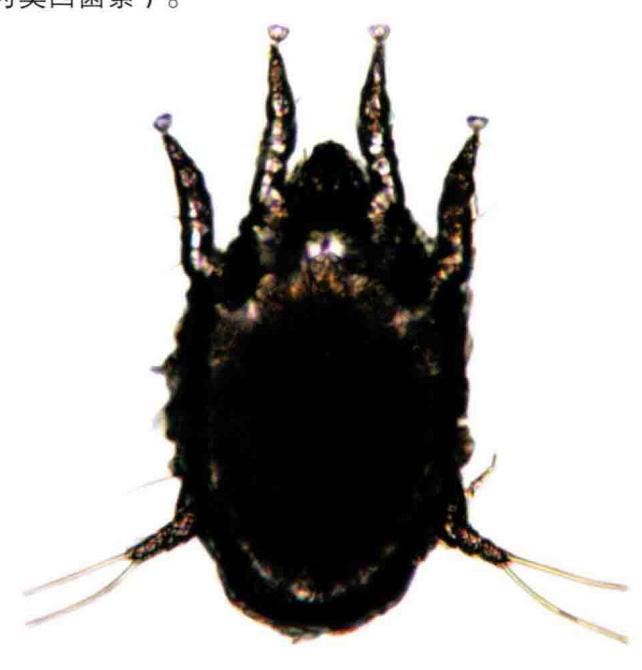

# 克氏并殖吸虫(Paragonimus kellicotti)

猫的肺吸虫,通过食入感染的 小龙虾或啮齿类宿主而感染。

发育周期:5~7周。

诊断: 可在粪便或气管冲洗液 中发现虫卵,虫卵长70~100μm,呈 棕色,有卵盖,另一端有一个小的 突起。胸片可能会发现肺叶背端区 域有充满空气的囊肿或组织密度影 (可达1cm)。气管冲洗液中可能 会发现虫卵。嗜酸性粒细胞数量升高。

成虫寄生部位: 肺部囊肿内。

近似种:世界范围内已报道多种犬猫的类似寄生虫种类。注意辨别区分叠宫属(Spirometra)和双叶槽属(Diphyllobothrium)绦虫的虫卵。

分布: 克氏并殖吸虫分布在美国北部, 但并殖属的其他虫种在全世界都有发现。

临床症状:通常无临床症状。

症状主要为咳嗽(轻度到阵发性)。若囊肿破裂导致呼吸窘迫可引起气胸。注意与哮喘、心丝虫、心脏病以及猫圆属线虫感染相区别。

治疗:无批准药物。连续数日给予高剂量的吡喹酮是有效的治疗方法。 重生特猫用驱绦虫药(Droncit® Feline Cestocide Tablets, 吡喹酮: 25 mg/kg, 口服,每8小时1次,连用3天),小于6周的猫不可使用。

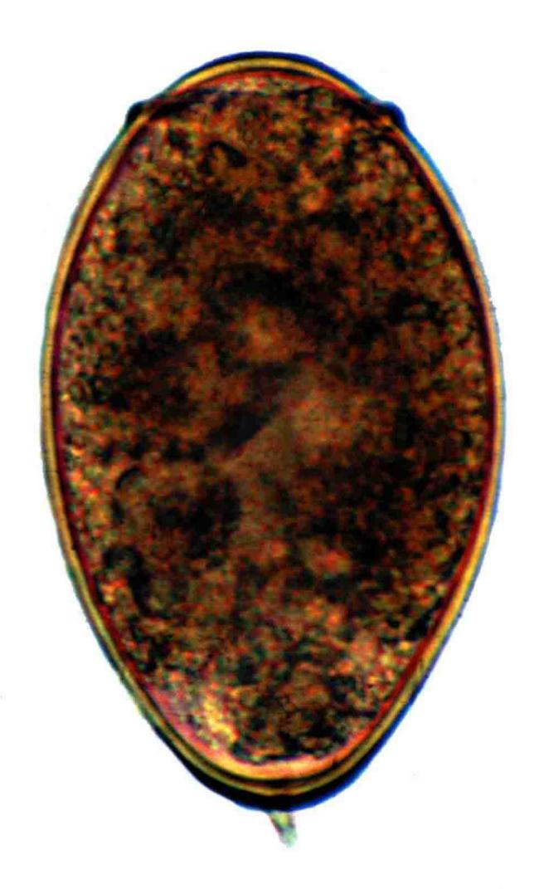

#### 猫 / 犬毛细线虫 (Pearsonema feliscati)

猫的膀胱毛细线虫,由于食入 虫卵或某些未确定的续转宿主而 感染。

发育周期:两个月。

诊断:尿液中的虫卵形似狐毛尾线虫(*Trichuris vulpis*),但稍小(长60 µm),且表面有大的凹点。

成虫寄生部位:整个膀胱壁黏膜。

近似种:无。

分布:全世界。

**临床症状**:无症状。极少数情况下猫表现出肾后尿道阻塞。

治疗: 无批准药物。成虫驱杀后, 尿液中仍可持续数周有虫卵排出。 可能有效的治疗方法如下。

害获灭(Ivomec®)驱虫药(1%的伊维菌素注射剂: 0.2 mg/kg,皮下注射或口服,两周时重复1次)。

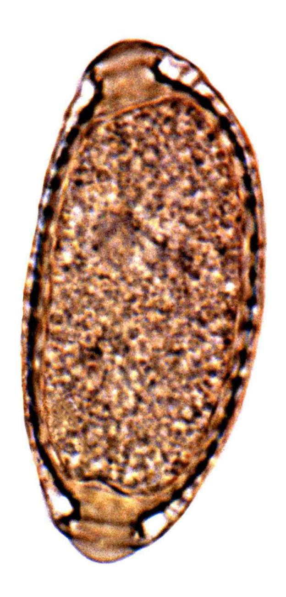

#### 人五鞭毛滴虫 (Pentatrichomonas hominis)

猫的毛滴虫滋养体;经 粪口途径传播。

发育周期:约1周。

诊断: 粪便置于生理 盐水中(漂浮集卵法所用的 溶液会杀死运动虫体),可 发现带鞭毛的滋养体(长 10 µm)颠簸前进运动。在被 杂质困住的虫体上可见到波 动膜。

寄生部位:盲肠和结肠肠腔内。

近似种:需与贾第虫的 滋养体相区分。

分布:世界各地。

临床症状: 虫体见于腹泻的猫,可能不是引起腹泻的主要原因。

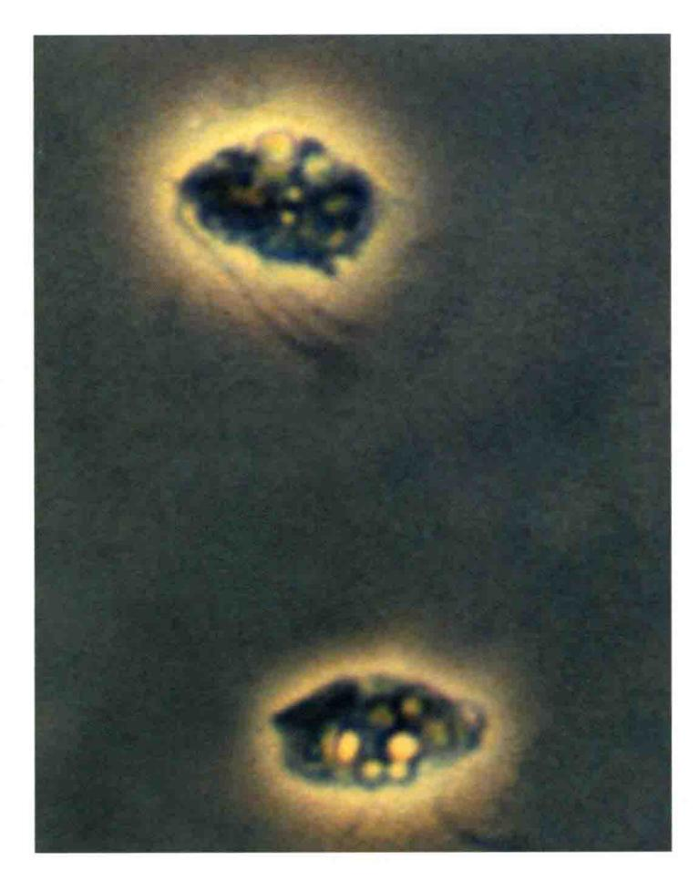

潜在的人兽共患病:可以直接由患猫粪便传染给照料猫的人。在清理猫粪便时应 采取常规防护措施。

治疗:无批准药物。可使用甲硝唑 (Metronidazole)。

灭滴灵口服片(福莱吉, Flagyl®)(甲硝唑: 66 mg/kg, 口服, 每 24 小时服用 1 次, 连续 5 天)。

# 包皮泡翼线虫(Physaloptera praeputialis)

猫科动物的胃线虫。成虫 附着于胃窦和邻近的十二指肠 近端。中间宿主为食粪的甲虫。

发育周期: 2~3个月。

诊断: 虫卵较钩虫卵稍短, 长约 45 µm, 镜下清晰, 卵壁厚, 内含有幼虫。常在粪便或胃内 镜的胃液中发现。胃镜检查时 可能发现损伤。

成虫寄生部位:胃部以及邻近的小肠。

近似种:稀泡翼线虫(Physaloptera rara)(成虫后端没有类似包皮的鞘,被认为是土狼的一种寄生虫)。泡翼属其他虫种寄生于犬、猫、狐狸、臭虫鼬和浣熊。

分布:全世界。

临床症状:呕吐。

治疗: 无批准药物。心丝虫预防药物不能预防感染。

有效的治疗方法如下。

害获灭(lvomec®)(1%的伊维菌素复合注射剂: 0.2 mg/kg,皮下注射或者口服,两周时重复1次)。

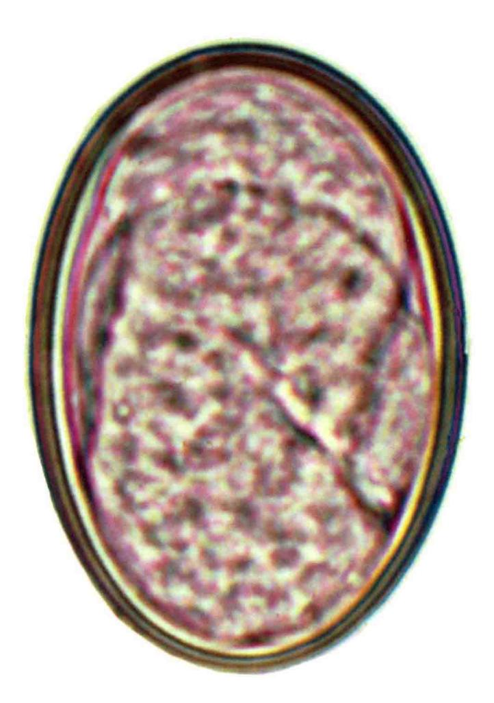

#### 稀泡翼线虫(Physaloptera rara)

猫科动物的胃线虫。成 虫附着于胃窦和邻十二指肠近 端。中间宿主为食粪甲虫。

发育周期: 2~3个月。

诊断: 虫卵较钩虫卵稍短, 长约 45 µm, 虫卵镜下清晰可 见,壁较厚,内含一个幼虫。 常在粪便或胃内镜的胃液中 发现。

成虫寄生部位:胃和小肠 近端。

近似种:包皮泡翼线虫(Physaloptera praeputialis)(成虫后端有类似包皮的鞘)。本属其他虫种寄生于犬、猫、狐狸、臭鼬和浣熊。

分布: 主要在美国中部。

临床症状:呕吐。

治疗:无批准药物。心丝虫预防药物不能预防感染。

有效的治疗方法如下。

害获灭 (Ivomec®) (1%的伊维菌素复合注射剂: 0.2 mg/kg,皮下注射或者口服,两周内重复 1 次 )。

硕虫敌(又称壮吉)(Strongid®T,双羟萘酸噻吩嘧啶:5 mg/kg,口服,3周后重复1次)。

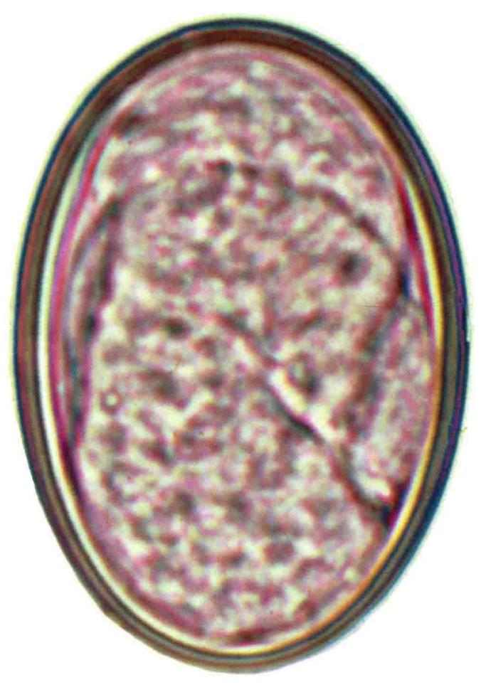

# 优美平体吸虫(Platynosomum concinnum)

猫科动物的肝脏吸虫, 通过吞食蜥蜴或两栖类动物 而感染。

发育周期:两个月。

诊断: 粪便中的虫卵较小,颜色较暗,有卵盖,长约 40 µm。

成虫寄生部位: 胆管和胆囊。

近似种:全世界有很多 种吸虫可寄生在猫的胆管中。

分布:美国东南部。

临床症状: 胆道梗阻可造成腹泻、抑郁、厌食、严重的体重下降、不同程度的黄疸(常较轻)。腹部超声显示肝脏扩张、胆管扩张、胆管增厚。效果好的超声图像可显示出胆管中的吸虫。

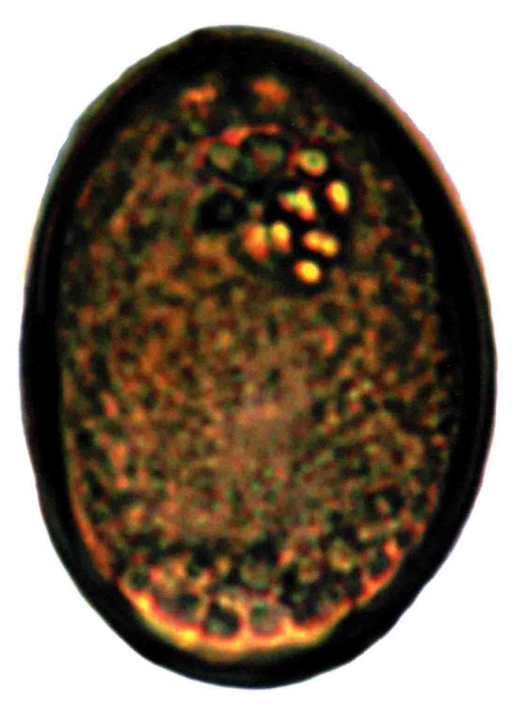

治疗: 无批准药物。吡喹酮可能有效。但对于衰弱的猫, 高剂量(40 mg/kg)的吡喹酮可能是致命的。

重生特猫用驱绦虫药(Droncit® Feline Cestocide Tablets, 吡喹酮 20 mg/kg, 口服, 1 个月时重复给药 1 次, 并继续粪检)。不宜用于小于 6 周的幼猫。

# 血红扇头蜱 (Rhipicephalus sanguineus)

棕色犬蜱。从灌木丛或矮树上黏附于宿主皮肤。

诊断: 常发现长3~7mm的成蜱,饱血后呈扁平豆状,棕色。 盾板边缘有眼,无肛前沟。若蜱与小雌螨相似。

寄生部位:皮肤。

相似的物种:变异革蜱(Dermacentor variabilis)、肩突硬蜱(Ixodes scapularis)。

分布范围:美国南部;不能耐受冰点温度,但可在室内越冬。

临床症状:通常无症状;可能会造成贫血。其所有阶段(幼蜱、若蜱和成蜱)都在犬身上吸血。可栖息于犬舍和家庭。当某地区感染时,需要考虑保护猫。

潜在的人兽共患病: 当没有接触时, 不会直接传染。

治疗: 拔除蜱后用酒精清洗伤口。

#### 口服

宝来威(Bravetor)(译者加)。

#### 滴液

哈茨®宠爱™月月驱蚤蜱除滴剂 (Hartz® Advanced Care™ Brand Once-a-Month™主要成分为苯氧司林 Phenothrin )进行护理,1月1次,对跳蚤和蜱有效,成年猫和幼猫滴剂。

#### 颈圈

亚当斯双动力猫用蚤蜱驱避颈圈(Adams™ Dural Action)[O- 异丙甲基氨基甲酸酯,3- 苯氧基 -d- 顺式 - 反式 -2,2- 二甲基 -3- (2- 甲代丙烯基)环丙烷,N- 正辛基二环二甲酰亚胺]。

伴塞特(Bansect®)猫用蚤蜱驱避颈圈,主要成分为二溴磷(Naled)。

哈茨二合一(Hartz® 2 in 1®)猫及猫宝宝用蚤蜱驱避颈圈,主要成分为杀虫畏(Tetrachlorvinphos)。

长效杀 90 天 (Longlife® 90 Day™, 司替罗磷)猫用颈圈。

净除(Preventef®, 二嗪农)猫用蚤蜱驱避颈圈。

喜克虫猫用蚤蜱驱避颈圈 (Scratchex®, 氯蜱硫磷)。

威克必克(Vet-Kem® Breakaway®) 猫用蚤蜱驱避颈圈[主要成分为残杀威(Propoxur)和S-烯虫酯(S)-Methoprene]。

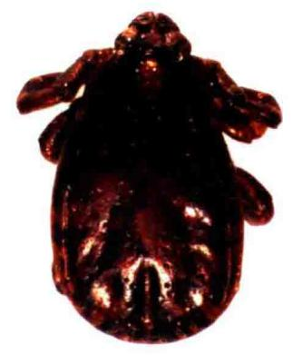

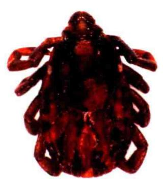

# 肉孢子虫属 (Sarcocystis spp.)

猫粪便中可发现孢子囊,食 入中间宿主(脊椎动物)肌肉组 织而感染。

发育周期: 3天至3周。

诊断: 粪便可见清晰的、椭圆形的孢子囊(长9~17μm),有时在薄的卵囊壁中见到两个孢子囊;排出体外时即有感染性。

寄生部位:小肠黏膜。

近似种:肉孢子虫属包括多个虫种,可感染多种中间宿主。 须认真检查孢子囊,与小型卵囊 和猫贾第虫(Giardia felis)的 包囊区分。

分布: 世界性分布。

临床症状:无症状。

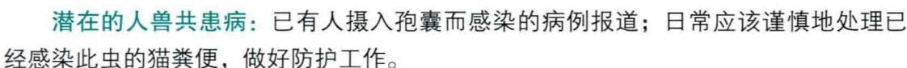

治疗: 没有被批准的药物。

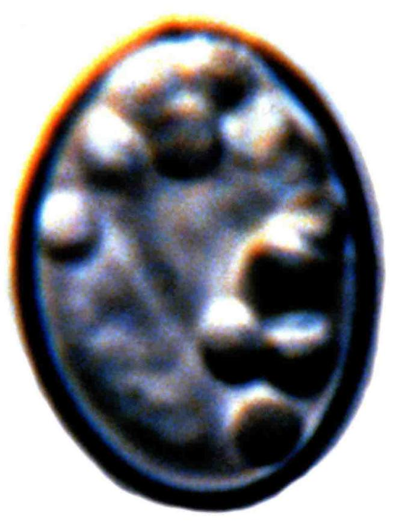

# 拟孟氏叠宫绦虫 (Spirometra mansonsoides)

猫/犬绦虫,因食入感染的蛇、啮齿 类动物和其他小型脊椎动物而感染。

发育周期:短至 10 天;可数年内持续排出虫体。

诊断: 粪便中的虫卵(长60μm) 大小与犬钩口线虫(Ancylostoma caninum)虫卵相似,呈棕色,一端有 卵盖,内含发育中幼虫的细胞。

成虫寄生部位:小肠。

近似种:全世界有多种叠宫属(Spirometra)绦虫。虫卵与宽节双叶槽绦虫(Diphyllobothrium latum)虫卵相似。

分布范围:美国。

临床症状:可能有腹泻、消瘦和/或呕吐。会造成非再生性贫血(有时很严重)。

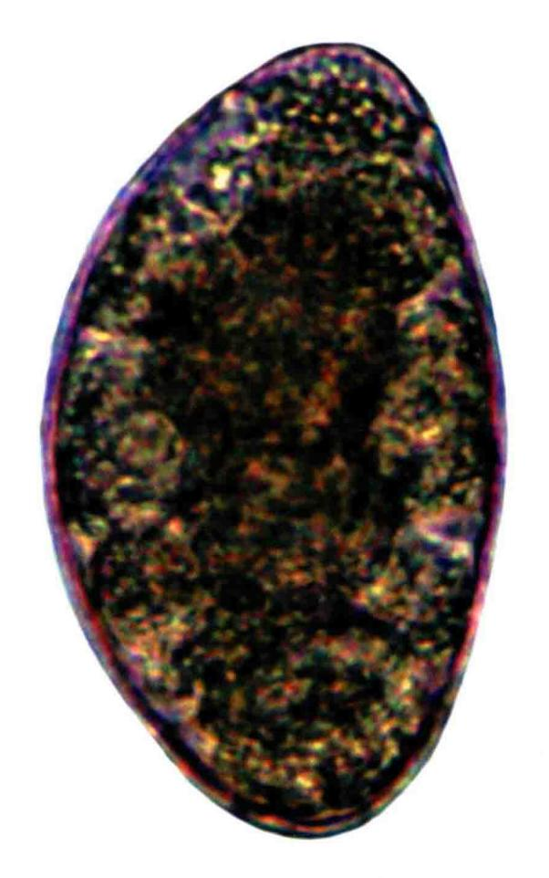

治疗:没有批准药物。阿苯达唑治疗无效。有报道称,吡喹酮(5 mg/kg)治疗有效,但其他的报道认为需提高药物剂量才有效。宠绦清(Cestex®,依西太尔)也可能是有效的。

小拜宠清(Drontal® Tablets,不适用于年龄小于 4 周或小于 1.5 磅重的小猫)。 宠绦清(Cestex®,不适用于年龄小于 7 周的小猫)。

重生特猫用驱绦虫片 (Droncit® Feline Cestocide Tablets,不适用于年龄小于 6 周的小猫)。

重生特犬猫用驱绦虫注射剂(不适用于年龄小于6周的小猫)。

如果治疗不成功,尝试如下药物:

重生特猫用驱绦虫片(Droncit® Feline Cestocide Tablets, 吡喹酮 7.5 mg/kg, 连用两天;或 25 mg/kg,连用两天)。不适合年龄小于 6 周的小猫。

# 带状带绦虫(Taenia taeniaeformis)

啮齿动物的绦虫。猫食入啮齿 动物的内脏而感染。

发育周期: 1~2个月。

诊断: 粪便中发现节片(长500~1000µm)或虫卵(长30~35µm)。绦虫节片呈矩形,每个节片有单侧的生殖口。撕开节片可见典型的虫卵。

成虫寄生部位:小肠。

近似种:家猫仅有的带属绦虫,但 其虫卵与棘球属(Echinococcus) 虫卵难以区别。

分布:世界性分布。

临床症状: 无临床表现。

治疗: 如下已批准的药物非常有效。 小拜宠清 ( Droptal® Tablets 不适用

小拜宠清 ( Drontal® Tablets,不适用于年龄小于 4 周和小于 1.5 磅重的小猫 )。

宠绦清(Cestex®,不适用于年龄小于7周的小猫)。

重生特猫用驱绦虫片(Droncit® Feline Cestocide Tablets,不适用于年龄小于6周的小猫)。

重生特犬猫用驱绦虫注射剂 (Droncit® Injectable Cestocide for Dogs and Cats,不适用于年龄小于6 周的小猫)。

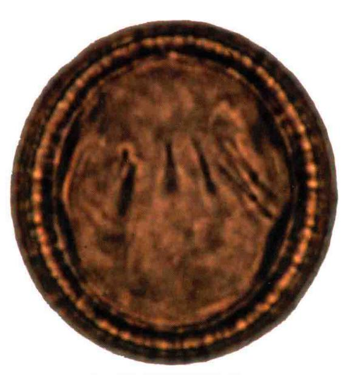

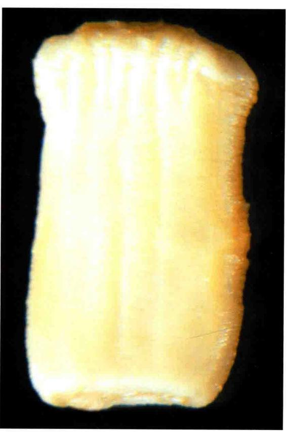

#### 狮弓蛔线虫(Toxascaris leonina)

猫/犬的常见蛔虫。 不能通过子宫而感染,因 此,小猫体内未见此虫。

发育周期:约两个月。

诊断: 粪便可查出 虫卵。虫卵呈卵圆形,长 90 µm,卵壳厚而光滑, 卵内部的卵细胞呈亮光 色。虫卵发育迅速。

成虫寄生部位:小肠。

近似种: 猫弓首蛔虫 (*Toxocara cati*) ——有 相似的大小和形状, 但其

卵壳凹凸不平, 且内部卵细胞颜色较暗。

分布: 世界性分布, 在凉爽气候条件下更常见。

临床症状: 无典型症状。此病报道较少。

潜在的人兽共患病: 儿童的内脏幼虫移行症。

治疗:几种非处方药物有效;标注治疗猫弓首蛔虫的药物可能都有效。特色克片(Task® Tabs,不适用于小于 10 日龄或小于 1 磅重的小猫)。

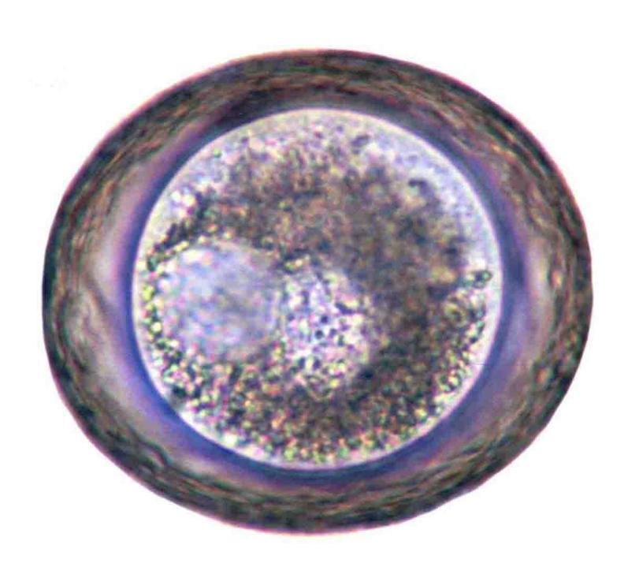

#### 猫弓首蛔虫(Toxocara cati)

常见的猫科动物蛔虫。 小猫可通过乳汁而感染。

发育周期:小猫最早在出生后3~4周开始排出虫卵。

诊断:虫卵呈球形, 长约80 µm,可出现在各 年龄段的猫的粪便中。卵壳 表面具有特征性凹点。

成虫寄生部位:小肠。

近似种:狮弓蛔线虫 (Toxascaris leonina) 虫 卵相对较大,但有光滑的卵 壳,且卵细胞颜色比较浅。

分布: 世界性分布。

临床症状: 无典型临

床症状。幼猫可能表现出精神沉郁、食欲不振。

潜在的人兽共患病:可在儿童的内脏和眼中出现幼虫移行。

治疗: 以下产品按标签说明使用。

小拜宠清(Drontal® Tablets,不适用于小于 4 周龄或小于 1.5 磅重的小猫)。 大宠爱(Revolution™,不适用于小于 6 周龄的小猫)。

特色克片 (Task® Tabs, 不适用于小于 10 日龄或小于 1.0 磅重的小猫)。

拦截者风味片(Interceptor® Flavor Tabs,不适用于小于 6 周龄或小于 1.5 磅重的小猫)。

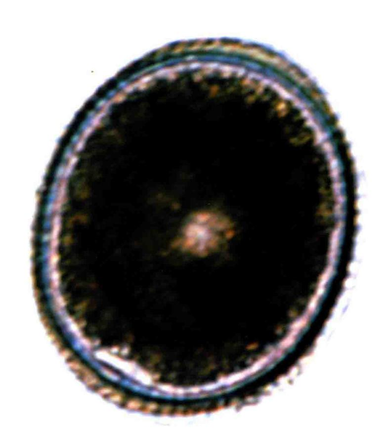

#### 刚第弓形虫(Toxoplasma gondii)

猫科动物的小型球虫,通过食入卵囊、被感染的鸟或哺乳动物的肉而感染。

发育周期: 3~18天; 若因食入卵囊而感染时,潜在期更长。

诊断: 粪便中的卵囊(长 11 ~ 13  $\mu$ m)清晰可见,未孢子化, 呈球形。

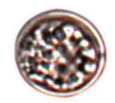

寄生部位:小肠黏膜。

近似种:与哈氏哈蒙德球虫(Hammondia hammondi)的卵囊无法区分。

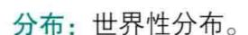

**临床症状**:肠道感染通常无症状。猫会出现严重的全身性疾病和眼部病变;此类疾病与粪便中排出卵囊无直接联系。

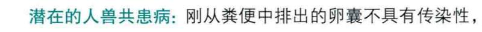

但在合适的条件下会迅速(24 小时)孢子化。因此,发现猫排出的卵囊与刚第弓形虫(*Toxoplasma gondii*)卵囊相似时,应该在诊所内饲养猫,以保护宠物主人或马上治疗以降低卵囊排出。

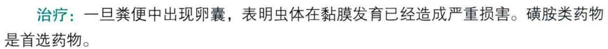

畜必生(Tribrissen®)片(磺胺嘧啶—甲氧苄氨嘧啶的混合物:  $15 \sim 50$  mg 磺胺嘧啶与  $5 \sim 10$  mg 甲氧苄氨嘧啶 /kg,口服,每 12 小时 1 次,连用 6 天;大于 4 kg 的猫可用此药)。

阿尔邦 (Albon®) (磺胺二甲氧嘧啶: 50 mg/kg, 口服, 1 次。此后, 27.5 mg/kg, 每 24 小时口服 1 次, 直到症状消失)。

普里莫尔(Primor®)[磺胺二甲氧嘧啶—奥美普林: 55 mg磺胺地托辛(sulfadimethozine)与11 mg甲氧苄氨嘧啶/kg,每24小时口服1次,连用23天]。

科瑞德 (Corid®) 1.25% 口服颗粒、9.6% 溶液、20% 可溶性粉剂(氨丙啉: 300 ~ 400 mg/kg,每 24 小时口服 1 次,连用 5 天; 110 ~ 220 mg/kg 服用 7 ~ 12 天; 20 ~ 40 mg/kg 服用 10 天)。

安蒂洛(Antirobe®)片剂或口服液(克林霉素: 粪便中出现卵囊时,  $25 \sim 50 \, \text{mg/kg}$ , 口服, 每  $24 \, \text{小时 1}$  次, 连用  $7 \sim 14 \, \text{天}$ 。当出现全身反应时,  $8 \sim 160 \, \text{mg/kg}$ ,皮下或口服, 每  $8 \, \text{小时 1}$  次, 连用  $14 \sim 28 \, \text{天}$ ; 或  $12.5 \sim 25 \, \text{mg/kg}$ ,皮下或口服, 每  $12 \, \text{小时 1}$  次, 连用  $14 \sim 28 \, \text{天}$ )。

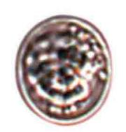

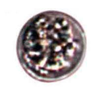

[General Information]

书名=犬猫常见寄生虫病的诊断与治疗图谱

作者=(美)德怀特鲍曼(Dwight

页数=106

SS号=14164681

DX号=

出版日期=2017.02

出版社=中国农业科学技术出版社