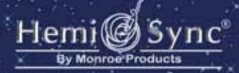
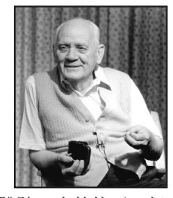

# The Gateway Experience® 意識探索之旅

Wave I — Discovery (Mandarin) 第一套 — 探索

## 意識探索之旅

由Robert A. Monroe敘述

#### 由**Bob Monroe**為意識探索之旅作注解

你期望從意識探索之旅得到什麼呢?可多可 少,要看你投入的深淺。這個練習提供你一 套工具–你要如何使用以及用在什麼地方, 是你的責任。有些人第一次發現他們自己, 因而活得更完美且更有建設性。也有人則是

因為達到非常深奧的境界,所以一生只需要體驗一次就夠了。但 仍然有些人因此成為真理探索者,並且在他們的日常生活裡持續 進行探索。

只有一個準則—那就是你謹慎地思考"意識探索的確認聲明"的 可能性:那就是你不只是一個肉身,你還可以存在於無時空限制 的能量世界;你還可以和其他的生物以超脫肉體的方式溝通—你 可以隨意稱呼它。

#### 意識探索的確認聲明

我不只是一個肉身,因為我不只是一個肉體,我非常渴望去擴 展、去體驗、去認識、去了解、去控制、去使用如此龐大的能量 和能量世界,這可能對我及我周圍的人有益處與建設性。同時我 非常渴望透過這些有著比我多或相同智慧、發展、和體驗的個 體,獲得幫助與合作。

#### 什麼是**Hemi-Sync®**?

Hemi-Sync®是有專利權且經科學和醫學證實的「聽覺引導」技 術,已有超過40年的精確研究。研究人員得知特殊的聲音模式可 以在深度的放鬆或沈睡中,領導大腦進入各種意識狀態去擴展認 知,以及進入其他異於尋常的境界。

聽覺引導採用複雜且多層次聲音的信號,它們同時作用而產生共 鳴,反射到特定意識狀態的腦波形式。其結果是整個大腦呈注意 力非常集中的「雙腦同步」,或簡稱Hemi-Sync®的狀態,此時左 右半腦將呈現於統一性的狀態。不同的Hemi-Sync®信號被用於促 進深度的放鬆、注意力的集中或其他希望達到的狀態。好比說: 雷射產生統一集中的光束,Hemi-Sync®產生統一集中注意力的心 智。那是一個增進人類表現至最理想的形態。

將Hemi-Sync®信號與音樂、口述指導或輕柔的聲音效果結合,就 能加強它的影響力。這些錄音不包含任何潛伏性影響思維的訊 息,你在任何情況都可以控制你自己。

#### 注意事項及警告﹕請閱讀

意識探索之旅是一個自我探索和個人發展的訓練系統。它不是一 個心理療法、不是哲學、宗教或醫學診斷或治療方法。它旨在讓 人獲得知識—其運用方法和結果,完全是受訓者的責任。

許多我們的產品對於健康所做的貢獻,並不是用來替代醫學診斷 或治療方法。千萬不要在開車、操作重型設備或其他可能會影響 腦波活動的設備時聽Hemi-Sync®。如果你有癲癇症狀、聽覺失調 或不良的精神狀態,必須先諮詢你的醫師後才能聽Hemi-Sync®。 即使這發生的機率並不高,但如果你感到任何身體或心理上的不 適,請立刻停止使用。不要複製Hemi-Sync®產品或使用杜比音效 或其他噪音消除系統,這樣會降低Hemi-Sync®信號的效用。

我們不承認任何具有特定用途的銷售和健身減肥療效 的保證。

#### 意識探索之旅

使用建議

意識探索之旅是一個可在家練習,用來發展、探索以及應用認知 拓展的課程。在這一系列的練習中,我們將結合Hemi-Sync®頻 率、口述指導以及輕柔的聲音〈或音樂〉,引導你集中注意力以 及全腦一致的意識狀態。你將慢慢的從清醒狀態進入深層放鬆, 然後進入拓展認知意識的起點,而後可能到達深奧的境界。當進 入這個狀態中,你將擁有一個更寬廣的看法來解決問題、發展創 造力或獲得指導。你可採用你個人整合的體驗,去認識及更了解 你自己,因而享受一個更滿意的生活。

每一套意識探索之旅的教材都是循序漸近的教學法,它的技術及 方法都是承接上一套教材而開發的。因此,這幾套教材必須按照 順序使用。接下來是對於聆聽這些練習的建議:

• 找一個黑暗且無干擾的環境,可以持續三十到四十五分鐘做練 習而不被干擾的房間。

- 用個人或家庭音響設備的耳機聆聽。
- 調整到你剛好可以聽到的音量,否則口述指導可能在一段安靜 的期間後出現把你嚇一跳。
- 為了避免影響Hemi-Sync®練習的效用,請在至少一小時前用 餐,並且避免酒精、藥物或過量的咖啡因。
- 讓你自己舒服,無論如何請在練習前上廁所。將任何緊身的衣 服鬆解並且脫掉鞋子、眼鏡或隱形眼鏡。選一個最舒服的姿勢 躺下,或讓頭有支撐地坐著聆聽。
- 如果你在練習中發癢,就抓它吧。你將能夠慢慢的找回讓你放 鬆的模式。
- 當你進入練習時,將會有新陳代謝的變化、發熱、移動及壓力 的產生。準備一條毯子在旁邊以便在需要時蓋上或置之不用。
- 帶一本記事簿以便紀錄你練習的細節,像是日期、時間、身體 姿勢、藥物或不尋常的飲食習慣、心情、態度、精力、月相或 其他不尋常的情況。

#### 第一套練習

探索:第一節 — 介紹

能量轉換箱變成你的心靈容器,裡面放了擔心、焦躁或練習中產 生的干擾。看著它、感覺它、聽著它、想著它或幻想它。你的箱 子也許是簡單的、或是華麗的,是高科技的、或是古老的,是一 個木箱,一顆光球,一台吸塵器或細胞核微粒收集器。

想像一個實體的象徵物放置在箱子裡,像是代表經濟壓力的皮 夾,一張照片或一個洋娃娃代表在你腦海裡的某人。你可以在箱 子裡放一些限制性的詞,像是"不能"、"不應該"、或"必 須";磚牆象徵你的防禦心;一張書桌或一台電腦象徵你的工 作,試試看,它是你可以使用的方法,你可以在練習中隨時更換 以及放入任何新東西。

"意識探索的確認聲明"使你完全集中你的意向和注意力。你可 以用這練習中出現的字句,將它們修改為對自己更重要、更深 刻,且可以代替個人看法的字句。試試看,讓它成為你的。

當你減少內心裡的對話時,共鳴聲會加速集合你的振動能量。它 幫助給予你的整個系統能量及賦予活力,並且移走在能量輸送上 的障礙。當你大聲的喊叫時,注意你身體的反應。練習裡的聲音 只是一個指導,設定你自己的節拍和速度,上下轉動音階,試試 不同的音調。

做比平常更深一點的呼吸,當你吸氣時,想像你正在將一股閃閃 發光的振動能量拉進你的身體。當你摒住呼吸時,讓它在你的腦 裡環繞。每當你吸一口氣時,試著從你的腳底釋放出疲倦的能 量。

剛開始你會覺得睜開和閉上眼睛時有點怪怪的,但請依然照作。 如果你第一步先學會控制自動和習慣性的行為,這對今後練習將 會非常有用。

只要你正常地呼吸、張開眼睛或移動你右手的手指頭,就可以隨 時回到意識完全清醒的狀況。

**Focus™ 3**是你探索自我旅途上的第一個路標,一個你的大腦和心 智更連貫、一致和平衡的Hemi-Sync®狀態。

在每個練習結束後,會有一個大聲的信號,你將會回到意識完全 清醒的狀況**(C-1)**。請不要太早取下你的耳機,專心地聆聽這個信 號直到聽不到為止。你"回來"得越完全,你就會越深入下一個 練習。

#### 探索第二節 — 集中層次**10**的介紹

集中層次**10**是一個當你的身體舒適平靜地休息時,你的意識卻保 持清醒和警覺的境界。照著指導的步驟做,集中注意力然後放鬆 身體各部位。當你進入深入的放鬆時,你的身體便會知道如何去 做,並且閉著眼睛"看"。

"意識清醒但身體休息"有個說法是可以增強敏感度:意識到你 的毛細孔在呼吸、聽到血液流過你耳朵後的窸窣聲、感覺到你的 心跳。也可能感覺到遠處的訊息:聽到你從前沒聽到的聲音,或 嗅到在遠處細微的味道。將你所有的期望放進箱子裡、放鬆並且 繼續跟著你的體驗走。

每作完一個練習之後,做一個健康狀況的確認,會幫助你平衡身 體和心理的能量。,讓你知道練習對你有用,而你不須要付出多 少精力。

#### 探索第三節 — 進階集中層次**10**

共鳴能量氣球**(**簡稱**REBAL)**是一個可以製造內在和外在高能量的 工具。你的REBAL作用像個磁鐵,把你渴望的能量吸過來,並 且擋開你厭惡的能量。當你建造越多的REBAL,你將維持在更 好的高能量標準。你的REBAL可能會自發性地改變形態、發展 出微細的薄膜或變成弧形的強大光環。雖然你可能不一定每次都 感受到你的REBAL,但你還是可以用你的感官察覺到它,或像 充滿電的電池一樣地把能量儲存起來。

當你在C-1時,你可以打開能量開關來使用它,就像你開燈一 樣。把共鳴能量呼吸當作開關,吸入振動的能量,當你閉氣時, 想像它是一個裡面有個數字10的發亮移動圓形。當你吸氣時,讓 這圓形圍繞著你。當你在人群中時,試著戳破你的REBAL,看 看它的共鳴是否吸引到和它和諧共鳴的人潮。試著將它延續到你 車子的四周,注意是否會因此讓你順利通過車流,或是可以更容 易的找到停車位。

#### 探索第四節 — 釋放和再充電

有沒有錄音帶都可以,釋放和再充電是你天天可以做的方法,幫 助你釋放和轉換自我加諸的情緒。從經驗中學習到的恐懼可以是 一個很好的警告信號,但當你收到警訊時你將不再須要它。在集 中層次 10裡,你可以平靜地分辨並且釋放任何阻礙你發展的恐 懼、障礙與限制,並且把阻礙的能量轉換成原本就存在的純淨 能量。

為了這個練習,必須瞭解"恐懼"是與自我限制相聯產生的主要 情緒,而"情緒"代表相關的感覺。相信你較廣闊的自己,知道 你已經準備好去探索,只要跟隨著引導並看看你會獲得什麼。如 果沒有獲得什麼,不要將它變成泡影,而是要知道這程序將在更 深層的意識中發生作用。

當你被引導入"回憶,事件",你可能會聯想到一個特殊的場 合,或是你之前經歷無邊無際的回憶。每次完結前的最後ㄧ個步 驟,都要吸入清淨的能量。

這是一個如何將能量轉換的例子:你可能會在向團體小組發言時 感到害怕。一旦將那想法消除,你將意識到自己把這難堪的情緒 和害怕聯想在一起。在你釋放了兩者之後,當你和其他人分享你 的體驗時,你再將那像孩子般的歡樂和滿足結合在一起,然後你 將會很樂意地和他人交換以及分享你的心得。

一旦你對上述的練習都感到非常自在舒服時,你可以試著故意放 置你認為會妨礙你進度的事物到箱子裡,並且可在事後收回。你 要跟隨著所有其他的引導去做,唯一的不同就是你預先確定你要 做什麼。比如:如果你懷疑這不自覺的恐懼與身體分離,正在干 擾你練習的進展,將這股恐懼用個象徵物來代表它〈可能是一個 繫在地上的魔毯〉,將它放進箱子裡並且跟著引導將它釋放。

這個練習不是一個快速修補或一次成功的捷徑。大部份自我加諸 的限制有很多層面,須要不斷重複的努力。但如果你真的想要超 越自己的極限,它可以使你進步神速。許多人做了這套練習後指 出,這是他們在整個系列其中最珍貴的經驗,很多人每天使用這 個方法來清除目前的挫折和失望。

#### 探索第五節 — 探究,睡眠

"探索,睡眠"是根據睡眠是一個進入另一種意識狀態的自然管 道的概念設計。我們心理的意識每晚都會通過這個管道,但是不 一定會記得,不管我們會不會記得,C-1的練習可幫助你在清醒 時,回想這常見且自然的程序。

很重要的一點,是不要抱著太大的期望。放下一切並且放鬆,以 一種好奇好玩的心態和興趣來接觸這個練習。就像是當你還小的 時候,你曾經脫離這物質世界而去幻想一切。你可以選擇為超脫 自我的練習加入一個確認聲明:「我完全地沒有任何期望,我正 等待著任何體驗。」在這練習中可能有些問題會干擾著你,像 是:「我已經開始與自己身體分離了嗎?或這是我應該感覺到的 嗎?」在這個練習做完之後,你會有很多時間回想你的體驗過 程,不管發生什麼,請記住你可能獲得一些以不同形式呈現的感 受。

Hemi-Sync®信號會在練習結束後逐漸消失,並且讓你進入自然的 睡眠。

#### 探索第六節 — 自由流動 **10**

自由流動**10**是讓你用自己目前所學到的方法,去追求你的目的。 到這個階段,你已經在練習的引導下創造了你自己的體驗,現在 你是你自己的導遊,你可以去搜尋你自己真正想知道的並對其負 責。不管你獲得什麼都是你的一部分,你的信念、能量、和態度 影響你自由流動探索的強度和範圍,懷著感恩的心情可提高意識 範圍所能及的交流和結合。

如果你有個特定的目標,事先把它簡略的寫下來,保持明確的態 度,當你開始的時候,記住這個目標,但必須自在且開放地去體 驗。期望何時引領會出現以及它如何出現,可能會阻礙你搜尋知 識。你不須要知道引導的方法,只要選擇被領導,你可能不一定 會看到或聽到什麼。刺痛或抽痛和直覺都可能是啟發。曾經有一 個意識探索之旅體驗者感覺不到什麼,但腿部感到抽筋,但之後 才曉得這包含很有價值的啟示﹕原來她練習時設想的物或事正在 "鉗制她的行事作風"。

反覆使用這個練習,並採用一種特定的方法:你的確認聲明、能 量轉換箱、共鳴能量氣球…等等。每一次你做這個練習時,都必 須保持一個新的觀點來探索。不要期望你的體驗會和其他人一 樣,尊重你的獨特性。你可以再檢測之前的體驗,但必須是以開 擴的心,而不是試著再造出一 個完全相同的情況。

總而言之,進入並享受這個覺醒、平靜、開闊的自由流動。

## 往前看

探索只是你前往自我成長探險的第一步。每個"探索"練習都是 建立在你之前所學之上,而這整個意識探索之旅課程是自成架構 的。當你繼續以下的課程,隨時都可以反覆之前的練習,成效會 累積得更多。持續的探索將讓你進步神速地進入更高的境界。

第二套—入門﹕這是六個連貫的練習,每一個都將帶領你前往 一個嶄新、令人興奮的自我發展旅程。你將學習到一套效果顯著 的方法,去掌控你無形的能量,而且你將會使用集中層次12的高 能量狀態,來創造你生命中重要的改變。

聯絡你當地的代理商或:

Monroe Products

P.O. Box 505, Lovingston, Virginia 22949

434-263-8692

800-541-2488

傳真: 434-263-8699

Interstate@Hemi-Sync.com

www.Hemi-Sync.com

### 常見問題

這些年意識探索之旅 的參與者曾經問了一些問[J.L.1]題,我們已 經把這些"問題和解答"加註和補充在你的使用手冊內。

問: 如果我在練習時,並沒有感覺到特別清醒和有警覺性,我 該怎麼做[J.L.2]?[J.L.3]

答: 有很多方法可以讓你自己更沉澱。試試以下的幾個方法: 慢慢地從十數到一;喝些清涼開水;洗個冷水澡或將你的 臉、脖子和手腕沖冷水。如果天氣不錯,你可以光著腳到 戶外走走,當你從腳底釋放出多餘的能量時,深呼吸;將 你的背倚靠著樹並且想像能量正從你的頭頂流到樹枝上, 以及從你的腳底流到樹的根部,一直延伸到地球中心。

問: 如果我在練習中睡著了怎麼辦?

答: 不要感到沮喪。你正在學習如何在深層放鬆和睡眠之間找 到平衡。如果你睡著了,你的潛意識將仍然在體驗並且從 練習中受惠,但以下有幾點建議:在做練習之前,確定你 是精神充足的(你也許要改一下做練習的時間);做練習前用 水潑濕臉部和脖子;放一個象徵睡覺的標誌在你的能量轉 換箱。如果這些建議都沒幫助,你也許試著坐著聽練習, 不要躺著聽。注意:你也許是在發呆,這和睡著不一樣。 如果你是在發呆,當回到意識清醒時,你將感到時間好像 未曾過去一樣,再次強調,雖然你未必記得體驗的過程, 但該些體驗將會被儲存。當你的練習有進展,發呆的情況 會漸漸減少。

問: 如果我不能或不願意大聲地發出共鳴聲音怎麼辦?

答: 參與共鳴聲音是重要的一環,如此做可幫助你感受到你無 形的能量,因而學到如何控制及使用它。當你減少內心的 對話時,共鳴會促使你的振動能量加速結合,你對於發出 聲音的尷尬將會逐漸消失。

問: 如果我不能一直安靜地仰臥該怎辦?

答: 你也許可以用耳塞,這樣一來,你便可以側臥或俯臥,你 也可以試著用枕頭支撐,或坐在較舒服的椅子上。

問: 如果我無法想像到我的共鳴能量氣球呢?

答: 想像是感受的唯一方法。有些人比較容易藉由想像自己被 叮叮聲的能量圍繞而"感覺"到共鳴能量氣球。其他人可 能"聽到"能量細碎的爆裂聲或靠直覺知道他們的共鳴能 量氣球已經形成。經常的練習製造你的共鳴能量氣球,來 加強你的感受力,用任何對你有效的方法都可以。

問: 我會感覺到我的額頭有一點微振或壓力,以及我的心跳加 速,這是正常的嗎?

答: 這些現象對一些人來說都是對Hemi-Sync®步驟的普遍反 應。記住,你是在擴展你的意識體驗,所以你必定對你的 心跳、呼吸或其他身體知覺更有感覺。很多人認為提升的 意識體驗,容易連接著肉體現實世界,可以讓他們更有自 信地進入其他意識狀態。如果你持續因此分心,將那些讓 你分心的事物放入你的能量轉換箱子。如果你感到任何不 舒服,確認你已經調整到適當的音量,剛好聽到口述指導 員的聲音就好。

問: 我該如何知道我是在一個特殊的集中層次上,或是在體驗 這個練習設想的用意?

答: 暫時取消你對集中層次的期望,並且相信你將體驗到練習 中所應該得到的結果。每個人理解集中層次認知都不一 樣。簡單地說,沒有兩個人的體驗是一模一樣的。集中注 意在你身體裡微小的改變或移動的感覺,並且讓你的體驗 呈現出來。你的體驗可以大得像宇宙或小得像世間瑣事。 接受所有向你而來的事物,不要有任何主觀判斷,並且繼 續相信自己的練習是有價值的。雖然有時口述指導裡會敘 述你應該得到什麼體驗,但一些沒有提及的體驗也可能出 現,而且它們對你可能很有意義,千萬不要屏棄任何 體驗。

問: Hemi-Sync®會成為依賴嗎?

答: 不,絕對不會。Hemi-Sync®練習就像是腳踏車的輔助輪:

對於練習是個好工具,但當你可以騎得又遠又自在時,你 就不須要它了。像是生物反饋,當你沒有聽Hemi-Sync® 時,你還是可以從中受惠了。你只須深呼吸並且記得你練 習時的感覺,就可以立刻改變意識層面。你多練習這個技 巧,它將變得更有效率。

問: 如果這"提高能量"的感覺讓我不舒服,我該怎麼做?

答: 你做這個練習的目標是去意識到你的無形能量,進而學會 控制及使用它。你可以從"實驗"的心態開始練習你的無 形能量,來減輕你的不適應。把能量加速或慢下來,都在 你的控制中。

問: 如果我無法有脫離身體的體驗怎麼辦?

答: 別灰心,請了解不是每個人都有脫離身體的體驗。這需要 很多次的練習,很多人都因為心生恐懼,而將自己拉了回 來。而且,如果你太辛苦地嘗試脫離身體,過度的努力可 能反而成為阻礙,迫使你回來。不須要太在意脫離身體的 體驗,它們只是你自我探索和個人發展課程的一小部分。

問: 當我離開身體時,我可以幫助其他人也脫離身體嗎?

答: 已經有參與者發展到有如此能力了。試試看,你和其他人 可以嘗試在你們脫離身體時互相交流地同步進行。

問: 一個無形的身體看起來像什麼?

答: 無形的身體也許感覺起來像一個能量球、霧狀或是一個人 形。它會以一個你比較可以接受的形體出現。

問: 我該如何控制脫離身體的狀況?

答: 如果你已經在開始之前設立了一個目標,一旦你脫離了身 體,你便不須要去決定你要做些什麼。如果脫離身體不由 自主地發生,要記住,你的想法就是無形的行動。試圖想 著某人並且接收他或她的能量,而不是試圖到達那個地理 位置。每當你想要回來的時候,想著返回你的身體,或移 動一隻手指或腳趾便可。

問: 當我在練習裡"看見"一大片的光,是神出現了嗎?

答: 感應到這光顯示你無形意識的潛能正在發展。很多具有較 高的意識探索者,或是有接近死亡體驗的人都會看到這種 光。這種光的出現,通常是在心情愉快、和宇宙合為一 體,或是感受到無窮的愛時出現。一個信佛教的人會聯想 到佛祖;信奉回教的人會聯想到阿拉或穆罕默德;信奉基 督教的人會聯想到耶穌基督。我們不提倡任何一個特定的 思想,我們鼓勵你找尋自己的。

問: 我應該把一個練習做幾次後,才能做下一個?

答: 這情況因人而異,你在進行下個練習前,應該對這個練習 感到熟悉和適應,並且讓直覺引導你何時開始下一個練 習。你也不須要到"精通"整個練習的地步,你隨時都可 以反覆練習幾遍從前做過的。

問: 如果服用了改變心智的藥物再做Hemi-Sync ®會受益更 多嗎?

答: 絕對不行。Hemi-Sync®練習是設計讓你學習控制你意識狀 態的,藥物只會干擾你的控制力。而且,你理性地分析和 理解體驗的能力,將會被改變心智的藥物摧毀。

- 問: 意識探索之旅和 Hemi-Sync® 的步驟會不會對正在練習各種 冥想方法的人更有幫助呢?
- 答: 是的,沒錯。很多長期做冥想的人指出,Hemi-Sync®促使 他們更容易進入並且更有能力維持在冥想狀態。意識探索 之旅是廣受認同的在家練習課程,主要在發展、探索和擴 展感知的應用。每個人可以從提供的方法和指導中受益 良多。
- 問: 意識探索之旅改變了我的生活。我該如何說服一個心存疑 慮的人,告訴他這個課程值得試一試呢?
- 答: 如果沒有興趣及渴望,這個練習將對人不會有很大的幫 助。意識探索之旅訓練系列提供方法和指導,但參與者必 須打開心胸,並且願意去探索。我們建議你用自己的成長 去啟發其他人,因為並不是每個人都對探索擴展的感知有 興趣。我們很多意識探索之旅的熱衷參與者,以前也曾對 此心存疑慮,你或許可以在向其他人介紹Hemi-Sync®之 前,先介紹他們一個比較[J.L.4]"主流"的練習,像是恢復 體力的小睡或是集中注意力。

問: 我的孩子們可以聽意識探索之旅嗎?

答: 這要看這孩子的成熟度,很多家長都提出了有關孩子使用 意識探索之旅之後得到不錯的效果。如果是10歲以上的小 孩,你可以自己評估斟酌。我們鼓勵家長和他們的孩子們 一起做,進而監測他們的進度。

問: 當我聆聽Hemi-Sync®練習時,我聽到的嘶嘶聲或窸窣聲是 什麼?

答: 你聽到的聲音是有用途的,它叫"粉紅噪音"或叫"粉紅 聲響"。它是人類耳朵可聽到的不規則分佈頻率,而在 Hemi-Sync®信號裡被當作是基礎音。不要使用Dolby®音效或 其他降低噪音的音效系統,這樣會干擾Hemi-Sync®步驟的 效果。

問: 有喀嚓喀嚓的聲音是正常的嗎?

答: 不。如果你不是聽到之前說的嘶嘶聲或窸窣聲,首先檢查 你的設備是否須要修理或清潔。如果你確定你的Hemi-Sync®產品是有瑕疵的,請退還我們以作免費替換。

問: Hemi-Sync®和催眠有何不同?

答: 催眠主要是被引導到一個易受驅使的狀態,並將掌控權交 給施催眠術的人。而在Hemi-Sync®的狀態下,你是有意識 地控制並且領導你自己的感知。在這個說法中,Hemi-Sync®是比較像是在自我催眠。無論如何,Hemi-Sync®步驟 會讓你更快且更可靠地達到你想要的境界。

問: Hemi-Sync®練習有包含潛伏性影響思維的訊息嗎?

答: 沒有。Hemi-Sync®練習沒有包含任何潛伏性影響思維的訊 息。偶爾當你在"睡覺"階段,為了避免嚇到你,你會聽 到非常低沉的口述,這只是重複你之前聽到的資訊而已。

問: 在有些練習裡,耳機一定要戴著嗎?

答: 不,如果你有音響設備,就可達到預計的效果。

問: The Monroe Institute®的住宿訓練課程和意識出遊,跟意識探 索之旅在家練習系列有何不同呢?

答: 裡面許多的練習是一樣的,在家訓練課程是自我進度的反 覆練習。住宿訓練課程則會提供有專業技能的培訓師,及 特殊的設備來幫助你學習,而且你也有機會和其他有相同 興趣的人交流互動。很多人開始在家訓練課程之後得到啟 發,進而來參加住宿訓練課程。雖然在家訓練課程不是住 宿訓練課程的必修課,但很多人在參加住宿訓練課程前, 都會選擇先修在家訓練課程,以提升自己的體驗能力。如 果你有興趣知道更多的住宿訓練課程細節,請前往我們的 網址:www.monroeinstitute.org或打電話到課程註冊組 434-361-1252 或 866-881-3440 (免付費電話)。

問: 我可以參觀The Monroe Institute嗎?

答: 我們很歡迎你,但那裡並不會有很多值得讓你參觀的東 西。我們的行政大樓純粹只是個忙碌的辦公室,當課程正 在進行時,住宿訓練中心、研究實驗室、錄音室和會議中 心都是不對外開放的。

問: 我可以跟人討論我的意識探索之旅嗎?

答: 請隨時聯絡我們有關意識探索之旅的相關問題或者你想要 分享的體驗。如果想和其他有做這練習的人討論,你需要 填寫一份表格以得到相關的名單。

#### 聯絡方法:

The *Gateway Experience* 辦事員

C/O Monroe Products

P.O. Box 505

Lovingston, VA 22949

434-263-8692

800-541-2488

FAX: 434-263-8699

Interstate@Hemi-Sync.com

www.Hemi-Sync.com

許多意識探索之旅的熱衷者變成自發性地去參與*The Monroe Institute*®設立的課程。如果你有興趣學習這個課程,請上機構網 址:*www.monroeinstitute.org*或打電話到課程註冊組*434-361-1252* 或 *866-881-3440 (*免付費電話*)*。

#### 書籍閱讀建議:

**Journeys Out Of The Body** by Robert A. Monroe (Doubleday, 1971) 脫離身體體驗的經典著作。

Monroe,一個務實的維吉利亞商人,發現自己離開肉體,並經 由"第二個身體",遊走在遠離他肉身和心靈生活的地方。他 不斷探索一個沒有時間或死亡的無邊無際的地方。

#### **Far Journeys** by Robert A. Monroe (Doubleday, 1985)

經過十幾年的深入研究,這個自我催眠的旅程帶領你到宇宙的 多次元空間[J.L.5]。Monroe提供對人類心靈未開發的資源,及 啟發無限可能的新認知。

#### **Ultimate Journey** by Robert A. Monroe (Doubleday, 1994)

Monroe發現他躺在一個遠超越極限的世界裡。當我們離開我們 的有形生命時,他繪製了這個為我們而開的路線圖,並且帶領 我們前往一個使人振奮和擴展人類體驗極限的旅程。